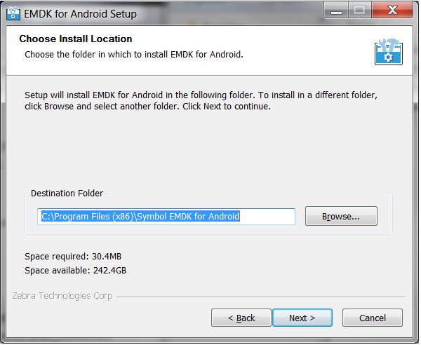
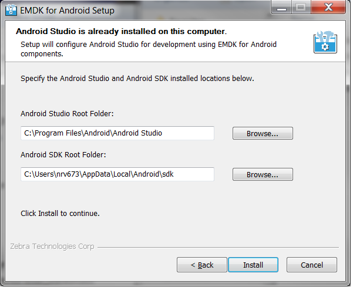
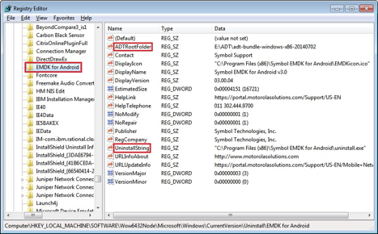
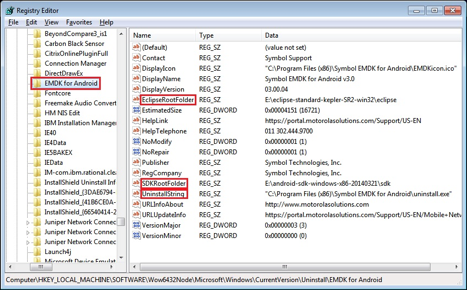

#### For help, please refer to [installing Android Studio](https://developer.android.com/studio/install) docs from the development community. 

#### Then go to [EMDK setup instuctions](../setup). 

<!-- 
##Installing EMDK for Android 

### 1. Install Android Studio
Download and install **Android Studio** from [http://developer.android.com/sdk/index.html](http://developer.android.com/sdk/index.html)

>NOTE: Android Studio should be installed on your computer before running the EMDK for Andriod installer. If Android Studio is already installed, please quit any open sessions before proceeding. 

### 2. Install EMDK for Android

1. Run the EMDK Installer as Administrator, then click Next.

2. Click "I Agree" after reading the License Agreement to continue.

3. Click "Next" or select a custom install location by clicking Browse and then click next.

	

4. Continue installing EMDK for Android in Android studio by selecting the **Use Android Studio** radio button ( As Shown ) and select Next.

	

5. When prompted, click **Yes** to install the ADB drivers.

6. After the driver install is complete you will be prompted to reboot, please do so.

After reboot the EMDK will be fully installed.

>If you decided to select **No** in step 5, complete the installation by click **Next**, then **Finish**

##Uninstalling EMDK for Android 
Uninstall the EMDK for Android by running the **Uninstall** application from **Start Menu > Programs > Symbbol EMDK for Android vX.X**

In most cases running the uninstall program will cleanly remove EMDK For Android from your Computer. If the auto-uninstallation fails, you may not be able to reinstall. The following directions will allow you to cleanly uninstall all components of the EMDK For Android. Follow the step by step instructions below:

###1. Removing installed EMDK directory
1. Open command prompt, type `regedt32` and press Enter.
2. In Registry Editor, locate the following registry key:
* On 32-Bit OS `[HKEY_LOCAL_MACHINE\SOFTWARE\Microsoft\Windows\CurrentVersion\Uninstall]`
* On 64-Bit OS `[HKEY_LOCAL_MACHINE\SOFTWARE\Wow6432Node\Microsoft\Windows\CurrentVersion \Uninstall]`

3. Each key listed under Uninstall in the left pane of Registry Editor represents a program that is currently installed. Scroll through and identify the registry key that has the name EMDK for Android (See Fig.01 or Fig.02).
* Fig.01
	
* Fig.02
	

4. Under key EMDK for Android look for the value UninstallString in the details pane on the right and identify the EMDK for Android installation path (i.e. the parent directory where uninstall.exe resides. See Fig.01 or Fig.02).

5. Locate and delete the EMDK for Android folder, subfolders and files.

###2. Removing installed EMDK short cuts under Start Programs

1. Locate and delete the following folder available at `C:\ProgramData\Microsoft\Windows\Start Menu\Programs`:
* `EMDK for Android vX.X` where vX.X = Base version of the Installation.
	* Example: `v3.0` when you have installed `EMDK for Android v3.0`

2. Also, locate and delete the following .lnk file available at `C:\ProgramData\Microsoft\Windows\Start Menu\Programs`:
* `EMDK for Android vX.X.lnk` where vX.X = Base version of the Installation.
	* Example: `v4.0` when you have installed `EMDK for Android v4.0`

###3. Removing installed EMDK plug-in and add-on from Android Studio and Android SDK

>Note: Make sure to close Android Studio before proceeding.

1. Under the EMDK for Android key in the Registry Editor, look for the value AndroidStudioPath in the details pane on the right and identify the Android Studio root folder
2. Locate and remove the Android Studio plug-in installed by EMDK as below:
	* Go to `\<android studio>\\\plugins` and delete `com.symbol.emdkwizard_x.x.x.jar` file and `EMDK` folder.

3. Under the EMDK for Android key in the Registry Editor, look for the value AndroidStudioSDKPath in the details pane on the right and identify the Android SDK root folder
4. Locate and remove the SDK add-on installed by EMDK as below:
	* Go to `\<android-sdk>\add-ons` and delete `addon-symbol_emdk-symbol-16` and `addon-symbol_emdk-symbol-19` folders.

###4. Removing installed EMDK registry settings

1. In the Registry Editor, locate the following registry key:
* On 32-Bit OS `[HKEY_LOCAL_MACHINE\SOFTWARE\Microsoft\Windows\CurrentVersion\Uninstall]`
* On 64-Bit OS `[HKEY_LOCAL_MACHINE\SOFTWARE\Wow6432Node\Microsoft\Windows\CurrentVersion\Uninstall]`

2. Right-click on the EMDK for Android key in the left pane and then click Delete. Click Yes to the prompt `Are you sure you want to delete this key and all of its subkeys?`.

3. If you have installed EMDK updates, scroll through and identify the following registry key:
* `EMDK for Android vX.X Update(X)` where vX.X = Base version of the Installation.
	* Example: `v3.0` when you have installed `EMDK for Android v3.0`
* Update(X) Update version only if an update is installed.
	* Example: `Update1` when you have installed `EMDK for Android v3.0 Update1`.

4. Right-click on the above key and then click Delete. Click Yes to the prompt `Are you sure you want to delete this key and all of its subkeys?`.

 -->