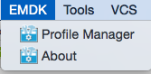
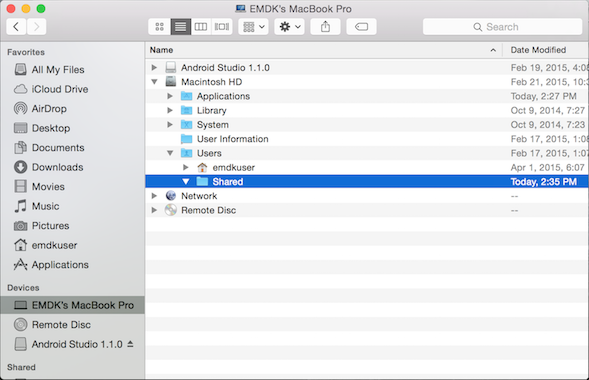

##Removing previous EMDK installations
>Note: Before upgrading, previous versions of EMDK for Android should be removed.

**Removing SDK add-ons**
1. Navigate to the /Users/[user]/Library/Android/sdk/add-ons directory.
2. Remove addon-symbol_emdk-symbol-XX folders.

**Removing Wizard Core**
1. Navigate to /Users/Shared directory.
2. Remove EMDK for Android folder.

**Removing Wizard plug-in**
1. Launch Finder and go to Applications (on the left side panel)
2. Locate Android Studio.app right click and select Show Package Contents.
2. Locate the Contents\plugins directory.
4. Remove the com.symbol.emdk.wizard.intellijIdea folder.

##Installing EMDK

###Prerequisites

* Android Studio 2.x or newer with Android API 19, API 22 and API 23 platforms and Android SDK Build-tools 23.0.x or newer installed. 
* Latest EMDK add-ons (“\EMDK-A-(version_number)-MAC\SDK\ addon-symbol_emdk-symbol-19/ , 
etc.)
* Latest EMDK Wizard core components (“\EMDK-A-(version_number)-MAC\EMDK for Android”)
* Latest EMDK Wizard plug-in for Android Studio (“\EMDK-A-(version_number)-MAC\Android Studio\ com.symbol.emdk.wizard.intellijIdea”)
* Latest EMDK device runtime (on KitKat only: “\EMDK-A-(version_number)-MAC\Device Update\ EmdkOSUpdateApp_v(version_number).apk”)

>IMPORTANT: All Android Studio sessions must be closed before starting this step.
	
###Download the EMDK for Android MacOS installation files

1. Download the [EMDK for Android MacOS installation files](/emdk-for-android/download)
2. Extract the downloaded zip file and make note of the path to the extracted files. This path will be refered to as **EMDK_FILES** for the rest of this guide.

The extracted folder contains the following files:

* EMDK add-ons 
* EMDK Wizard core components
* EMDK Wizard plug-in for Android Studio
* EMDK device runtime (KitKat only)

>NOTE: Instructions for installing EmdkOSUpdate on Mac can be found in the [Device Setup](/emdk-for-android/8-0/guide/setupDevice) guide.

###EMDK SDK add-on Integration

Add EMDK APIs to the Android SDK
1. Navigate to the /Users/**username**/Library/Android/sdk/add-ons directory.

	

2. Copy all EMDK sdk addon folders from **EMDK\_FILES/SDK/** into the add-ons directory.
	* addon-symbol-emdk\*

3. Exit & Launch Android Studio
4. Go to Tools > Android > SDK Manager

Now the integrated EMDK add-ons should appear in the SDK Manager

###EMDK Wizard plug-in Integration

**Configuring Mac OS X with EMDK Wizard core components**

1. Locate the /Users/Shared folder.

2. Copy **EMDK\_FILES/EMDK for Android** folder into the /Users/Shared folder.

**Integrate the EMDK Wizard plug-in into Android Studio**

1. Launch Finder and go to the Applications folder.

2. Locate Android Studio.app, right click and select Show Package Contents.

	

3. Locate the Contents\plugins directory.

	

4. Copy com.symbol.emdk.wizard.intellijIdea\_x.x.xx folder from **EMDK\_FILES/Andoid Studio** into the plugins directory.

5. Exit & Launch Android Studio.

Now the “EMDK” menu should appear in the Android Studio menu bar:

7.	Launch EMDK -> About to see installed EMDK Wizard components.

##Uninstalling EMDK for Android
To uninstall the EMDK for android perform the following steps:

>Note: It is recommended that you close all Android Studio IDE windows before proceeding with uninstallation. 

1. Remove the EMDK SDK add-on by deleting the emdk addon folders from `/Users/**username**/Library/Android/sdk/add-ons`
	- addon-symbol-emdk*
	
2.  Locate the /Users/Shared folder then delete the **EMDK for Android** folder.

	

3. Remove the EMDK for Andrdoid IDE plugin:

	1. Locate Android Studio.app in your Applications folder, right click and select Show Package Contents.

		

	2. Locate the Contents\plugins directory.

		

	3. Delete com.symbol.emdk.wizard.intellijIdea\_x.x.xx folder from the plugins directory.

##Configuring ADB on Mac OSX
The ADB connectivity on Mac OSX for Zebra Android devices will not be successful by default. Therefore the Vendor ID must be specified under third party USB Vendor ID list to get the device connected on Mac OSX.

>NOTE: The Google Mobile Service (GMS) devices (ex: TC 55 GMS) will be connected without any change to the USB Vendor ID list.

To add the Zebra Vendor ID to ADB:

1. Enter the following command using a terminal: `echo 0x05e0 >> ~/.android/adb_usb.ini`
2. Next, navigate to the ADB directory: `cd /Users/<user>/Library/Android/sdk/platform-tools/`
3. Stop the the adb service if it is running: `./adb kill-server`
3. Connect a Zebra Android device and enter the following command verify the list of attached devices:
	`./adb devices`

