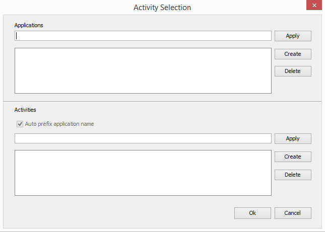

## Overview

When creating a profile for **Barcode** or **MSR** data capture you can configure an Activity Selector to automate the process of activating and deactivating the profile. This allows for automated profile management of complex applications. 

## Name
The name field is used by the EMDK to identify this particular feature parameter set when you want to manage just part of the profile programmatically using the EMDK [ProfileManager](/emdk-for-android/8-0/api/core/ProfileManager) API. This can be useful if you have multiple types of the same feature and want to update only one of them without having to update the whole profile. See [EMDK Profiles Overview](/emdk-for-android/8-0/guide/profile-manager) for more information.

> **Note**: As of EMDK 6.8, DataWedge can no longer be configured for data capture through Profile Manager. Zebra recommends using the [DataWedge APIs](/datawedge/latest/guide/api/) instead. 

##Activity Selection

###Applications
In the **Applications** section of the Activity Selection configuration screen, you would enter an **application name** and then click the **Apply** button to add that application to the application list.  **Applications names** are the formal package definition of the application. For example "com.symbol.profiledatacapturesample1". 

Your Profile could be created in one EMDK project, and then copied to another project for use. In this case you could add all the application names to the list that you foresee using the profile. Keep in mind that this is a convenience feature to simplify activity entry, you are not restricted to  activities that exist in this package.

###Activities
The Activities section of the Activities Selection configuration screen allows you to build a list of activities that your profile should be active for.  

After selecting an application from the Applications list, you would enter an **Activity Class Name** and click the **Apply** button to add that activity to the list.

**Activity Class Names** in the list must have the complete application name prefixed to the Activity class name ( i.e. **com.symbol.profiledatacapturesampe1**.MainActivity).  If all the Activities you wish to add to the list belong to the same application, then you can simply check the "Auto prefix application name" check box and then enter only the **Activity Class Name**.  If however, you wish to add a mix of Activities that belong to specified application and Activities that belong to other applications, then you must manually prefix the **application name** to the **Activity Class Name** before clicking apply

If you wish to enable all activities in selected application you could enter an **Activity Selection wildcard**  ( &#42; ) instead of specifying each individually.  Just enter an Asterisk and click the **Apply** button.

