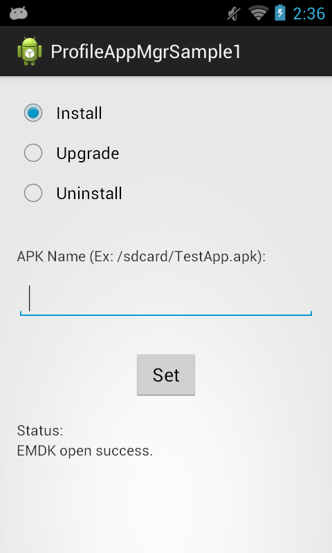
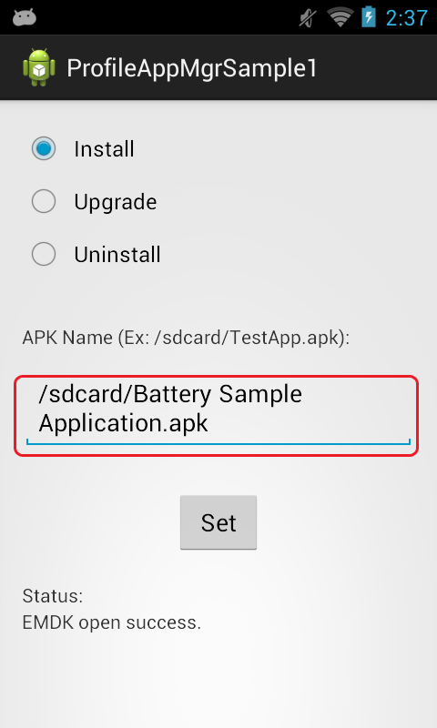
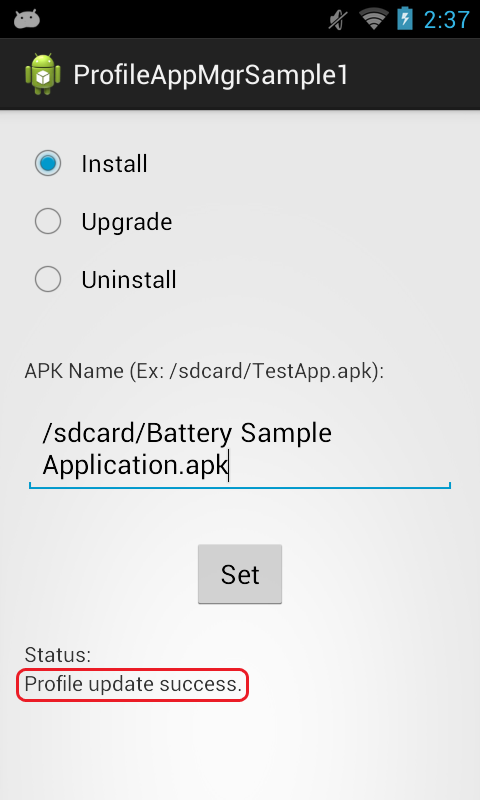

##Overview

The EMDK for Android allows you to manage applications on the device. 

The available actions are:  
- Install an application
- Uninstall an application
- Upgrade an application  
- Set an application as the default launcher 

This sample application will allow you to install, upgrade, and uninstall an application. 

##Requirements
Android API 22 (or higher) must be installed via the SDK Manager before attempting to load this sample.

##Loading the Sample Application
The following guide will walk you through setting up the EMDK samples in your IDE.

* [Android Studio](/emdk-for-android/8-0/guide/emdksamples_androidstudio)

>**NOTE**: The appearance of sample app screens can vary by sample app version, Android version and screen size.

##Using This Sample
1. When the application starts it should look like the following.  
    
2. Enter the path to an APK file that you have placed on your device.  /sdcard/Battery Sample Application.apk
      
  >Note:  
  >To place an APK file on the device connect the device to to you computer over USB as a "Medea Device" and copy an APK to your device.  
3.  Click "Set" 
4.  Check the status field.   
    

