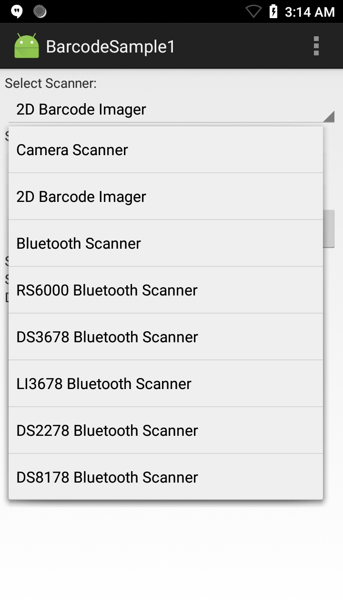
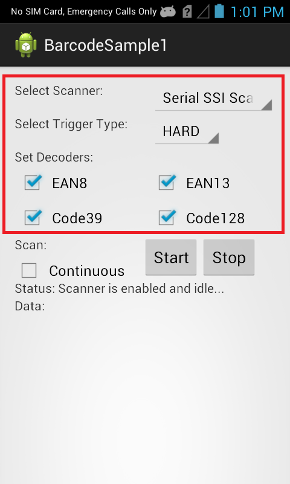

##Overview
EMDK for Android can be used handle all barcode scanning entirely in Java using [Barcode/Scanning APIs](/emdk-for-android/7-3/api). These APIs work independently of any [Data Capture profiles](/emdk-for-android/7-3/mx/data-capture/barcode).  

>**Note**: As of EMDK 6.8, DataWedge can no longer be configured for data capture through Profile Manager. Zebra recommends using the [DataWedge APIs](/datawedge/latest/guide/api/) instead.

<!-- The available actions in the [Barcode/Scanning API](/emdk-for-android/7-3/api) are:
  
* Set [Scanner Device](/emdk-for-android/7-3/api/barcode/BarcodeManager-DeviceIdentifier/)  
* Set [TriggerType](/emdk-for-android/7-3/api/barcode/Scanner)
* Set [Decoder Params](/emdk-for-android/7-3/api/barcode/ScannerConfig-DecoderParams)
* Set [Reader Params](/emdk-for-android/7-3/api/barcode/ScannerConfig-ReaderParams)
* Set [Scan Params](/emdk-for-android/7-3/api/barcode/ScannerConfig-ScanParams)
* Scan barcodes based on selected features   

This sample application permits barcode scanning based on the selected scanner and [Decoder Params](/emdk-for-android/7-3/api/barcode/ScannerConfig-DecoderParams).
 -->

##Requirements
* Android Studio on a Mac or Windows PC with Android API 22 (or higher) installed
* Two (2) Zebra Android devices, at least one of which is among the [supported devices](../../guide/about/#supporteddevices)
* A barcode that contains the Bluetooth MAC address of the second Zebra device (to pair with)

##Using Sample App

>**NOTE**: The appearance of sample app screens can vary by sample app version, Android version and screen size.

Before beginning, download, build and install the sample app. For help, please see the [Sample App Set-up Guide](/emdk-for-android/8-0/guide/emdksamples_androidstudio). 

1. When the application starts it should look similar to the image below:
  
   
  
2. Select a scanner to use. If the desired scanner is external to the mobile device (Bluetooth or wired), be sure it's connected and in "SSI" mode before making a selection. 

   

3. Point the device at a barcode and press the scan trigger. The app displays the scanned barcode data similar to the image below: 
   
   

> **NOTE: Sample apps are for demonstration purposes only and should not be used in production environments**.

<!-- The EMDK for Android is used when you wish to handle all barcode scanning entirely in Java using [Barcode/Scanning APIs](/emdk-for-android/8-0/api) introduced in EMDK V3.0. These APIs work independently of any [Data Capture profiles](/emdk-for-android/8-0/mx/data-capture/barcode).  

>**Note**: As of EMDK 6.8, DataWedge can no longer be configured for data capture through Profile Manager. Zebra recommends using the [DataWedge APIs](/datawedge/latest/guide/api/) instead.

The available actions in the [Barcode/Scanning API](/emdk-for-android/8-0/api) are:
  
* Set [Scanner Device](/emdk-for-android/8-0/api/barcode/BarcodeManager-DeviceIdentifier/)  
* Set [TriggerType](/emdk-for-android/8-0/api/barcode/Scanner)
* Set [Decoder Params](/emdk-for-android/8-0/api/barcode/ScannerConfig-DecoderParams)
* Set [Reader Params](/emdk-for-android/8-0/api/barcode/ScannerConfig-ReaderParams)
* Set [Scan Params](/emdk-for-android/8-0/api/barcode/ScannerConfig-ScanParams)
* Scan barcodes based on selected features   

This sample application permits barcode scanning based on selected scanner, trigger type and few [Decoder Params](/emdk-for-android/8-0/api/barcode/ScannerConfig-DecoderParams).

##Requirements
Android API 22 (or higher) must be installed via the SDK Manager before attempting to load this sample.

##Loading the Sample Application
The following guide will walk you through setting up the EMDK samples in your IDE.

* [Android Studio](/emdk-for-android/8-0/guide/emdksamples_androidstudio)

>**NOTE**: The appearance of sample app screens can vary by sample app version, Android version and screen size.

##Using This Sample
1. When the application starts it should look like the following:
  
    
  
2. Set scanner to "2D Barcode Imager," which is the default. 

    

3. Click the Scan button on the screen or press the hard scan key of device and scan a barcode. The scanned barcode data appears in the "Data" field of app.

    

above steps per engineering TUT-32177. The steps below removed as no longer relevant (to be validated).

  > Note: Trigger Type "HARD" lets you scan the barcode using device's hard scan key whereas "SOFT" allows you to scan without using devic's hard scan key.

4. Keep all checkboxes checked for decoder params and this is how it should look after setting all fields.
    
      

5. Click "Start" button and the status will be updated.

   
 
6. Since we selected Trigger Type as "HARD", press the hard scan key of Zebra device and scan a particular barcode. It will get the scanned barcode data in "Data" field of UI.
   
    
  
 -->

