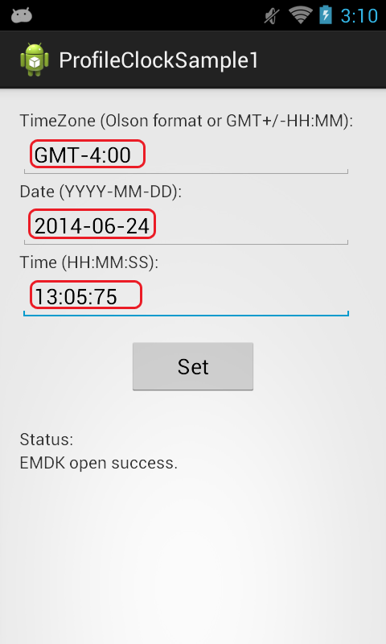

##Overview##
One of the features of the EMDK for Android is the ability to set the system clock. This sample application will show you how you can create a custom application for setting the system time. 

##Requirements
Android API 22 (or higher) must be installed via the SDK Manager before attempting to load this sample. 

##Loading the Sample Application
The following guide will walk you through setting up the EMDK samples in your IDE.

* [Android Studio](/emdk-for-android/8-0/guide/emdksamples_androidstudio)

>**NOTE**: The appearance of sample app screens can vary by sample app version, Android version and screen size.

##Using This Sample
1. When the application starts it should look like the following.  
    
2. Enter the time you would like to set.  
      
3.  Click "Set" 
4.  Check the status field.   
    

