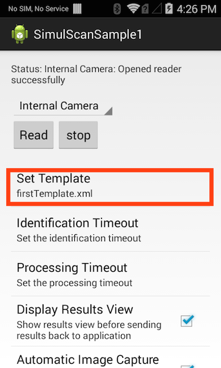
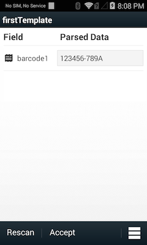
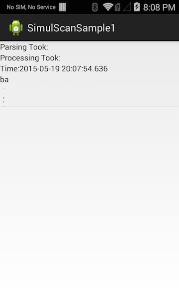

> **`IMPORTANT:`** Support for SimulScan features has been removed from EMDK for Android 8.0 for devices running Android 10 and later. 

##Overview
This sample application will show how the Simulscan API's can be used to capture multiple types of data from forms, boxes and the like.

##Prerequisites

You will need:

* A SimulScan licensed device
* A Simulscan template
* A printed copy of the form used to create the template

Follow the template generation and device licensing sections of the [SimulScan API tutorial](/emdk-for-android/8-0/tutorial/tutSimulScanAPI)

##Requirements
Android API 22 (or higher) must be installed via the SDK Manager before attempting to load this sample.

##Loading the Sample Application
The following guide will walk you through setting up the EMDK samples in your IDE.

* [Android Studio](/emdk-for-android/8-0/guide/emdksamples_androidstudio)

>**NOTE**: The appearance of sample app screens can vary by sample app version, Android version and screen size.

##Using This Sample

1. Place a template on the sdcard of you SimulScan licensed device.

		:::
		adb push myTemplate.xml /sdcard/simulscan/templates/
	

2. Launch The SimulScan sample application
	
	The Simulscan sample app will find the templates you place on the devices sdcard, and populate the "Set Template" option list.  Select the template you wish to use from that list.
	 

3. Press the "Read" button, and follow the on screen instructions. The sample app will extract the fields defined in the template. If the "Display Results View" option is checked, a list of results will be displayed for you to review.

	     

4. Press the "Accept" button. The sample app will then display a screen showing how long simulscan took to capture and decode the template fields. Press the devices "Back" hardware button to return to the main screen.

	 

