
 <button type="button" class="close" data-dismiss="alert" aria-label="Close">×</button> <h4>Regarding EMDK Barcode Scanning APIs</h4> 
<u>Zebra strongly recommends the use of DataWedge for all applications that require barcode scanning</u>. <b>While Zebra will continue to support EMDK Barcode APIs</b>, the efficiency and feature richness of intent-based interfaces make it a simpler alternative to app development using EMDK Barcode APIs.
 
 <b>DataWedge facts</b>:
    
<ul>
        <li><b>DataWedge APIs have the same capabilities currently available in EMDK Barcode APIs.</li>
        <li><b>DataWedge intent-based APIs are easier and faster to implement than EMDK Barcode APIs.</li>
        <li><b>New features are added to DataWedge before being considered for EMDK Barcode APIs.</li>
    </ul>
     
    <a href="/datawedge" class="btn btn-danger">Learn About DataWedge</a>  

 

> **`IMPORTANT:`** Support for SimulScan features has been removed from EMDK for Android 8.0 (and later) for devices running Android 10 (and later). 

## Overview

This guide walks through creation of an app using the [Barcode/Scanning APIs](/emdk-for-android/9-0/api) introduced in EMDK-A 3.0 to perform additional options along with scanning operations on Zebra Android devices without using Profile Wizard. The API uses [Barcode Manager](/emdk-for-android/9-0/api), which is the primary object to access barcode scanning feature. 

This tutorial focuses on scanning barcodes using the soft scan trigger implemented as a button in the app, not the hard scan trigger on the device.

> Note: The Profile Wizard is not required to use the Barcode/Scanning APIs; everything is configured programmatically.

-----

The following features are configured:

* **Device Types -** gets the scanning devices supported by a specific Zebra device (i.e. Serial SSI Scanner, Camera Scanner etc.)

* **[Decoder Params](/emdk-for-android/9-0/api) -** used to configure various types of decoders through apps for scanning specific types of scanners (i.e. Code 11, Code 39, UPCA etc.).

* **[Reader Params](/emdk-for-android/9-0/api) -** used to configure reader-specific options of a particular scanning device. This tutorial configures Illumination Mode for the Camera Scanner.

> Note: "Illumination Mode" is available only for the camera scanner device.

* **[Scan Params](/emdk-for-android/9-0/api) -**
class that provides access to scanning parameters available for all decoders.

This tutorial configures the following scanning params:
1. **Vibration** is used to configure Vibration of the scanner device when scanning barcodes.
2. **Scan Tone** is used to set scan tone while scanning barcodes. We can apply various media, notification or alarm tones to the device while scanning barcodes. We can also keep a silent tone by not passing any parameter to this attribute. In this tutorial, we will provide a list of Scan Tones for the user to select including silent mode where we won't pass any parameter to Scan Tone attribute.      

-----    

## Creating The Project

> Note: Provide "AdvancedScanningTutorial" as the project name for this tutorial.

Create a new project with Android Studio, click [here](/emdk-for-android/9-0/tutorial/tutCreateProjectAndroidStudio).

## Enabling Android Permissions
1. Modify the Application's Manifest.xml to use the EMDK library and to set permission for the EMDK to scan the barcodes.
  
    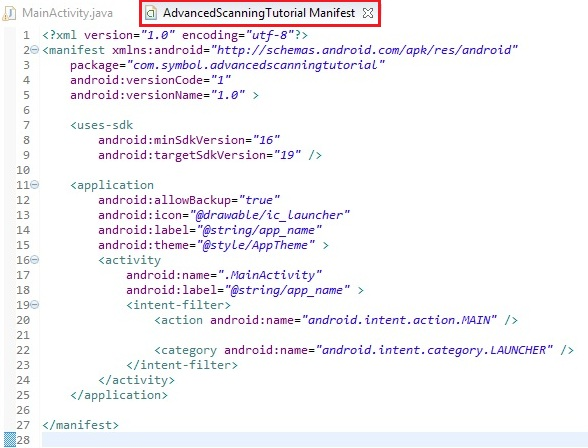

    You must first enable permissions for 'com.symbol.emdk.permission.EMDK': 
   
        :::xml
        <uses-permission android:name="com.symbol.emdk.permission.EMDK" /> 

    Then you must enable the library for EMDK:  
      
        :::xml
        <uses-library android:name="com.symbol.emdk" />

    When done, your manifest.xml should look like:

    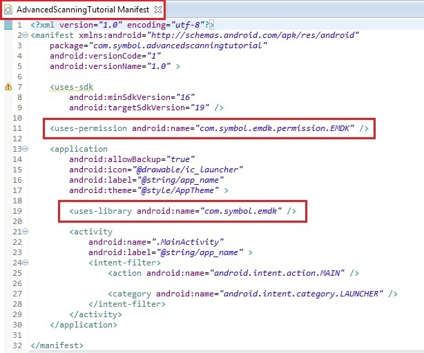 

##Adding Some Code    
1. Now we will start to add some code. 

    First you must add references to the libraries:  
    
        :::java
        import com.symbol.emdk.EMDKManager;
		import com.symbol.emdk.EMDKManager.EMDKListener;
		import com.symbol.emdk.barcode.ScanDataCollection;
		import com.symbol.emdk.barcode.Scanner.DataListener;
		import com.symbol.emdk.barcode.Scanner.StatusListener;
		import com.symbol.emdk.barcode.StatusData;   

    Then you must extend the activity to implement EMDKListener. 

    After that you also need to implement `StatusListener` for notifying client applications to notify scan events. Override its `onStatus` function.

     Implement `DataListener` for notifying client applications when the scan data is available. Override its `onData` function.

	Finally, we will implement `OnCheckedChangeListener` that has an overriden method `onCheckedChanged`, which gets called whenever the user checks or unchecks any checkbox. We will be using checkboxes for various decoders that user can check or uncheck based on the requirement.  
    
        :::java
        public class MainActivity extends Activity implements EMDKListener,
		StatusListener, DataListener, OnCheckedChangeListener {  
          
            .. .. .. .. .. .. ...  
          
         @Override
	     public void onClosed() {
		  // TODO Auto-generated method stub

	     }

	     @Override
	     public void onOpened(EMDKManager arg0) {
		  // TODO Auto-generated method stub

	     }

	     @Override
	     public void onData(ScanDataCollection scanDataCollection) {
		  // TODO Auto-generated method stub

	     }

	     @Override
	     public void onStatus(StatusData statusData) {
		  // TODO Auto-generated method stub

	     }

	     @Override
	     public void onCheckedChanged(CompoundButton buttonView, boolean isChecked) {
		  // TODO Auto-generated method stub

	     }  
          
        }

	> Note: To organize imports in Android Studio, press CTRL+ALT+O or CMD+ALT+O.    

    We will now create some global variables to hold the instance objects of EMDKManager, [BarcodeManager](/emdk-for-android/9-0/api) and [Scanner](/emdk-for-android/9-0/api). These variables would be used throughout the code.

    It will have some UI elements such as [Checkboxes](http://developer.android.com/reference/android/widget/CheckBox.html) to  

    We will then add some UI elements starting with a [TextView](http://developer.android.com/reference/android/widget/TextView.html) to display the status of scanning operation and then [EditText](http://developer.android.com/reference/android/widget/EditText.html) to populate scanned barcode data.

    We will also declare a boolean variable to call setProfile() method only when required avoiding scanner exceptions while setting profile.
    
        :::java
        // Declare a variable to store EMDKManager object
		private EMDKManager emdkManager = null;
	
		// Declare a variable to store Barcode Manager object
		private BarcodeManager barcodeManager = null;
	
		// Declare a variable to hold scanner device to scan
		private Scanner scanner = null;
	
		// Button to scan barcodes through the app using soft trigger
		private Button scanButton;
	
		// Text view to display status of EMDK and Barcode Scanning Operations
		private TextView statusTextView = null;
	
		// Edit Text that is used to display scanned barcode data
		private EditText dataView = null;
	
		// CheckBox to set Decoder Param Code 11;
		private CheckBox checkBoxCode11;
	
		// CheckBox to set Decoder Param Code 39;
		private CheckBox checkBoxCode39;
	
		// CheckBox to set Decoder Param Code 128;
		private CheckBox checkBoxCode128;
	
		// CheckBox to set Decoder Param Code UPCA;
		private CheckBox checkBoxCodeUPCA;
	
		// CheckBox to set Decoder Param EAN 8;
		private CheckBox checkBoxEAN8;
	
		// CheckBox to set Decoder Param EAN 13;
		private CheckBox checkBoxEAN13;
	
		// CheckBox to set Reader Param Illumination Mode;
		private CheckBox checkBoxIlluminationMode;
	
		// CheckBox to set Scan Param Vibration Mode (decodeHapticFeedback);
		private CheckBox checkBoxVibrationMode;
	
		// Drop Down for selecting scanner devices
		private Spinner deviceSelectionSpinner;
	
		// Drop Down for selecting the type of streaming on which the scan beep
		// should
		// be played
		private Spinner scanToneSpinner;
	
		// Array Adapter to hold arrays that are used in various drop downs
		private ArrayAdapter<String> spinnerDataAdapter;
	
		// List of supported scanner devices
		private List<ScannerInfo> deviceList;
	
		// Provides current scanner index in the device Selection Spinner
		private int scannerIndex = 0;
	
		// Boolean to avoid calling setProfile() method again in the scan tone
		// listener
		private boolean isScanToneFirstTime;

    The code till here looks like:

    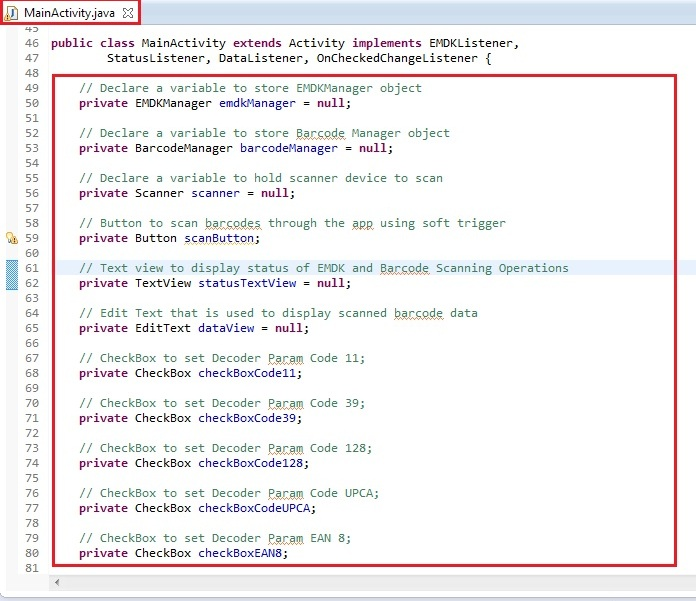

	and the remaining part looks like:

	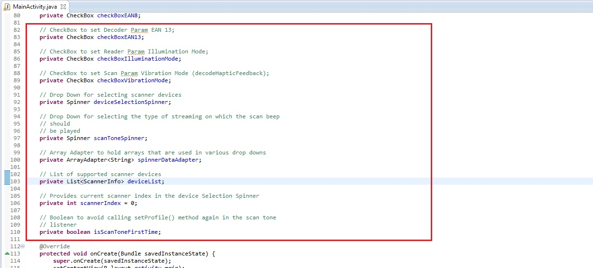

	> Note: Due to more variables, it has been divided into multiple screen captures. 

2. Now, let us design the simple UI that has fields for each of the features mentioned above starting with [Spinner](http://developer.android.com/guide/topics/ui/controls/spinner.html) to display list of scanner devices and scan tones at the bottom. It will then have some [Checkboxes](http://developer.android.com/reference/android/widget/CheckBox.html) to display decoder params, reader params and scan params for scanner. We then have a [Button](http://developer.android.com/reference/android/widget/Button.html) that would be set as a soft trigger in the app to scan barcodes later in this tutorial as we are not using the hard scan trigger of the device. Finally the screen has a [TextView](http://developer.android.com/reference/android/widget/TextView.html) to display the status of scanning operation and above that an [EditText](http://developer.android.com/reference/android/widget/EditText.html) to populate scanned barcode data. Since the UI has lots of elements, we need to embed it in a [ScrollView](http://developer.android.com/reference/android/widget/ScrollView.html) to view all the UI elements.

    So, remove all the code, inside "res/layout/activity_main.xml" and add following XML layout code for UI.

        :::xml
	    <ScrollView xmlns:android="http://schemas.android.com/apk/res/android"
	    android:layout_width="fill_parent"
	    android:layout_height="fill_parent"
	    android:paddingBottom="5dip" >
	
		    <RelativeLayout
		        android:layout_width="match_parent"
		        android:layout_height="wrap_content" >
		
		        <TextView
		            android:id="@+id/device_Selection"
		            android:layout_width="match_parent"
		            android:layout_height="wrap_content"
		            android:layout_margin="5dip"
		            android:text="Select Scanner Device Type:"
		            android:textSize="16sp"
		            android:textStyle="bold" />
		
		        <Spinner
		            android:id="@+id/device_selection_spinner"
		            android:layout_width="match_parent"
		            android:layout_height="wrap_content"
		            android:layout_below="@+id/device_Selection"
		            android:layout_margin="5dip" />
		
		        <TextView
		            android:id="@+id/decoder_selection"
		            android:layout_width="match_parent"
		            android:layout_height="wrap_content"
		            android:layout_below="@+id/device_selection_spinner"
		            android:layout_margin="5dip"
		            android:text="Select Decoder Params:"
		            android:textSize="16sp"
		            android:textStyle="bold" />
		
		        <RelativeLayout
		            android:id="@+id/decoder_layout"
		            android:layout_width="match_parent"
		            android:layout_height="wrap_content"
		            android:layout_below="@+id/decoder_selection"
		            android:layout_margin="5dip" >
		
		            <CheckBox
		                android:id="@+id/checkBoxCode39"
		                android:layout_width="wrap_content"
		                android:layout_height="wrap_content"
		                android:layout_alignParentLeft="true"
		                android:layout_margin="3dip"
		                android:checked="true"
		                android:text="Code 39"
		                android:textSize="14sp" />
		
		            <CheckBox
		                android:id="@+id/checkBoxCode128"
		                android:layout_width="wrap_content"
		                android:layout_height="wrap_content"
		                android:layout_margin="3dip"
		                android:layout_toRightOf="@+id/checkBoxCode39"
		                android:checked="true"
		                android:text="Code 128"
		                android:textSize="14sp" />
		
		            <CheckBox
		                android:id="@+id/checkBoxUPCA"
		                android:layout_width="wrap_content"
		                android:layout_height="wrap_content"
		                android:layout_margin="3dip"
		                android:layout_toRightOf="@+id/checkBoxCode128"
		                android:checked="true"
		                android:text="UPCA"
		                android:textSize="14sp" />
		
		            <CheckBox
		                android:id="@+id/checkBoxCode11"
		                android:layout_width="wrap_content"
		                android:layout_height="wrap_content"
		                android:layout_alignParentLeft="true"
		                android:layout_below="@+id/checkBoxCode39"
		                android:layout_margin="3dip"
		                android:checked="true"
		                android:text="Code 11"
		                android:textSize="14sp" />
		
		            <CheckBox
		                android:id="@+id/checkBoxEan8"
		                android:layout_width="wrap_content"
		                android:layout_height="wrap_content"
		                android:layout_below="@+id/checkBoxCode128"
		                android:layout_margin="3dip"
		                android:layout_toRightOf="@+id/checkBoxCode11"
		                android:checked="true"
		                android:text="EAN 8"
		                android:textSize="14sp" />
		
		            <CheckBox
		                android:id="@+id/checkBoxEan13"
		                android:layout_width="wrap_content"
		                android:layout_height="wrap_content"
		                android:layout_below="@+id/checkBoxUPCA"
		                android:layout_marginLeft="25dip"
		                android:layout_marginTop="3dip"
		                android:layout_toRightOf="@+id/checkBoxEan8"
		                android:checked="true"
		                android:text="EAN 13"
		                android:textSize="14sp" />
		        </RelativeLayout>
		
		        <TextView
		            android:id="@+id/reader_selection"
		            android:layout_width="match_parent"
		            android:layout_height="wrap_content"
		            android:layout_below="@+id/decoder_layout"
		            android:layout_margin="5dip"
		            android:text="Select Reader Params:"
		            android:textSize="16sp"
		            android:textStyle="bold" />
		
		        <CheckBox
		            android:id="@+id/illumination"
		            android:layout_width="wrap_content"
		            android:layout_height="wrap_content"
		            android:layout_alignParentLeft="true"
		            android:layout_below="@+id/reader_selection"
		            android:layout_margin="3dip"
		            android:checked="false"
		            android:text="Illumination Mode"
		            android:textSize="14sp" />
		
		        <TextView
		            android:id="@+id/scan_selection"
		            android:layout_width="match_parent"
		            android:layout_height="wrap_content"
		            android:layout_below="@+id/illumination"
		            android:layout_margin="5dip"
		            android:text="Select Scan Params:"
		            android:textSize="16sp"
		            android:textStyle="bold" />
		
		        <RelativeLayout
		            android:id="@+id/scan_layout"
		            android:layout_width="match_parent"
		            android:layout_height="wrap_content"
		            android:layout_below="@+id/scan_selection"
		            android:layout_margin="5dip" >
		
		            <CheckBox
		                android:id="@+id/vibration"
		                android:layout_width="wrap_content"
		                android:layout_height="wrap_content"
		                android:layout_alignParentLeft="true"
		                android:layout_margin="3dip"
		                android:checked="false"
		                android:text="Vibration"
		                android:textSize="14sp" />
		
		            <TextView
		                android:id="@+id/scan_tone"
		                android:layout_width="match_parent"
		                android:layout_height="wrap_content"
		                android:layout_below="@+id/vibration"
		                android:layout_margin="5dip"
		                android:text="Select Scan Tone:"
		                android:textSize="14sp" />
		
		            <Spinner
		                android:id="@+id/scan_tone_spinner"
		                android:layout_width="match_parent"
		                android:layout_height="wrap_content"
		                android:layout_below="@+id/scan_tone"
		                android:layout_margin="5dip" />
		        </RelativeLayout>
		
		        <Button
		            android:id="@+id/btn_scan"
		            android:layout_width="wrap_content"
		            android:layout_height="wrap_content"
		            android:layout_below="@+id/scan_layout"
		            android:layout_centerHorizontal="true"
		            android:layout_margin="5dip"
		            android:text="Scan" />
		
		        <EditText
		            android:id="@+id/editText1"
		            android:layout_width="wrap_content"
		            android:layout_height="wrap_content"
		            android:layout_below="@+id/btn_scan"
		            android:layout_centerHorizontal="true"
		            android:ems="10"
		            android:fadeScrollbars="true"
		            android:focusableInTouchMode="false"
		            android:inputType="none|textMultiLine" />
		
		        <TextView
		            android:id="@+id/textViewStatusTitle"
		            android:layout_width="wrap_content"
		            android:layout_height="wrap_content"
		            android:layout_below="@+id/editText1"
		            android:layout_centerHorizontal="true"
		            android:text="Status:" />
		
		        <TextView
		            android:id="@+id/textViewStatus"
		            android:layout_width="wrap_content"
		            android:layout_height="wrap_content"
		            android:layout_below="@+id/textViewStatusTitle"
		            android:layout_centerHorizontal="true"
		            android:layout_marginBottom="10dip"
		            android:text="" />
		    </RelativeLayout>
		
		</ScrollView>

    The code till here looks like:

    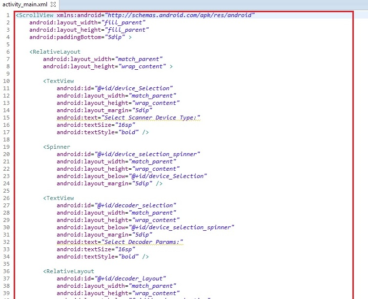      
 
3. In the `onCreate` method, we take reference of UI elements that are declared in `res/layout/activity_main.xml` in order to use them in our [Activity](http://developer.android.com/reference/android/app/Activity.html). We would then set `OnCheckedChangeListener` for all the checkboxes followed by `setOnTouchListener` for the "Scan" button that we have declared in UI.

    We will also set the Spinner Adapter to hold the list of Scanner devices and Scan Tones followed by the listener calls for both spinners.    

    We then call getEMDKManager so that the EMDK can be initialized and checked to see if it is ready. 

        :::java
        // Reference to UI elements
		statusTextView = (TextView) findViewById(R.id.textViewStatus);
		dataView = (EditText) findViewById(R.id.editText1);
		checkBoxCode11 = (CheckBox) findViewById(R.id.checkBoxCode11);
		checkBoxCode39 = (CheckBox) findViewById(R.id.checkBoxCode39);
		checkBoxCode128 = (CheckBox) findViewById(R.id.checkBoxCode128);
		checkBoxCodeUPCA = (CheckBox) findViewById(R.id.checkBoxUPCA);
		checkBoxEAN8 = (CheckBox) findViewById(R.id.checkBoxEan8);
		checkBoxEAN13 = (CheckBox) findViewById(R.id.checkBoxEan13);

		checkBoxIlluminationMode = (CheckBox) findViewById(R.id.illumination);
		checkBoxVibrationMode = (CheckBox) findViewById(R.id.vibration);

		checkBoxCode11.setOnCheckedChangeListener(this);
		checkBoxCode39.setOnCheckedChangeListener(this);
		checkBoxCode128.setOnCheckedChangeListener(this);
		checkBoxCodeUPCA.setOnCheckedChangeListener(this);
		checkBoxEAN8.setOnCheckedChangeListener(this);
		checkBoxEAN13.setOnCheckedChangeListener(this);
		checkBoxIlluminationMode.setOnCheckedChangeListener(this);
		checkBoxVibrationMode.setOnCheckedChangeListener(this);

		deviceSelectionSpinner = (Spinner) findViewById(R.id.device_selection_spinner);
		scanToneSpinner = (Spinner) findViewById(R.id.scan_tone_spinner);

		// Adapter to hold the list of scan tone options
		spinnerDataAdapter = new ArrayAdapter<String>(this,
				android.R.layout.simple_spinner_item, getResources()
						.getStringArray(R.array.scan_tone_array));
		spinnerDataAdapter
				.setDropDownViewResource(android.R.layout.simple_spinner_dropdown_item);
		// Set adapter to scan tone drop down
		scanToneSpinner.setAdapter(spinnerDataAdapter);

		// Add onClick listener for scan button to enable soft scan through app
		addScanButtonListener();

		// On Item Click Listener of Scanner Devices Spinner
		addSpinnerScannerDevicesListener();

		// On Item Click Listener of Scan Tone Spinner
		addSpinnerScanToneListener();

		// The EMDKManager object will be created and returned in the callback.
		EMDKResults results = EMDKManager.getEMDKManager(
				getApplicationContext(), this);
		// Check the return status of getEMDKManager and update the status Text
		// View accordingly
		if (results.statusCode != EMDKResults.STATUS_CODE.SUCCESS) {
			statusTextView.setText("EMDKManager Request Failed");
		}

    So the complete `onCreate` method looks like:
     
     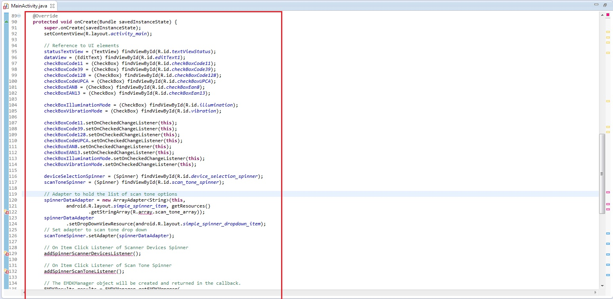

4. You will see some errors, which we need to get rid of. So first, we need to provide `scan_tone_array` to the spinner data adapter. So create `arrays.xml` file under `res/values` folder and write following code of array in `<resources>` tag. This will remove the adapter error.

        :::xml
		<!-- Array of type of streaming on which the scan beep should be played -->
        <string-array name="scan_tone_array">
          <item>NONE (Silent Mode)</item>
          <item>Adara.ogg</item>
          <item>Antimony.ogg</item>
          <item>Xenon.ogg</item>
          <item>Vega.ogg</item>
          <item>decode-short.wav</item>
          <item>decode.wav</item>
        </string-array>

    So the complete `arrays.xml` code looks like:
     
     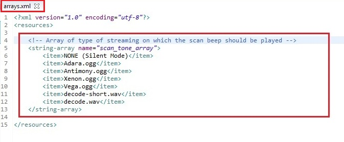

5. Next, We need to add listeners for `Scanner Devices` and `Scan Tone` spinners. The listener for scanner devices spinner will disable the scanner if there is any using `deInitScanner` method and create new scanner instance of scanner device selected from this spinner with the help of index stored in `scannerIndex` using `initializeScanner` method. It will then call `setProfile` method which will set whatever the parameters are enabled in the User interface for various features.

    > Note: We need to re-initialize the scanner and set the properties as we change the device type.

    The listener for scan tone will simply call `setProfile` method, which will set the parameters selected by user on the User Interface.

    > Note: For scan tone spinner listener, we don't need to re-initialize scanner as we are not changing scanner device.

        :::java
        // Listener for Scanner Device Spinner
		private void addSpinnerScannerDevicesListener() {
	
		 deviceSelectionSpinner
					.setOnItemSelectedListener(new OnItemSelectedListener() {
	
				@Override
				public void onItemSelected(AdapterView<?> parent,
								View arg1, int position, long arg3) {
	
					scannerIndex = position;
					try {
						deInitScanner();
						initializeScanner();
						setProfile();
					} catch (ScannerException e) {
								e.printStackTrace();
					}
				}
	
				@Override
				public void onNothingSelected(AdapterView<?> arg0) {
					// TODO Auto-generated method stub
				}
			});
		}
	
		// Listener for Scan Tone Spinner
		private void addSpinnerScanToneListener() {
	
			scanToneSpinner.setOnItemSelectedListener(new OnItemSelectedListener() {
	
				@Override
				public void onItemSelected(AdapterView<?> parent, View arg1,
						int position, long arg3) {
	
					// Ignore Scan Tone spinner firing of for the first time, which
					// is not required
					if (isScanToneFirstTime)
						setProfile();
					else
						isScanToneFirstTime = true;
				}
	
				@Override
				public void onNothingSelected(AdapterView<?> arg0) {
					// TODO Auto-generated method stub
				}
			});
		}

	> Note: The purpose of `isScanToneFirstTime` boolean is to simply avoid calling `setProfile` again in the scan tone spinner initially, as it has already been set in the device spinner.  

    This is how it looks like:
     
	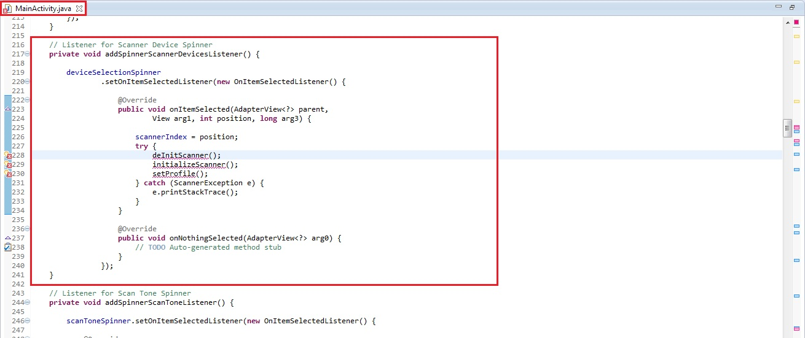

	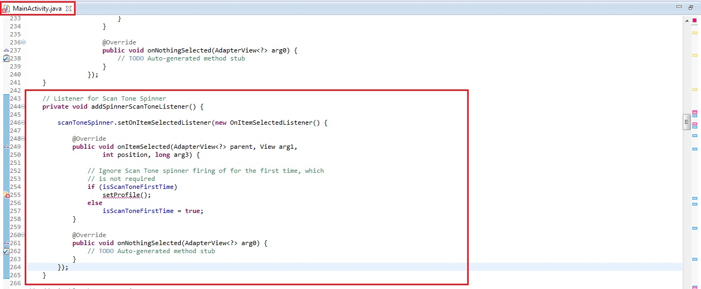

6. We will now add the `setOnTouchListener` for Scan button. The purpose behind this is to scan barcodes by calling `read` method when user presses the Scan button and stop scanning by canceling any pending asynchronous read calls using `cancelRead` method when user releases the Scan button. The `read` method will not turn ON the scanner. It will, however, put the scanner in a state in which the scanner can be turned ON either by pressing a hardware trigger or can be turned ON automatically. This is determined by the `Scanner.TriggerType`. In order to scan barcodes using button through our application, we need to set the trigger type to `TriggerType.SOFT_ONCE` where the scan beam will come up automatically without having to press the hard scan trigger on the device after issuing the read call.

		:::java
		// Listener for scan button that uses soft scan to scan barcodes through app
		private void addScanButtonListener() {
			Button scanButton = (Button) findViewById(R.id.btn_scan);
			// On Touch listener for scan button that scans barcodes when pressed
			// and stops
			// scanning when the button is released
			scanButton.setOnTouchListener(new OnTouchListener() {
				@Override
				public boolean onTouch(View v, MotionEvent event) {
					// Scan Button Press Event
					if (event.getAction() == MotionEvent.ACTION_DOWN) {
						try {
							// Enable Soft scan
							scanner.triggerType = TriggerType.SOFT_ONCE;
							// cancel any pending reads before reading barcodes
							if (scanner.isReadPending())
								scanner.cancelRead();
							// Puts the device in a state where it can scan barcodes
							scanner.read();
						} catch (ScannerException e) {
							e.printStackTrace();
						}
						// Scan Button Release Event
					} else if (event.getAction() == MotionEvent.ACTION_UP) {
						try {
							// cancel any pending reads before reading barcodes
							if (scanner.isReadPending())
								scanner.cancelRead();
						} catch (ScannerException e) {
							e.printStackTrace();
						}
					}
					return false;
				}
			});
		}

	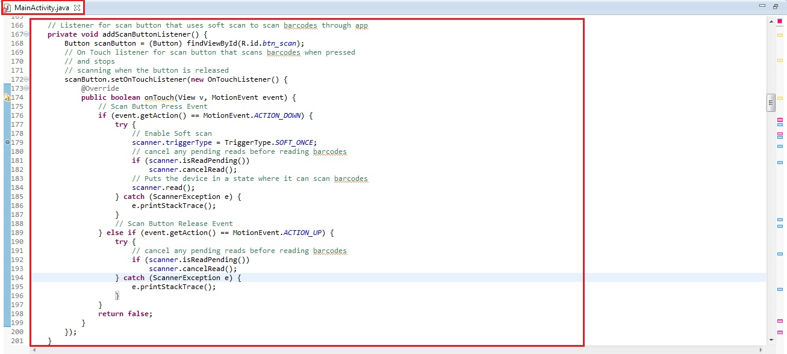 

7. It will still show few errors as we have not specified the required methods yet. So first we will add `deInitScanner()` method that cancels any pending read operations, removes all status and data listeners, disables the existing scanner instance and sets the scanner instance to `NULL`.

        :::java
	    // Disable the scanner instance
		private void deInitScanner() {
	
			if (scanner != null) {
				try {
					scanner.cancelRead();
	
					scanner.removeDataListener(this);
					scanner.removeStatusListener(this);
					scanner.disable();
	
				} catch (ScannerException e) {
					// TODO Auto-generated catch block
					statusTextView.setText("Status: " + e.getMessage());
				}
				scanner = null;
			}
		}

    This is how `deInitScanner` method looks like:
     
    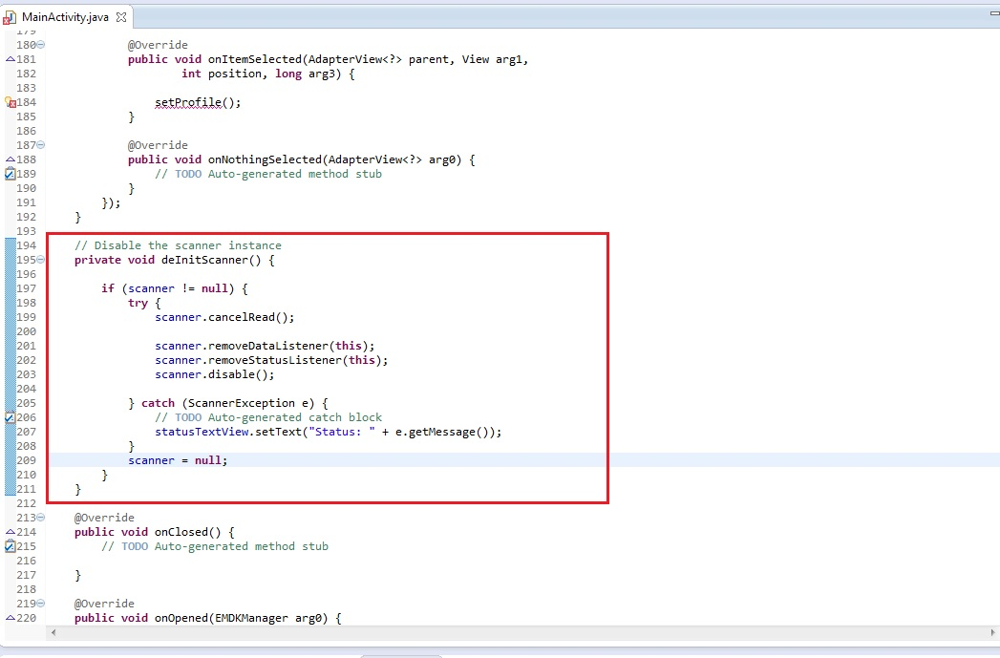

7. Next, we will write a method `initializeScanner` to initialize and enable the scanner and its listeners such as status, data etc. by using [Barcode Manager](/emdk-for-android/9-0/api) object. The `enable` method enables the scanner hardware. This method does not make the scanner to scan or turn on the laser. Basically it will make the scanner device available for your application. If the same of scanner is enabled by other applications, this will throws ScannerExceptions. You must call `disable()` when you are done the scanning, otherwise it will remain locked and be unavailable to other applications.

	In case of any errors, the `statusTextView` will display a failure message to notify user.

		:::java
		// Method to initialize and enable Scanner and its listeners
		private void initializeScanner() throws ScannerException {
	
			if (deviceList.size() != 0) {
				scanner = barcodeManager.getDevice(deviceList.get(scannerIndex));
			} else {
				statusTextView
						.setText("Status: "
								+ "Failed to get the specified scanner device! Please close and restart the application.");
			}
	
			if (scanner != null) {
	
				// Add data and status listeners
				scanner.addDataListener(this);
				scanner.addStatusListener(this);
	
				try {
					// Enable the scanner
					scanner.enable();
	
				} catch (ScannerException e) {
					// TODO Auto-generated catch block
					statusTextView.setText("Status: " + e.getMessage());
				}
			}
		}

    This is how `initializeScanner` method looks like:
     
    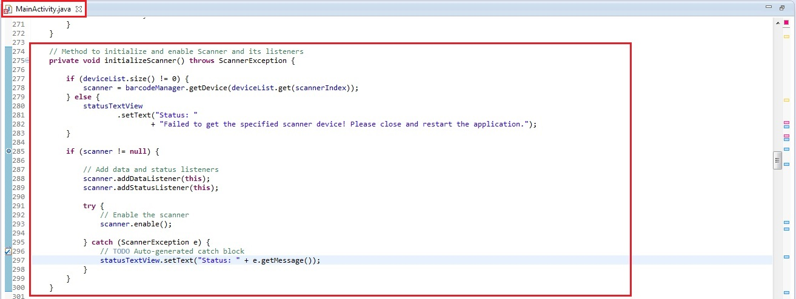

8. Now, we will add `setProfile` method. This method will create an instance of [ScannerConfig](/emdk-for-android/9-0/api), which will allow us to modify scanner properties (Ex. [Decoder Params](/emdk-for-android/9-0/api), [Reader Params](/emdk-for-android/9-0/api), [Scan Params](/emdk-for-android/9-0/api) etc.) and set the changes back to the scanner instance. Here, we will read the checkboxes and spinner values and set them accordingly to the scanner instance through [ScannerConfig](/emdk-for-android/9-0/api). `config` is name of [ScannerConfig](/emdk-for-android/9-0/api) instance.

	Initially we will cancel any pending asynchronous read calls before applying profile and reading barcodes using `cancelRead` method on the `scanner` instance.  

    `config.decoderParams` allows us to set all the decoder params such as `code11`,`code39` etc. `readerParams.readerSpecific.cameraSpecific.illuminationMode` enables user to set [Illumination Mode](/emdk-for-android/9-0/api), which is available only for CameraSpecific devices. `config.scanParams.decodehapticfeedback` lets you set [Vibration Mode](/emdk-for-android/9-0/api) of the scanning device. `config.scanParams.decodeAudioFeedbackUri` will accept a URI for the [Audio Tone](/emdk-for-android/9-0/api) that user needs to set while scanning a barcode.

    > Note: An empty URI (Ex. `config.scanParams.decodeAudioFeedbackUri = "";`) indicates that there will not be any scan tone while scanning a barcode. In other words, it would be your silent mode.

		:::java
		// Sets the user selected Barcode scanning Profile
		public void setProfile() {
			try {
	
				// cancel any pending asynchronous read calls before applying profile
				// and start reading barcodes
				if (scanner.isReadPending())
					scanner.cancelRead();
	
				ScannerConfig config = scanner.getConfig();
	
				// Set code11
				if (checkBoxCode11.isChecked()) {
					config.decoderParams.code11.enabled = true;
				} else {
					config.decoderParams.code11.enabled = false;
				}
	
				// Set code39
				if (checkBoxCode39.isChecked()) {
					config.decoderParams.code39.enabled = true;
				} else {
					config.decoderParams.code39.enabled = false;
				}
	
				// Set code128
				if (checkBoxCode128.isChecked()) {
					config.decoderParams.code128.enabled = true;
				} else {
					config.decoderParams.code128.enabled = false;
				}
	
				// set codeUPCA
				if (checkBoxCodeUPCA.isChecked()) {
					config.decoderParams.upca.enabled = true;
				} else {
					config.decoderParams.upca.enabled = false;
				}
	
				// set EAN8
				if (checkBoxEAN8.isChecked()) {
					config.decoderParams.ean8.enabled = true;
				} else {
					config.decoderParams.ean8.enabled = false;
				}
	
				// set EAN13
				if (checkBoxEAN13.isChecked()) {
					config.decoderParams.ean13.enabled = true;
				} else {
					config.decoderParams.ean13.enabled = false;
				}
	
				// set Illumination Mode, which is available only for
				// INTERNAL_CAMERA1 device type
				if (checkBoxIlluminationMode.isChecked()
						&& deviceSelectionSpinner.getSelectedItem().toString()
								.contains("Camera")) {
					config.readerParams.readerSpecific.cameraSpecific.illuminationMode = IlluminationMode.ON;
				} else {
					config.readerParams.readerSpecific.cameraSpecific.illuminationMode = IlluminationMode.OFF;
				}
	
				// set Vibration Mode (decodeHapticFeedback)
				if (checkBoxVibrationMode.isChecked()) {
					config.scanParams.decodeHapticFeedback = true;
				} else {
					config.scanParams.decodeHapticFeedback = false;
				}
	
				// Set the Scan Tone selected from the Scan Tone Spinner
				config.scanParams.audioStreamType = AudioStreamType.RINGER;
				String scanTone = scanToneSpinner.getSelectedItem().toString();
				if (scanTone.contains("NONE"))
					// Silent Mode (No scan tone will be played)
					config.scanParams.decodeAudioFeedbackUri = "";
				else
					// Other selected scan tones from the drop-down
					config.scanParams.decodeAudioFeedbackUri = "system/media/audio/notifications/"
							+ scanTone;
	
				scanner.setConfig(config);
	
				// Starts an asynchronous Scan. The method will not turn
				// ON the
				// scanner. It will, however, put the scanner in a state
				// in which
				// the scanner can be turned ON either by pressing a
				// hardware
				// trigger or can be turned ON automatically.
				scanner.read();
	
				Toast.makeText(MainActivity.this,
						"Changes Appplied. Press Scan Button to start scanning...",
						Toast.LENGTH_SHORT).show();
	
			} catch (ScannerException e) {
				statusTextView.setText(e.toString());
			}
		}  

    The `setProfile` method looks like:
     
    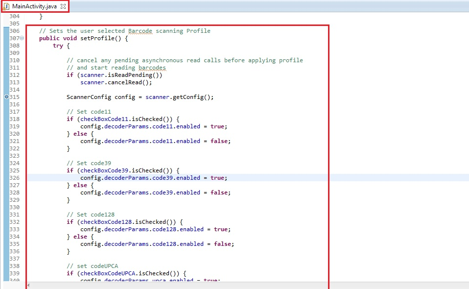  
    
9. Whenever the user checks or unchecks any checkbox, we update the settings to the scanner instance at runtime by calling `setProfile()` method through `onCheckedChanged` method of the `OnCheckedChangeListener` that we implemented earlier. So add the method call in `onCheckedChanged()` method.

		:::java
		setProfile();

    This looks like:
     
    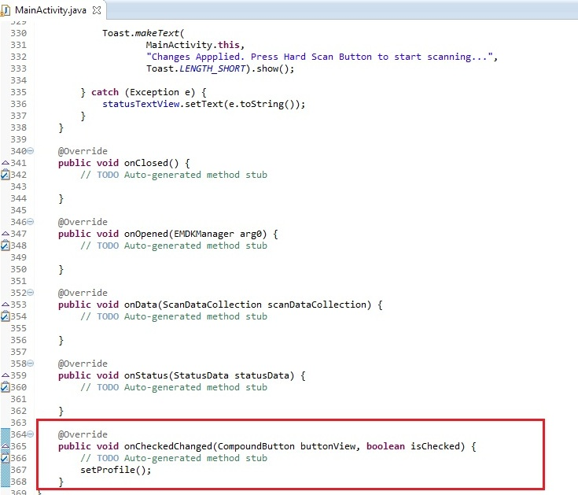

10. Now we need to use the `onOpened` method to get a reference to the [EMDKManager](/emdk-for-android/9-0/api). The [EMDKListener](/emdk-for-android/9-0/api) interface will trigger this event when the EMDK is ready to be used. The [EMDKListener](/emdk-for-android/9-0/api) interface must be implemented in order to get a reference to the EMDKManager APIs. This event will pass the EMDKManager instance and we assign it to the global variable `emdkManager` that we created in the earlier steps. We have used that instance to get an instance of [Barcode Manager](/emdk-for-android/9-0/api) to enable scanning.

    Once that is done, we need to get all the scanner devices that a Zebra Android device supports with the default one selected first using `enumerateScannerDevices()` that we will declare in the next step. We are not calling `initializeScanner()` and `setProfile` methods here as we have already called them in the device selection spinner listener.

	> Note: 
    > Rename the argument of `onOpened` method from `arg0` to `emdkManager` 

		:::java
		this.emdkManager = emdkManager;

		// Get the Barcode Manager object
		barcodeManager = (BarcodeManager) this.emdkManager
				.getInstance(FEATURE_TYPE.BARCODE);

		// Get the supported scanner devices
		enumerateScannerDevices();  

    Your complete `onOpened` method should now look like this:
    
    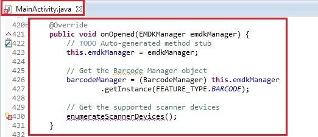
    	                        
11. To get rid of error, we will create `enumerateScannerDevices` that will get all the scanner devices that a Zebra Android device supports with the default one selected first. It uses `getSupportedDevicesInfo` method on `barcodeManager` instance that returns a list of supported scanner devices for that particular Zebra device. We will then iterate through this list, get the friendly names of each scanner device and add them to our list with those names to show user in Device Spinner.

		:::java
		// Go through and get the available scanner devices
		private void enumerateScannerDevices() {
	
			if (barcodeManager != null) {
	
				List<String> friendlyNameList = new ArrayList<String>();
				int spinnerIndex = 0;
				// Set the default selection in the spinner
				int defaultIndex = 0;
	
				deviceList = barcodeManager.getSupportedDevicesInfo();
	
				if (deviceList.size() != 0) {
	
					Iterator<ScannerInfo> it = deviceList.iterator();
					while (it.hasNext()) {
						ScannerInfo scnInfo = it.next();
						friendlyNameList.add(scnInfo.getFriendlyName());
						if (scnInfo.isDefaultScanner()) {
							defaultIndex = spinnerIndex;
						}
						++spinnerIndex;
					}
				} else {
					statusTextView
							.setText("Status: "
									+ "Failed to get the list of supported scanner devices! Please close and restart the application.");
				}
	
				spinnerDataAdapter = new ArrayAdapter<String>(MainActivity.this,
						android.R.layout.simple_spinner_item, friendlyNameList);
				spinnerDataAdapter
						.setDropDownViewResource(android.R.layout.simple_spinner_dropdown_item);
	
				deviceSelectionSpinner.setAdapter(spinnerDataAdapter);
				deviceSelectionSpinner.setSelection(defaultIndex);
	
			}
		}

	Your complete `enumerateScannerDevices` method should now look like this:
    
    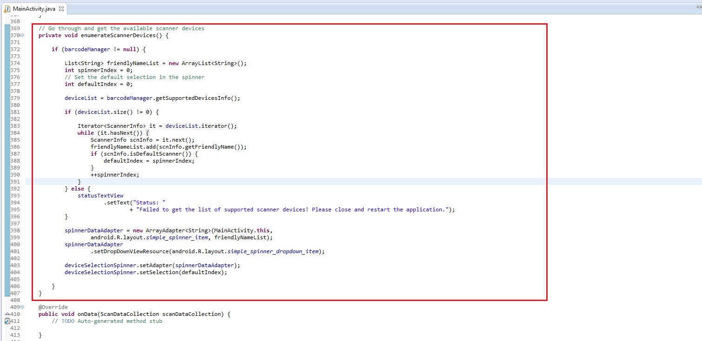

9. As mentioned earlier that whenever a barcode is scanned, its data will be received in a callback `onData` method upon data availability. So we need to get that data, process it in the format we want and populate in the [EditText](http://developer.android.com/reference/android/widget/EditText.html) of UI.

    The received data should be processed on a background thread not to block the UI thread. Hence we will use Android's own [AsyncTask](http://developer.android.com/reference/android/os/AsyncTask.html) to process the scanned data on background thread. So we create AsyncTask `AsyncDataUpdate` that takes [ScanDataCollection](/emdk-for-android/9-0/api), which has the scanned data. It then processes this object in `doInBackground` method to filter the barcode data and label type in strings, which is then passed to the UI thread in `onPostExecute` method of AsyncTask to Populate.

        :::java
        // Update the scan data on UI
	    int dataLength = 0;

	    // AsyncTask that configures the scanned data on background
	    // thread and updated the result on UI thread with scanned data and type of
	    // label
	    private class AsyncDataUpdate extends
			AsyncTask<ScanDataCollection, Void, String> {

		  @Override
		  protected String doInBackground(ScanDataCollection... params) {
			ScanDataCollection scanDataCollection = params[0];

			// Status string that contains both barcode data and type of barcode
			// that is being scanned
			String statusStr = "";

			// The ScanDataCollection object gives scanning result and the
			// collection of ScanData. So check the data and its status
			if (scanDataCollection != null
					&& scanDataCollection.getResult() == ScannerResults.SUCCESS) {

				ArrayList<ScanData> scanData = scanDataCollection.getScanData();

				// Iterate through scanned data and prepare the statusStr
				for (ScanData data : scanData) {
					// Get the scanned data
					String barcodeDate = data.getData();
					// Get the type of label being scanned
					LabelType labelType = data.getLabelType();
					// Concatenate barcode data and label type
					statusStr = barcodeDate + " " + labelType;
				}
			}

			// Return result to populate on UI thread
			return statusStr;
		  }

		  @Override
		  protected void onPostExecute(String result) {
			// Update the dataView EditText on UI thread with barcode data and
			// its label type
			if (dataLength++ > 50) {
				// Clear the cache after 50 scans
				dataView.getText().clear();
				dataLength = 0;
			}
			dataView.append(result + "\n");
		  }

		  @Override
		  protected void onPreExecute() {
		  }

		  @Override
		  protected void onProgressUpdate(Void... values) {
		  }
	    }

    We call this AsyncTask in overridden `onData` method, by creating an instance of `AsyncDataUpdate` and passing the `scanDataCollection` for further processing.

        :::java
        // Use the scanned data, process it on background thread using AsyncTask
		// and update the UI thread with the scanned results
		new AsyncDataUpdate().execute(scanDataCollection);

    So the `onData` method and `AsyncDataUpdate` looks like:
    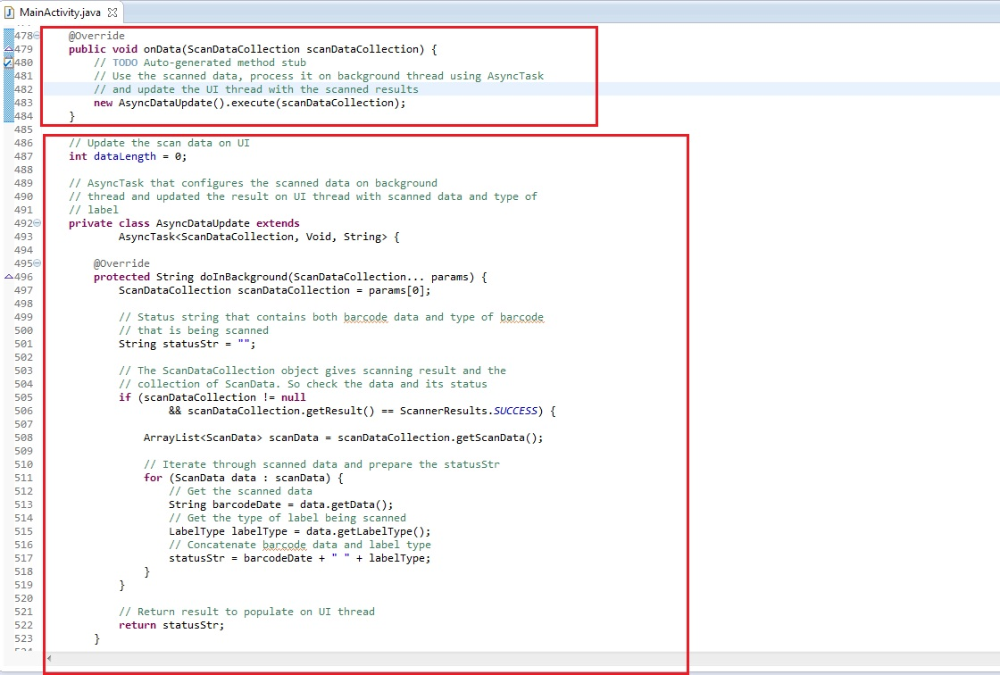
  
10. Whether we scan the barcode by pressing the hard scan key or keep it idle, it returns the status of the scanner at specific point of time in the overridden `onStatus` method of implemented `StatusListener` interface. Since we are also displaying the status along with barcode data, we will make use of this method and populate the status.

    Just like scanned data, we are also processing the scanner status on a background thread. Hence we will create another [AsyncTask](http://developer.android.com/reference/android/os/AsyncTask.html) named `AsyncStatusUpdate` that takes [StatusData](/emdk-for-android/9-0/api) and processes it in `doInBackground` method to retrieve state in string format which is populated in status Text View on UI thread in `onPostExecute` method of the AsyncTask.              

        :::java
        // AsyncTask that configures the current state of scanner on background
	    // thread and updates the result on UI thread
	    private class AsyncStatusUpdate extends AsyncTask<StatusData, Void, String> {

		  @Override
		  protected String doInBackground(StatusData... params) {
			// Get the current state of scanner in background
			StatusData statusData = params[0];
			String statusStr = "";
			ScannerStates state = statusData.getState();
			// Different states of Scanner
			switch (state) {
			// Scanner is IDLE
			case IDLE:
				statusStr = "The scanner enabled and its idle";
				isScanning = false;
				break;
			// Scanner is SCANNING
			case SCANNING:
				statusStr = "Scanning..";
				isScanning = true;
				break;
			// Scanner is waiting for trigger press
			case WAITING:
				statusStr = "Waiting for trigger press..";
				break;
			// Scanner is not enabled
			case DISABLED:
				statusStr = "Scanner is not enabled";
				break;
			default:
				break;
			}
			// Return result to populate on UI thread
			return statusStr;
		  }

		  @Override
		  protected void onPostExecute(String result) {
			// Update the status text view on UI thread with current scanner
			// state
			statusTextView.setText(result);
		  }

		  @Override
		  protected void onPreExecute() {
		  }

		  @Override
		  protected void onProgressUpdate(Void... values) {
		  }
	    }

    We call this AsyncTask in overridden `onStatus` method, by creating an instance of `AsyncStatusUpdate` and passing the `StatusData` for further processing.

        :::java
        // process the scan status event on the background thread using
		// AsyncTask and update the UI thread with current scanner state
		new AsyncStatusUpdate().execute(statusData);

    So the `onStatus` method and `AsyncStatusUpdate` looks like:
    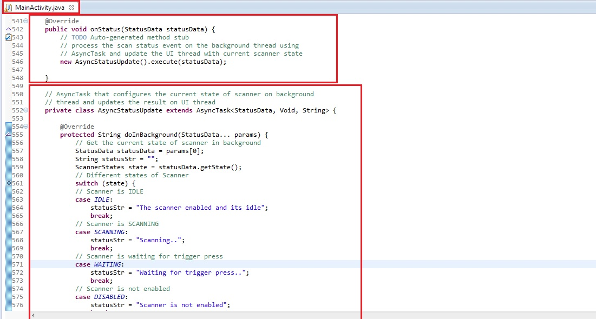

11. Now let's override the `onDestroy` method so we can release the EMDKManager and BarcodeManager resources:  

        :::java
	    @Override
		protected void onDestroy() {
			super.onDestroy();
	
			if (barcodeManager != null)
				barcodeManager = null;
	
			if (emdkManager != null) {
	
				// Clean up the objects created by EMDK manager
				emdkManager.release();
				emdkManager = null;
			}
		} 

    Your `onDestroy` method should now look like this:  

    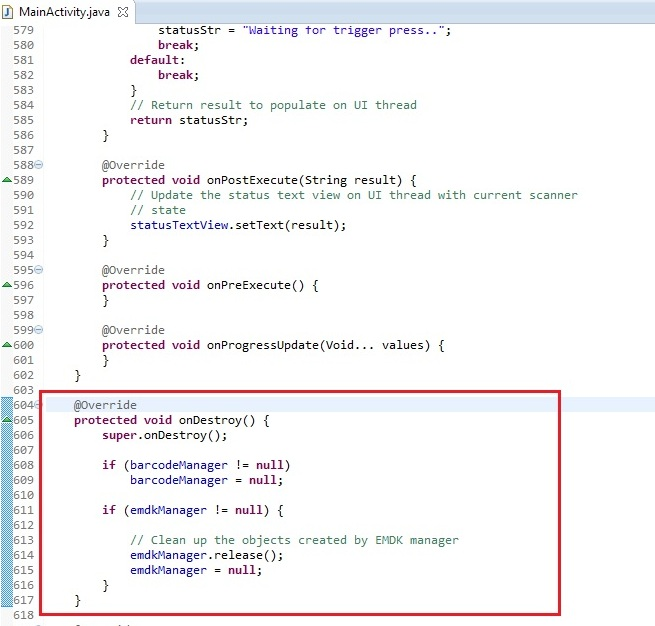

12. When we are done with scanning, we must release the scanner hardware resources for other applications to use. So override `onStop` method and disable the scanner by calling `deInitScanner` method to release it.

        :::java
	    @Override
		protected void onStop() {
			// TODO Auto-generated method stub
			super.onStop();
			deInitScanner();
		}

    Your `onStop` method should now look like this:  

    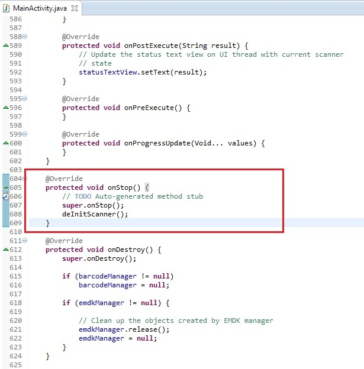 

13. Finally, Clean up the objects created by EMDK manager in `onClosed` method, if EMDK closed abruptly.

        :::java
        // The EMDK closed abruptly. // Clean up the objects created by EMDK
		// manager
		if (this.emdkManager != null) {

			this.emdkManager.release();
			this.emdkManager = null;
		}

    Your `onClosed` method should now look like this:  

    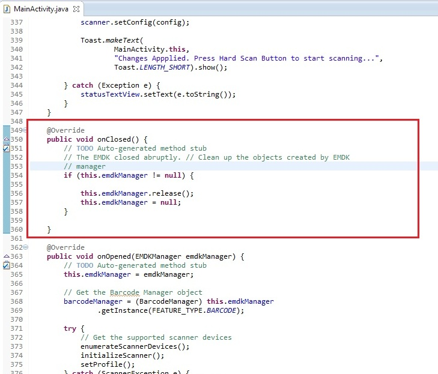
	
That's it!!! We are done with all the coding part that will let us perform some advanced barcode scanning operations on our Zebra Android device using [Barcode/Scanning APIs](/emdk-for-android/9-0/api) introduced in EMDK V 3.0. Now let us run the application.
 
## Running the Application

1. Connect the device to a USB port. 

2. Run the application.

    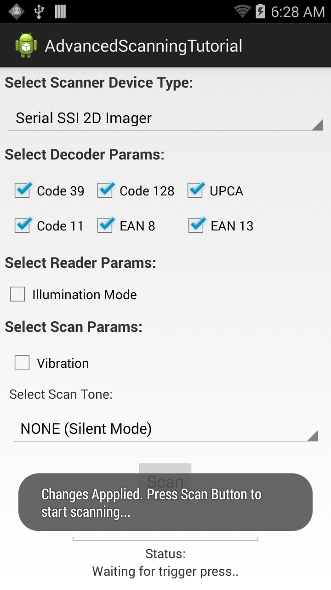

    You can see a [Toast](http://developer.android.com/guide/topics/ui/notifiers/toasts.html), which indicates that the Scanner has been enabled and you can start scanning by pressing hard scan button of the device.
  
3. Now if you press and hold the Scan button on the UI, the status listener in the code starts working and current status of Scanner is displayed in Status [TextView](http://developer.android.com/reference/android/widget/TextView.html), which is `Scanning`. The "Scanner Device Type" Spinner shows Serial SSI Scanner as it is the default scanner for Zebra TC55 device. All the decoders are checked, which means current configuration scan supports all of these decoder types. But Scan Tone is `NONE`, which means there won't be any tone/sound while scanning a barcode.   

    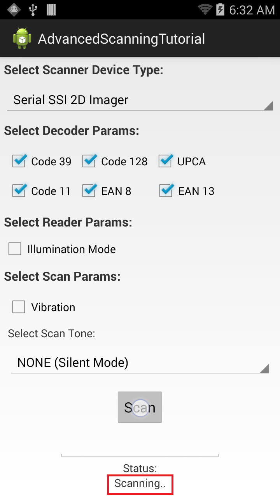

    The scanner status is always updated on the status text view below the Edit Text at the bottom.

4. Lets us change some configurations starting with the device type. We will change it to Camera Scanner.

	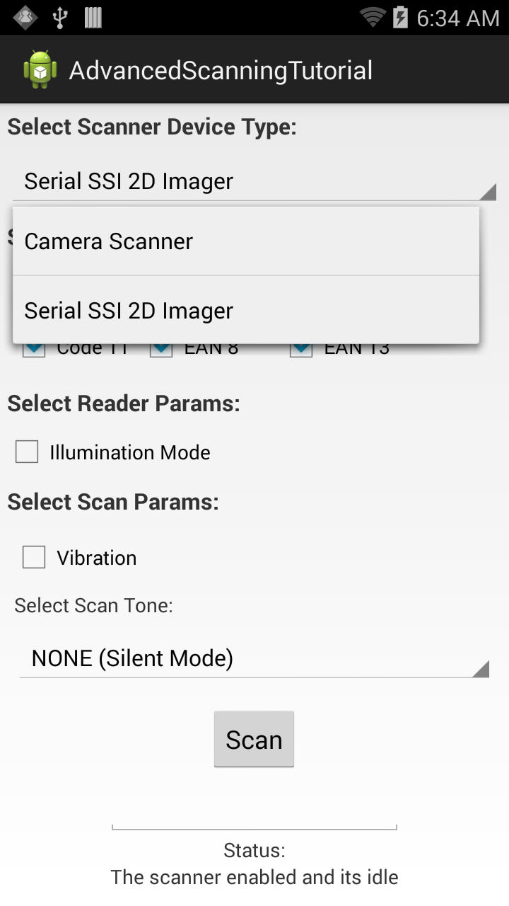

	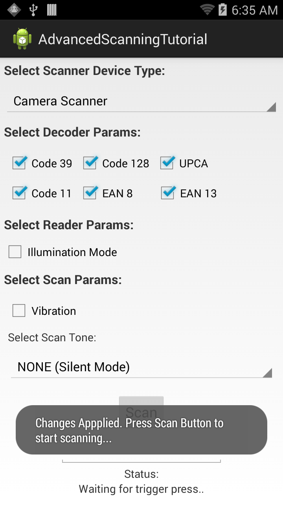

It will display a success toast when the changes are applied each time you change any scanner configuration just for your knowledge.

5. Next check the Vibration checkbox and select some scan tone from the Select Scan Tone spinner.

	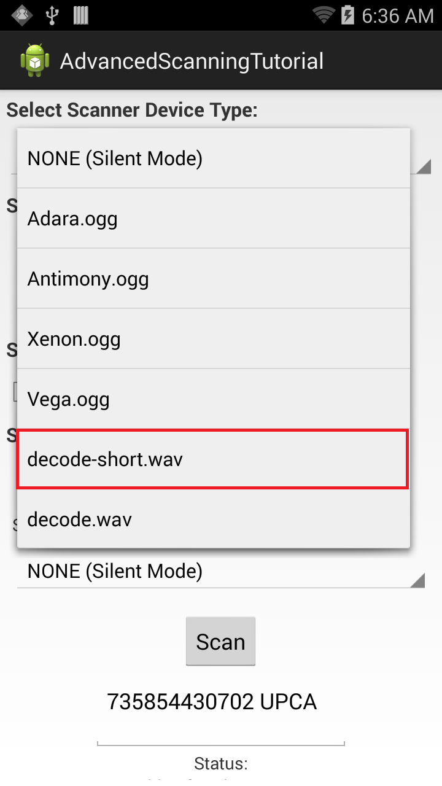

	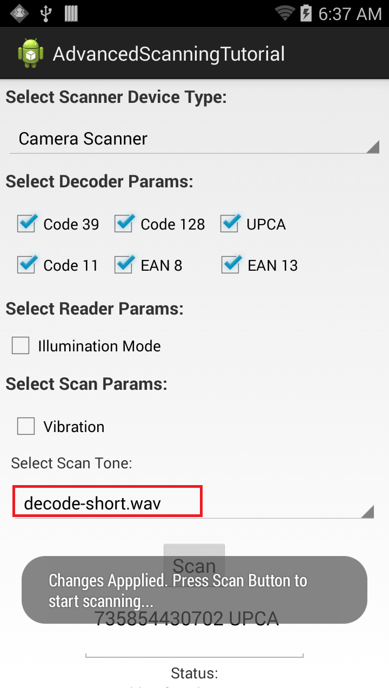

4. Now once again scan a barcode and this time it will open your device's camera to scan the barcode.

    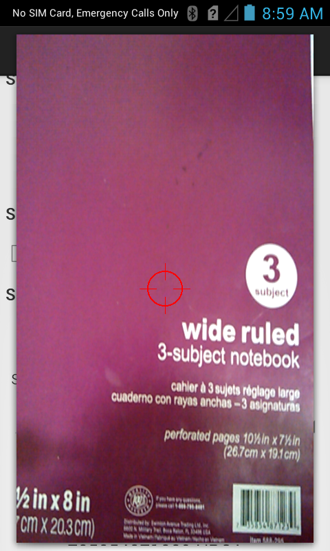

	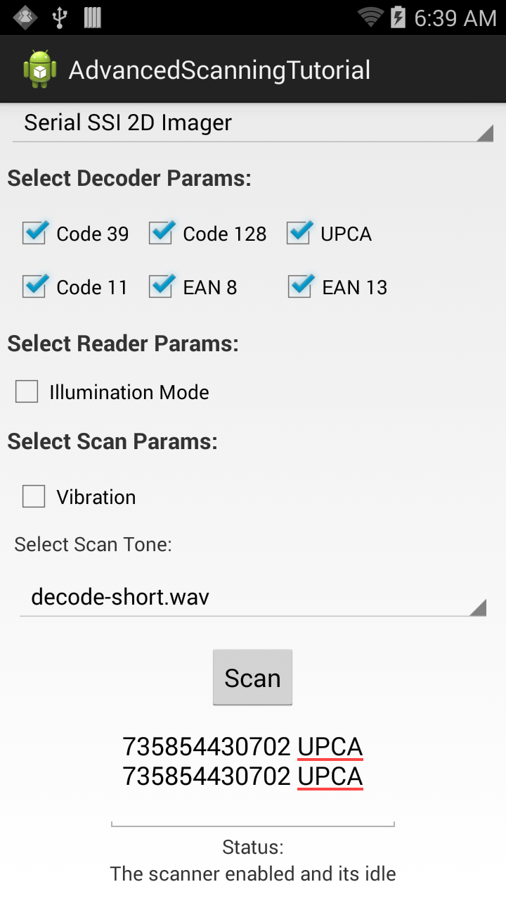  

    This is how [Barcode/Scanning APIs](/emdk-for-android/9-0/api) introduced in EMDK V 3.0 can be used to perform some of the Advanced Scanning operations using soft scan key through application on your Zebra devices without using Profile Wizard. 

##Important Programming Tips##

1. The following changes in the application's `AndroidManifest.xml` are required:  
  
    >Note:
    >* Include the permission for EMDK:  
    
        :::xml
        <uses-permission android:name="com.symbol.emdk.permission.EMDK"/>
    
	>Note:
    >* Use the EMDK library:  
    
        :::xml
        <uses-library android:name="com.symbol.emdk"/>
   
2. Use DataWedge v1.7.12 or higher to test the `ProfileManager.processProfile()` method for DataWedge profiles.

3. Optionally, the example below shows how to convert raw data (byte array) into hex format:

		:::java
		byte[] rawData = data.getRawData();
		StringBuilder builder = new StringBuilder();
		for(byte b : rawData) { 
			builder.append(String.format("%02x", b)); 
		}
		return builder.toString();

