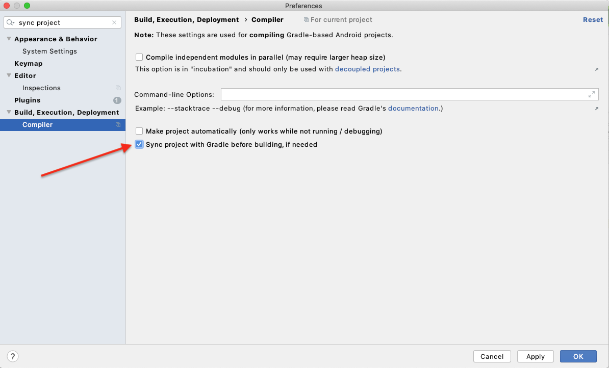
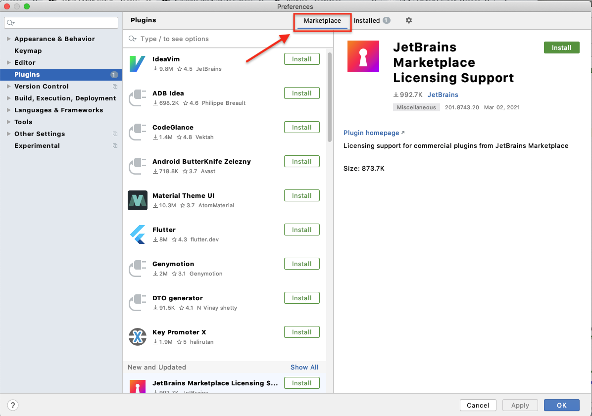
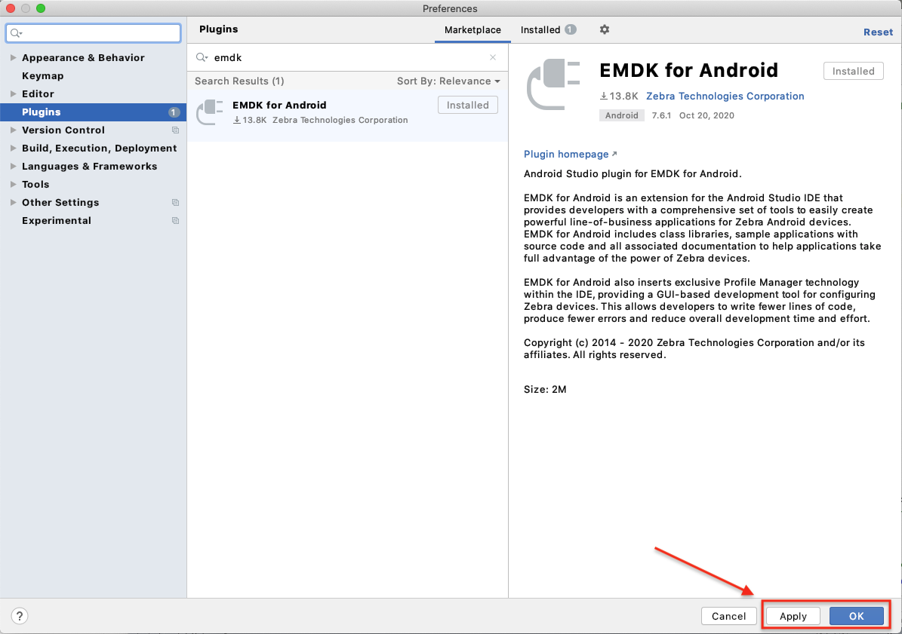

## Overview

**This document describes how to set up macOS and Windows computers running Android Studio to work with Zebra's EMDK for Android software development kit**. Android Studio enables Java developers to easily create powerful line-of-business apps for Android. EMDK extends Android Studio with tools to interface with and configure Zebra Android devices and their scanners, ports and other peripherals needed for data acquisition or other enterprise application requirements. 

### Prerequisites
The following software is required to use EMDK for Android:

#### Windows
* Windows 7, 8, 8.1, 10 (32- or 64-bit)
* [Android Studio](https://developer.android.com/studio/) 2.2 or later  
* A Java Development Kit (JDK)

#### macOS  
* macOS 10.10.5 Yosemite or later
* [Android Studio](https://developer.android.com/studio/) 2.2 or later
* A Java Development Kit (JDK) 

>**`IMPORTANT:`** Be sure to read and understand the licensing agreement(s) of any selected JDK or SDK.

-----

> **Please [install Android Studio](https://developer.android.com/studio/) before proceeding**. 

### Enable EMDK SDK

This section includes the minumum steps for enabling EMDK to build productivity apps targeting Zebra devices running Android. To add the capability to also configure device settings from a new or existing app, complete this section ***and*** the [EMDK Plugin section](#installemdkplugin). 

**To enable the EMDK SDK in Android Studio**:

1. a. In Android Studio, **go to the app module** in the Android project in which to use EMDK. 
   b. **Navigate to the** `build.gradle` **file**: 
   
_Click to enlarge; ESC to exit_. 
   c. **Add the following line to the dependencies section**: 

        :::java
            dependencies {
            compileOnly 'com.symbol:emdk:x.x.x' //  e.g. ‘com.symbol:emdk:7.6.10’
                ...
            }
2. From the menu bar, go to **Android Studio > Preferences > Build, Execution, Deployment > Compiler**. 
3. **Check the "Sync project with Gradle...**" box shown below: 
   
_Click to enlarge; ESC to exit_. 
4. **Enable Android permissions** by modifying the application's `Manifest.xml` file: 

         :::xml
         <manifest xmlns:android="http://schemas.android.com/apk/res/android" package="com.symbol.basicscansample1">
         <uses-permission android:name="com.symbol.emdk.permission.EMDK" />    
            <application>
         ...    
            </application>
         </manifest>
5. **For apps targeting devices running Android 11** (API 30) or later, add the following line in the &lt;queries&gt; note of the app's `Manifest.xml` file:

         :::xml
         <queries>
            ...
           <package android:name="com.symbol.emdk.emdkservice" />
         </queries>
6. **Enable the EMDK library** in the application node of the manifest:  
      
        :::xml
        <application>
         <uses-library android:name="com.symbol.emdk"/>    
         <activity>
         ...    
         </activity>
      </application>
 

#### [EMDK APIs](../../api) are now ready to use. 

#### Notes:
* In the build.gradle, a plus sign ("+") can be substituted for a major or minor version number in the dependencies section. For example, declaring `com.symbol:emdk:7.6+` uses SDK versions 7.6 and newer.
* The Java version used to compile a project is based on the `compileSdkVersion` selected for the project. Different versions of Android support different versions of Java. If necessary, the default Java version can be overridden. [Learn more](https://developer.android.com/studio/intro/studio-config#jdk). 

-----

### Install EMDK Plugin

The optional EMDK Plugin adds Profile Manager, a graphical UI for accessing the Zebra MX device-configuration layer built into every device. **Zebra strongly recommends using the EMDK Plugin if the app is intended to alter settings on the device**. 

> **NOTE**: Dialog boxes of Android Studio for macOS and Windows versions might vary slightly. 

**To set up the EMDK Plugin**:

1. [Uninstall prior EMDK installations](#uninstallemdk) and related files, if any.  
2. **Select a Project SDK**: 
   a. Open an Android Studio project (if not already open). 
   b. Select **File -> Project Structure**. 
   c. In the left-hand pane **under Project Settings, select "Project"** (if not already selected). 
   d. In the right-hand pane **under "Project SDK," select an SDK from the drop-down** or add or download one, as in the image below. 
   **NOTE:** The [Android development community recommends](https://developer.android.com/studio/intro/studio-config#jdk) using the latest OpenJDK. 
   
   _Click to enlarge; ESC to exit_. 
   e. **Click "Apply" and then "OK"** to close. 
3. **Install the EMDK for Android plugin**: 
   a. Go to **Android Studio -> Preferences.** 
   b. In the left-hand pane, **select "Plugins"** to show Installed Plugins and the Plugin Marketplace:
   
_Click to enlarge; ESC to exit_. 
   c. **Click "Marketplace"** (if necessary) to show available Plugins. 
   d. **Enter "emdk" in the search box** and **hit ENTER**. 
   e. **Click "Install**" button. 
   
_Click to enlarge; ESC to exit_. 
   f. **Click "Apply"** to activate the Plugin, then **Click "OK"** to close. 

_Click to enlarge; ESC to exit_. 

**The EMDK Plugin adds an "EMDK" menu** in the Android Studio menu bar: 
   
_Click to enlarge; ESC to exit_. 

##### EMDK Plugin is now ready to use. 

> **See the full list of [EMDK for Android Plugin versions](https://bintray.com/zebratechnologies/EMDKAndroid/com.symbol.emdk)**.

### Uninstall EMDK

#### Windows 

1. **Close Android Studio**, if open.
2. From **Windows -> All Programs -> EMDK for Android [vX.X], select "Uninstall."**  
3. **Follow prompts** to complete the uninstallation.

#### Mac OS

**Note**: This process references folders that are hidden by default. To unhide, see section below. 

**In the macOS Finder**:

1. **Remove SDK add-ons**:
   * Navigate to the `/Users/[userName]/Library/Android/sdk/add-ons` directory. 
   * Remove all `addon-symbol_emdk-symbol-XX` folders, if present. 
2. **Remove Wizard Core**:
   * Navigate to the `/Users/Shared` directory.
   * **Remove the "EMDK for Android" folder**, if present.
3. **Remove Wizard plugin**:
   * **Open Applications** folder.
   * Locate and **right-click Android Studio** app.
   * **Select "Show Package Contents"** from the menu.
   * Navigate to `Contents` -> `plugins` directory.
   * **Remove** `com.symbol.emdk.wizard.intellijIdea` **folder**, if present.

-----

**To unhide Mac OS folders**:

1. **Open Terminal** app (in Finder -> Applications -> Utilities).
2. **Paste the following into Terminal** window (and hit RETURN): 

      :::term
      defaults write com.apple.finder AppleShowAllFiles YES

3. **Right-click on the Finder icon** (in the Dock) while holding the "Option/alt" key.
4. **Select "Relaunch"** from the menu to make hidden files visible. 
5. **To reverse, replace "YES" with "NO"** in the Terminal command and repeat Step 3. 

