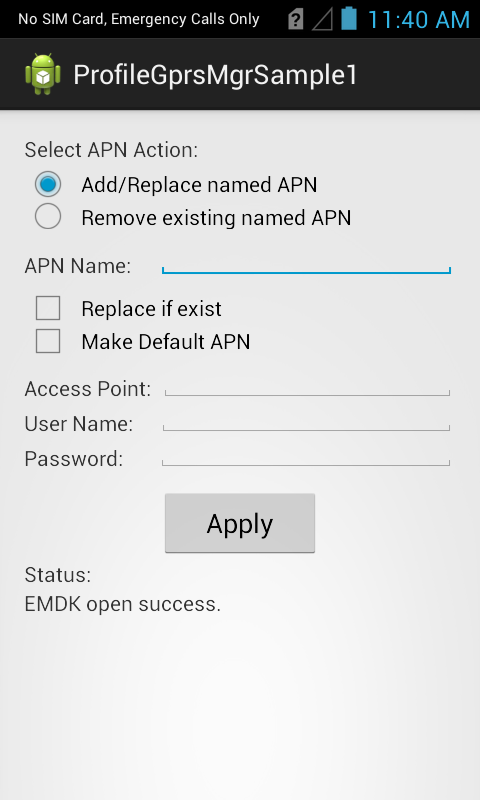
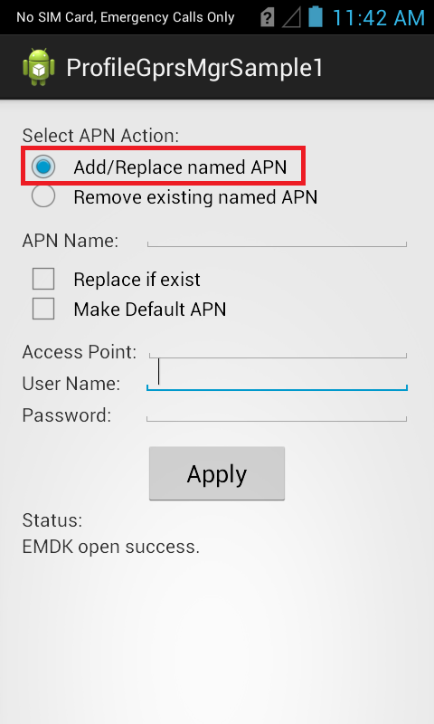
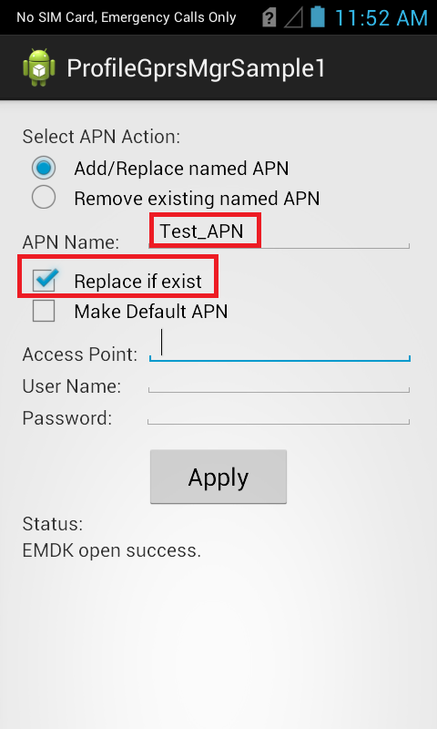
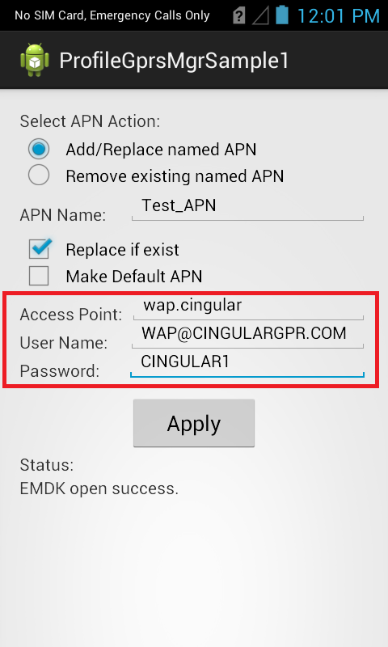
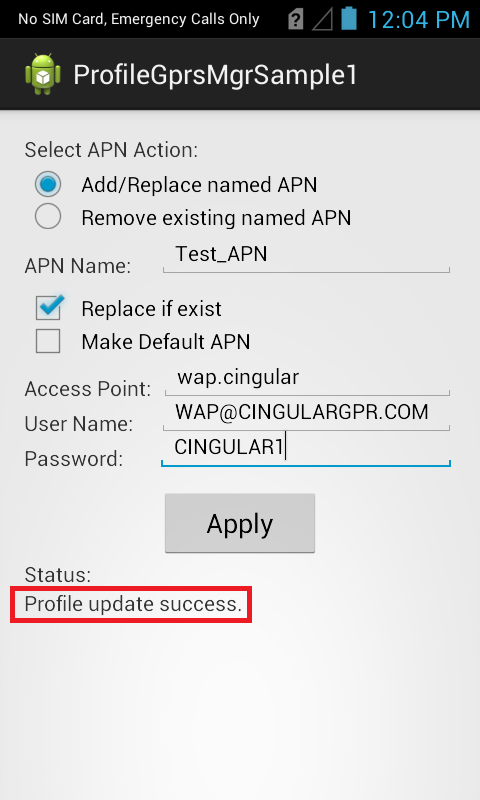

##Overview
The EMDK for Android allows you to add or remove APNs to a Zebra device. 

The available actions are:
  
* Add/Replace named APN  
* Remove existing named APN  
* Remove all existing APNs  

This sample application will allow you to Add/Replace named APN and remove existing named APN.

##Requirements
Android API 22 (or higher) must be installed via the SDK Manager before attempting to load this sample.

##Loading the Sample Application
The following guide will walk you through setting up the EMDK samples in your IDE.

* [Android Studio](/emdk-for-android/9-1/guide/emdksamples_androidstudio)

>**NOTE**: The appearance of sample app screens can vary by sample app version, Android version and screen size.

##Using This Sample
1. When the application starts it should look like the following.
  
  
  
2. Select Add/Remove named APN
  
     

3. Provide APN Name (Ex. "Test_APN") and check the checkbox "Replace if exist".

  

4. Provide the applicable APN details such as:

  Access Point: wap.cingular

  Use Name: WAP@CINGULARGPR.COM

  Password: CINGULAR1

  
  
5. Click "Apply" button.

6. Check the status field.   
    

