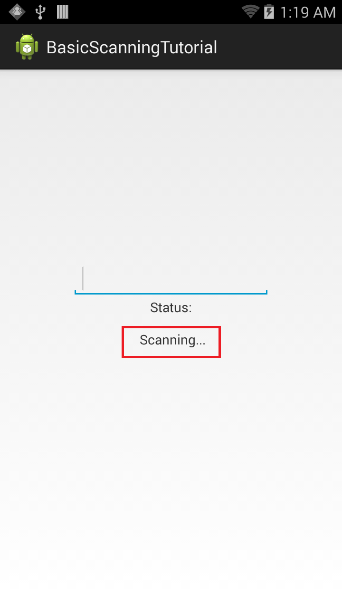
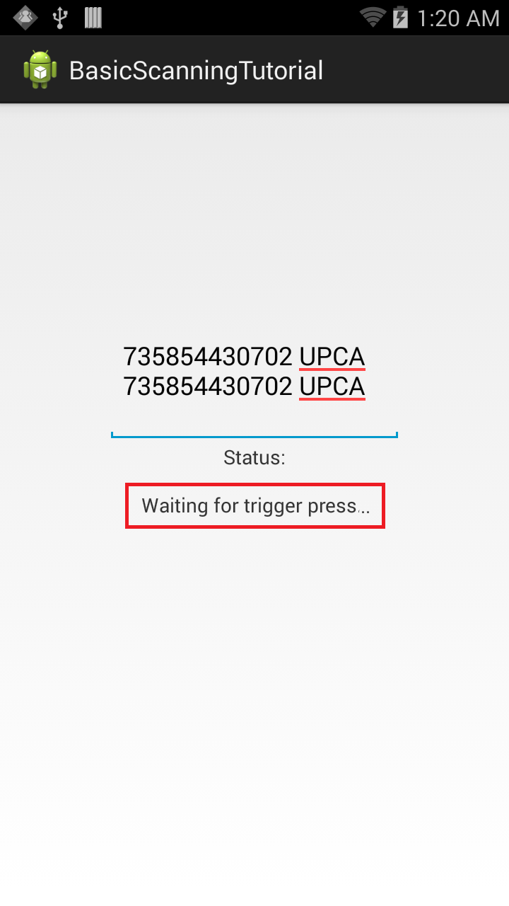

 <button type="button" class="close" data-dismiss="alert" aria-label="Close">×</button> <h4>Regarding EMDK Barcode Scanning APIs</h4> 
<u>Zebra strongly recommends the use of DataWedge for all applications that require barcode scanning</u>. <b>While Zebra will continue to support EMDK Barcode APIs</b>, the efficiency and feature richness of intent-based interfaces make it a simpler alternative to app development using EMDK Barcode APIs.
 
 <b>DataWedge facts</b>:
    
<ul>
        <li><b>DataWedge APIs have the same capabilities currently available in EMDK Barcode APIs.</li>
        <li><b>DataWedge intent-based APIs are easier and faster to implement than EMDK Barcode APIs.</li>
        <li><b>New features are added to DataWedge before being considered for EMDK Barcode APIs.</li>
    </ul>
     
    <a href="/datawedge" class="btn btn-danger">Learn About DataWedge</a>  

 

> **`IMPORTANT:`** Support for SimulScan features has been removed from EMDK for Android 8.0 (and later) for devices running Android 10 (and later). 

## Overview

This guide provides a walk-through of the steps for creating an application that uses [Barcode/Scanning APIs](../../api) to perform Scanning operations on a Zebra Android device without using Profile Wizard. The API uses [Barcode Manager](../../guide/barcode_scanning_guide/), which is the primary object for accessing barcode scanning features. 

> Note: **The demo app in this guide is intended for tutorial purposes only** and should not be used in production environments. 

-----

### Create The Project

Start by creating a new project in Android Studio. Call it `BasicScanningTutorial` to match later references in this guide. For help, see the [Android Studio tutorial](../../tutorial/tutCreateProjectAndroidStudio). 

### Enable Android Permissions

Modify the application's `Manifest.xml` file to use the EMDK library and to set permissions for EMDK to scan the barcodes. 

1. Enable permissions for `com.symbol.emdk.permission.EMDK`:  

	        :::xml
		<manifest xmlns:android="http://schemas.android.com/apk/res/android" package="com.symbol.basicscansample1">
			<uses-permission android:name="com.symbol.emdk.permission.EMDK" />    
			<application>
			...    
			</application>
		</manifest>

2. Enable the EMDK library in the application node:  
      
        :::xml
        <application>
        	<uses-library android:name="com.symbol.emdk"/>    
        	<activity>
			...    
			</activity>
		</application>

3. Add references to the libraries:  

        :::java
		import com.symbol.emdk.EMDKManager;
		import com.symbol.emdk.EMDKManager.EMDKListener;
		import com.symbol.emdk.EMDKResults;
		import com.symbol.emdk.barcode.BarcodeManager;
		import com.symbol.emdk.barcode.ScanDataCollection;
		import com.symbol.emdk.barcode.ScanDataCollection.ScanData;
		import com.symbol.emdk.barcode.Scanner;
		import com.symbol.emdk.barcode.Scanner.DataListener;
		import com.symbol.emdk.barcode.Scanner.StatusListener;
		import com.symbol.emdk.barcode.Scanner.TriggerType;
		import com.symbol.emdk.barcode.ScannerConfig;
		import com.symbol.emdk.barcode.ScannerException;
		import com.symbol.emdk.barcode.ScannerResults;
		import com.symbol.emdk.barcode.StatusData;
		import com.symbol.emdk.barcode.StatusData.ScannerStates;

4. Extend the activity to implement `EMDKListener`, implement `StatusListener` for notifying client applications to notify scan events, and override its `onStatus` function. Implement `DataListener` for notifying client applications to notify data events and override its `onData` function.
    
        :::java
			public class MainActivity extends Activity implements EMDKListener, StatusListener, DataListener {
				@Override
				public void onOpened(EMDKManager emdkManager) {
				// TODO Auto-generated method stub
				}
				@Override
				public void onClosed() {
				// TODO Auto-generated method stub
				}
				@Override
				public void onStatus(StatusData statusData) {
				// TODO Auto-generated method stub
				}
				@Override
				public void onData(ScanDataCollection scanDataCollection) {
				// TODO Auto-generated method stub
				}
			}

5. Create some global variables to hold the instance objects of `EMDKManager`, `BarcodeManager` and `Scanner`. These variables are used throughout the code. This section also adds some UI elements starting with a [TextView](http://developer.android.com/reference/android/widget/TextView.html) to display the status of the scanning operation and [EditText](http://developer.android.com/reference/android/widget/EditText.html) to populate scanned barcode data.
    
        :::java
        // Variables to hold EMDK related objects
        private EMDKManageremdkManager = null;
        private BarcodeManager barcodeManager = null;
        private Scanner scanner = null;
		// Variables to hold handlers of UI controls
		private TextView statusTextView = null;
		private EditText dataView = null;

6. Design a simple UI that has a [TextView](http://developer.android.com/reference/android/widget/TextView.html) to display the status of scanning operation. Above that is an [EditText](http://developer.android.com/reference/android/widget/EditText.html) element to populate scanned barcode data.

7. Remove all the code inside the `res/layout/activity_main.xml` folder and add the following XML layout code for the UI:

        :::xml
        <RelativeLayout xmlns:android="http://schemas.android.com/apk/res/android"
        xmlns:tools="http://schemas.android.com/tools"
        android:layout_width="match_parent"
        android:layout_height="match_parent"
        android:padding="16dip"
        tools:context=".MainActivity" >

          <EditText
          android:id="@+id/editText1"
          android:layout_width="wrap_content"
          android:layout_height="wrap_content"
          android:layout_above="@+id/textViewStatusTitle"
          android:layout_centerHorizontal="true"
          android:ems="10"
          android:fadeScrollbars="true"
          android:inputType="none|textMultiLine" />

          <TextView
          android:id="@+id/textViewStatus"
          android:layout_width="wrap_content"
          android:layout_height="wrap_content"
          android:layout_centerInParent="true"
          android:text="" />

          <TextView
          android:id="@+id/textViewStatusTitle"
          android:layout_width="wrap_content"
          android:layout_height="wrap_content"
          android:layout_above="@+id/textViewStatus"
          android:layout_centerHorizontal="true"
          android:layout_marginBottom="15dp"
          android:text="Status:" />

        </RelativeLayout>

8. In the `onCreate()` method, take the reference of UI elements that are declared in `res/layout/activity_main.xml` to use them in the [Activity](http://developer.android.com/reference/android/app/Activity.html). Then call `getEMDKManager` to initialize EMDK and confirm that it's ready. 

        :::java
        // References to UI elements
        statusTextView = (TextView) findViewById(R.id.textViewStatus);
        dataView = (EditText) findViewById(R.id.editText1);

        // Requests the EMDKManager object. This is an asynchronous call and should be called from the main thread.
        // The callback also will receive in the main thread without blocking it until the EMDK resources are ready.
        EMDKResults results = EMDKManager.getEMDKManager(getApplicationContext(), this);

        // Check the return status of getEMDKManager() and update the status TextView accordingly.
		if (results.statusCode!=   EMDKResults.STATUS_CODE.SUCCESS) {
		    updateStatus("EMDKManager object request failed!");
		    return;
		    } else {    
		    	updateStatus("EMDKManager object initialization is   in   progress.......");
		    }

9. Write a method `initBarcodeManager()` to initialize the Barcode Manager object. 

		:::java
		private voidinitBarcodeManager() {
			// Get the feature object such as BarcodeManager object for accessing the feature.
			barcodeManager =  (BarcodeManager)emdkManager.getInstance(EMDKManager.FEATURE_TYPE.BARCODE);
			// Add external scanner connection listener.
			if (barcodeManager == null) {
			        Toast.makeText(this, "Barcode scanning is not supported.", Toast.LENGTH_LONG).show();
				                finish(); 
				            }
				        }

10. Write a method `initializeScanner()` to initialize and enable the scanner and its listeners by using the Barcode Manager object. The `enable()` method enables the scanner hardware. This method does not turn on the laser to start scanning, but makes the scanner available to the application. If the same scanner is enabled by another application, calling the `enable()` method results in a `ScannerException`. 

		:::java
		private voidinitScanner() {
			if (scanner == null) {
				// Get default scanner defined on the device
				scanner = barcodeManager.getDevice(BarcodeManager.DeviceIdentifier.DEFAULT);
			if(scanner != null) {
				// Implement the DataListener interface and pass the pointer of this object to get the data callbacks.
				scanner.addDataListener(this);
				
				// Implement the StatusListener interface and pass the pointer of this object to get the status callbacks.
				scanner.addStatusListener(this);

				// Hard trigger. When this mode is set, the user has to manually            
				// press the trigger on the device after issuing the read call.            
				// NOTE: For devices without a hard trigger, use TriggerType.SOFT_ALWAYS.
				scanner.triggerType =  TriggerType.HARD;

				try{
				// Enable the scanner                
				// NOTE: After calling enable(), wait for IDLE status before calling other scanner APIs 
				// such as setConfig() or read().
				scanner.enable();

				} catch (ScannerException e) { 
					updateStatus(e.getMessage());
		            deInitScanner();
				}
			} else {
		            updateStatus("Failed to   initialize the scanner device.");
				}    
			}
		}

11. Create a method to release scanner resources when no longer required. Name this method `deInitScanner()` and call the `release()` method to unlock the scanner and make it available to other applications.

		:::java
		private void deInitScanner() {
			if (scanner != null) {
				try {
					// Release the scanner
				scanner.release();
			} catch (Exception e)   {
				updateStatus(e.getMessage());
			}
			scanner = null;    
			}
		}

12. Use the `onOpened()` method to get a reference to the `EMDKManager`. The `EMDKListener` interface triggers this event when EMDK is ready to be used. The `EMDKListener` interface must be implemented to get a reference to EMDKManager APIs. This event passes the `EMDKManager` instance and assigns it to the global variable `emdkManager` created in earlier steps. Use that instance to get an instance of the [Barcode Manager API](../,,/api) to enable scanning.

		:::java
		// Get a reference to EMDKManager
		this.emdkManager =  emdkManager;

		// Get a  reference to the BarcodeManager feature object 
		initBarcodeManager();

		// Initialize the scanner
		initScanner();

13. When a barcode is scanned, its data is received in the `onData` method callback. This step gets that data, processes it in the desired format and populates the [EditText](http://developer.android.com/reference/android/widget/EditText.html) UI element. `IMPORTANT:` Any extensive processing on received data should be done in a background thread to avoid blocking the UI thread.

		:::java
		// The ScanDataCollection object gives scanning result and the collection of ScanData. Check the data and its status. 
		String dataStr = "";
		if ((scanDataCollection != null) &&   (scanDataCollection.getResult() == ScannerResults.SUCCESS)) {
			ArrayList<ScanData> scanData =  scanDataCollection.getScanData();
			// Iterate through scanned data and prepare the data. 
			Strfor (ScanData data :  scanData) {
				// Get the scanned dataString barcodeData =  data.getData();
				// Get the type of label being scanned
				ScanDataCollection.LabelType labelType = data.getLabelType();
				// Concatenate barcode data and label type
				dataStr =  barcodeData + "  " +  labelType;
			}
				// Updates EditText with scanned data and type of label on UI thread.
				updateData(dataStr);
		}

14. The following helper function displays the data string on UI from data callbacks.

			:::java
			// Variable to hold scan data length
			private int dataLength=  0;
			private voidupdateData(finalString result) {
				runOnUiThread(newRunnable() {
					@Overridepublic voidrun() {
					// Update the dataView EditText on UI thread with barcode data and its label type.
					if (dataLength++ >=   50) {
						// Clear the cache after 50 scans
						dataView.getText().clear();
						dataLength =  0;
					}
					dataView.append(result + "\n");
				}
			});
		}

15. Whether scanning the barcode by pressing the hard scan key or keeping it idle, it returns the status of the scanner at a specific point in time in the `overriddenonStatus()` method of the implemented `StatusListener` interface. Since the status also is being displayed along with barcode data, the app can make use of this method and populate the status.

		:::java
		// The status will be returned on multiple cases. Check the state and take the action.
		// Get the current state of scanner in background
		ScannerStates state =  statusData.getState();
		String statusStr = "";
		// Different states of Scannerswitch (state) {
			case IDLE:
			// Scanner is idle and ready to change configuration and submit read.
			statusStr = statusData.getFriendlyName()+" is   enabled and idle...";
			// Change scanner configuration. This should be done while the scanner is in IDLE state.
			setConfig();
			try {
				// Starts an asynchronous Scan. The method will NOT turn ON the scanner beam, 
				//but puts it in a  state in which the scanner can be turned on automatically or by pressing a hardware trigger.
			scanner.read();
		} 
			catch (ScannerException e)   {
			updateStatus(e.getMessage());
		}
			break;
		case WAITING:
			// Scanner is waiting for trigger press to scan...
			statusStr = "Scanner is waiting for trigger press...";
			break;
		case SCANNING:
			// Scanning is in progress...
			statusStr = "Scanning...";
			break;
		case DISABLED:
			// Scanner is disabledstatusStr = statusData.getFriendlyName()+" is disabled.";
			break;
		case ERROR:
			// Error has occurred during scanning
			statusStr = "An error has occurred.";
			break;
		default:
			break;
		}
		// Updates TextView with scanner state on UI thread.
		updateStatus(statusStr);

16. The following helper function displays the status string on UI from status callbacks and exceptions.

		:::java
			private voidupdateStatus(final String status) {
				runOnUiThread(newRunnable() {
					@Override
					public voidrun() {
						// Update the status text view on UI thread with current scanner state
						statusTextView.setText(""+  status);
					}
				});
			}

17. Scanner configuration changes should be done while the scanner is in IDLE state and according to get-modify-set approach. Also, Zebra recommends using the `ScannerConfig.isParamSupported(String param)` API to check whether the parameter is supported on the device dynamically prior to set.

			:::java
			private voidsetConfig() {
				if (scanner != null) {try {
					// Get scanner config
						ScannerConfig config = scanner.getConfig();
					// Enable haptic feedback
					if (config.isParamSupported("config.scanParams.decodeHapticFeedback")) {
						config.scanParams.decodeHapticFeedback = true;
					}
					// Set scanner config
					scanner.setConfig(config);
				} catch (ScannerException e)   {
					updateStatus(e.getMessage());
				}
			}
		}

18. Override the `onDestroy()` method to release `EMDKManager` resources:  

			:::java
			@Override
			protected void onDestroy() {
			super.onDestroy();
			// Release all the EMDK resources
			if (emdkManager != null) {
				emdkManager.release();
				emdkManager= null;
			}
		}

19. Lastly, clean up the objects created by EMDK manager in `onClosed` method in case EMDK closed unexpectedly. Restarting the app also might resolve such issues. 

		:::java
		@Override
		public void onClosed() {
			// The EMDK closed unexpectedly. Release all the resources.
			if (emdkManager != null) {
				emdkManager.release();
				emdkManager= null;
			}
		updateStatus("EMDK closed unexpectedly! Please close and restart the application.");
		}

#### The sample app is now ready to use. 

-----

<!-- 
 
 -->

## Running the Application

1. Connect the device to a USB port on the development host. The EMDK runtime is preloaded on Zebra devices and ready to run EMDK applications. **Note**: The device must be in USB Debug mode.
 
2. Run the application. The the scanner is enabled (scan status: IDLE) and a status message "Waiting for trigger press..." appears in the [TextView](http://developer.android.com/reference/android/widget/TextView.html) field.

     
    *Click to enlarge; ESC to exit*.
  
3. Pressing the scan trigger executes the status listener code. The status changes to "Scanning..." as displayed in the Status [TextView](http://developer.android.com/reference/android/widget/TextView.html):  
	
     
    *Click to enlarge; ESC to exit*.

4. Once scanning completes, release the scan trigger. Data populates the [EditText](http://developer.android.com/reference/android/widget/EditText.html) field and status returns to "Waiting for trigger press..." as displayed in the Status [TextView](http://developer.android.com/reference/android/widget/TextView.html) field:

     
    *Click to enlarge; ESC to exit*.

This is how [Barcode/Scanning APIs](/emdk-for-android/6-10/api) can be used to perform Basic Scanning operations on Zebra devices without using the Profile Wizard. 

-----

##Important Programming Tips

### Edit the manifest

1. Be sure to make the following required changes in the application's AndroidManifest.xml:  
  
    >Note:
    >* Include the permission for EMDK:  
    
        :::xml
        <uses-permission android:name="com.symbol.emdk.permission.EMDK"/>
    
	>Note:
    >* Use the EMDK library:  
    
        :::xml
        <uses-library android:name="com.symbol.emdk"/>
   
2. Use DataWedge v1.7.12 or higher to test the `ProfileManager.processProfile()` for DataWedge profiles.

### Edit the build.gradle

Make the following required changes in the application's build.gradle file: 

	>Note: 
	>* Include the dependency for EMDK:

			:::xml
			compileOnly ’com.symbol:emdk:+’

### Content Backup

Once the barcode is enabled, the `read` method is called on the scanner and the scanning API starts an asynchronous scan. The method puts the scanner in a state in which it can be turned ON either automatically or by pressing a hardware trigger as determined by the `Scanner.TriggerType`. The data notification must registered in order to scan and get the scan data. The read request can be canceled by issuing a `cancelRead`. If a `read()` is submitted while another read is pending, the method call fails. Therefore, **Zebra recommends checking whether a read is pending by calling** `isReadPending()` before submitting a `read()`. A `read()` also can be submitted from within `onData` and `onStatus` events. If called within `onStatus`, it should be called only when IDLE status is received. If called within `onData`, then checking for `isReadPending()` is recommended.

> Note: The `read` method allows only a single barcode scan. If multiple scans are desired, the `read` method must be called multiple times.

-----

## What's Next
After completing this basic tutorial, the next logical step might be to explore the [Barcode/Scanning APIs](../../api) in depth, and use them to perform advanced scanning operations.
