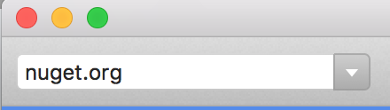
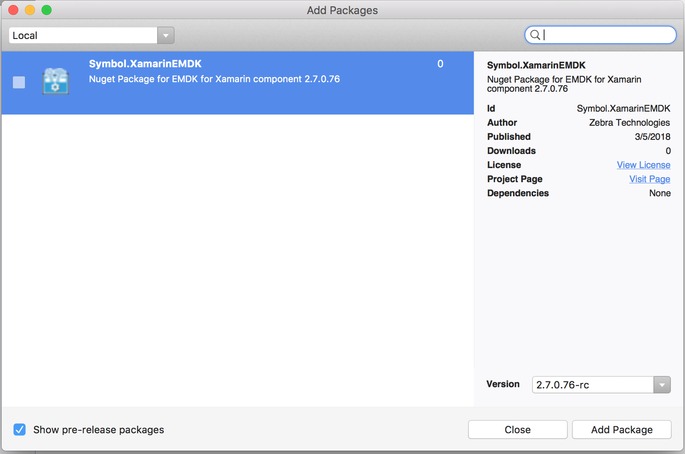

The EMDK For Xamarin NuGet package includes the API libraries required for an Android application. The package must be installed and added to any Android project before the APIs will be available for use. In previous versions of EMDK For Xamarin, the EMDK APIs were distributed via a Xamarin component. Late in 2017, [Microsoft announced](https://blog.xamarin.com/hello-nuget-new-home-xamarin-components/) that it would be sunsetting support for Xamarin components and that all providers should use NuGet packages instead.

Zebra will officially support NuGet packages in a future EMDK for Xamarin version. In the meantime, the instructions below cover the Beta release of the EMDK For Xamarin NuGet package, which is based on the EMDK for Xamarin 2.7 APIs.

**Review the instructions for the Visual Studio in use**:

* [Visual Studio 2017 for Windows](#visualstudio2017forwindows)
* [Visual Studio 2017 for Mac](#visualstudio2017formac)

>**WARNING**: Do not use `Add Xamarin Component` from the `EMDK` menu shown below; it will not function as intended.

 

-----

## Visual Studio 2017 for Windows

### Installing the NuGet Package (beta)
1. [Download the EMDK For Xamarin NuGet file](https://github.com/zebra-stage/zebra-stage.github.io/blob/master/emdk-for-xamarin/nuget/Symbol.XamarinEMDK.2.7.0.76-rc.nupkg?raw=true) and save to a local folder.  

2. From within a project, right-click the project name and select `Manage NuGet Packages...` from the menu:
	
 
3. Click the `Settings` (gear) icon in the upper-right corner:
	
 

4. Click the "`+`" button in the upper-right corner:
	
 
5. Change the `Name` to "`Local`" and specify the path to where the downloaded EMDK For Xamarin NuGet file is located. Then click the "`Update`" button: 
	
 
6. Click the "`OK`" button.
7. Check the "`Include prerelease`" checkbox and in the upper-right corner, change the package source to "`Local`" as shown: 
	
 
8. Select the `Symbol.XamarinEMDK` package, if it is not already selected, and then click the "`Install`" button: 
	
 
9. When prompted, click "`OK`" to accept the changes and "`I Accept`" for the license: 
	
 
	
 
10. The EMDK for Xamarin APIs are now referenced and can be used in the project:
	

-----

### Removing the NuGet Package

**To remove the EMDK For Xamarin NuGet package**:

Right-click on the `Symbol.EMDKForXamarin` package and select "`Remove`" as below:
	
 

-----

## Visual Studio 2017 for Mac
Microsoft has replaced Xamarin Studio for Mac with [Visual Studio 2017 for Mac](https://docs.microsoft.com/en-us/visualstudio/mac/). Install the latest version before proceeding.

### Installing the Beta NuGet Package
1. [Download the EMDK For Xamarin NuGet file](https://github.com/zebra-stage/zebra-stage.github.io/blob/master/emdk-for-xamarin/nuget/Symbol.XamarinEMDK.2.7.0.76-rc.nupkg?raw=true) and save to a local folder. 

2. In the project right-click "`Packages`" folder.

3. Click "`Add Packages`" as below:
	
 
4. In the drop down where it says `nuget.org`, select `Configure sources`
	
 
5. Click the `Add` button in the lower right corner
	
 
6. Select the folder where you saved the EMDK For Xamarin NuGet file and click the `Open` button
	
 
7. Click the `Add Source` button
	
 
8. You should now see the `Local` source listed. Click `Ok` to save
	
 
9. Make sure `Show pre-release packages` checkbox is selected
	
 
10. Select the `Symbol.XamarinEMDK` package, if it is not already selected, and then click "Add package". Accept the license when prompted.
	
 
11. You can now use the EMDK For Xamarin API's

-----

### Removing the NuGet Package

**To remove the EMDK For Xamarin NuGet package**:

Right-click the `Symbol.EMDKForXamarin` package and select "`Remove`" as below:
	
 

