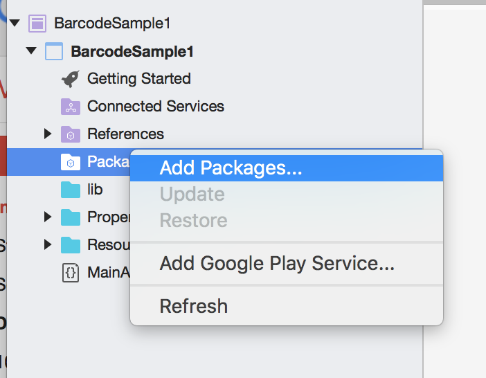
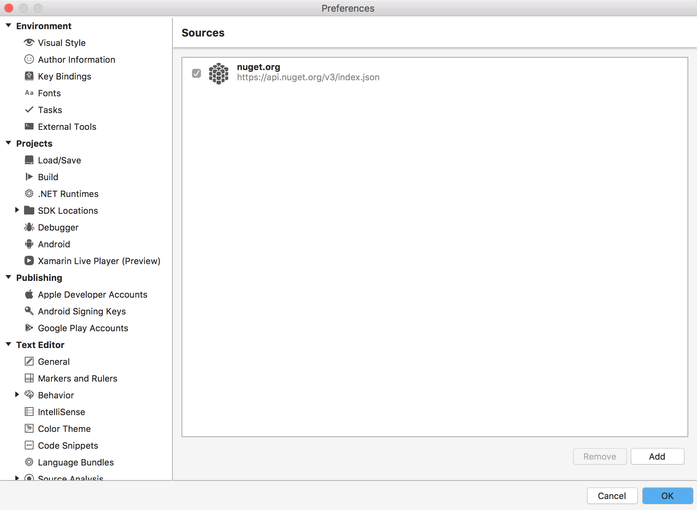
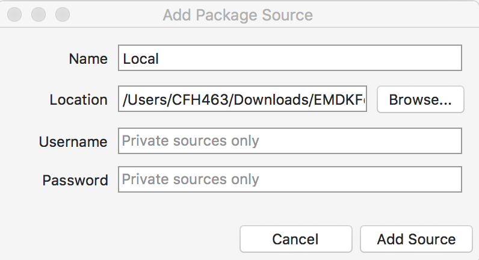

The EMDK For Xamarin Nuget package includes the API libraries that you will use in your Android application. You must install the component and add it to your android project before being able to use the APIs.

## Installing the Beta NuGet Package
1. [Download the EMDK For Xamarin Nuget file](https://github.com/zebra-stage/zebra-stage.github.io/blob/master/emdk-for-xamarin/nuget/Symbol.XamarinEMDK.2.7.0.76-rc.nupkg?raw=true) and save to a local folder  

2. In your project right click `Packages` folder

3. Click `Add Packages`

	

4. In the drop down where it says `nuget.org`, select `Configure sources`

	

5. Click the `Add` button in the lower right corner

	

6. Select the folder where you saved the EMDK For Xamarin Nuget file and click the `Open` button

	

7. Click the `Add Source` button

	

8. You should now see the `Local` source listed. Click `Ok` to save

	

9. Make sure `Show pre-release packages` checkbox is selected

	

10. Select the `Symbol.XamarinEMDK`, if it is not already be selected, and then click "Add package". Accept the license when prompted.

	

11. You can now use the EMDK For Xamarin API's

## Removing the NuGet Package
To remove the EMDK For Xamarin NuGet package:

1. Right click on the `Symbol.EMDKForXamarin` package and select `Remove`

	

