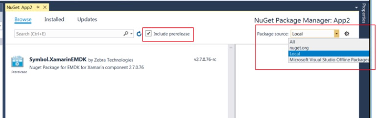
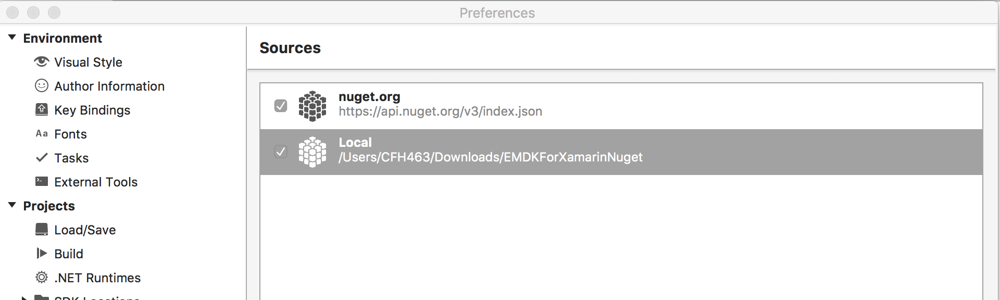

The EMDK For Xamarin Nuget package includes the API libraries that you will use in your Android application. You must install the package and add it to your Android project before being able to use the APIs. In previous versions of EMDK For Xamarin, the EMDK APIs were distributed via a Xamarin component. Late in 2017, [Microsoft announced](https://blog.xamarin.com/hello-nuget-new-home-xamarin-components/) that they will be sunsetting support for Xamarin components and that all providers should use NuGet packages instead.

In the next version of EMDK for Xamarin, Zebra will be providing official support, however below you can find instructions for the Beta release of the EMDK For Xamarin NuGet package that is based on the EMDK for Xamarin 2.7 APIs.

Please be sure to review the instructions for the version of Visual Studio you are using
* [Visual Studio 2017 for Windows](#visualstudio2017forwindows)
* [Visual Studio 2017 for Mac](#visualstudio2017formac)

>NOTE: Do not use the `Add Xamarin Component` menu item from the `EMDK` menu. This will not function as intended.

## Visual Studio 2017 for Windows

### Installing the Beta NuGet Package
1. [Download the EMDK For Xamarin Nuget file](https://github.com/zebra-stage/zebra-stage.github.io/blob/master/emdk-for-xamarin/nuget/Symbol.XamarinEMDK.2.7.0.76-rc.nupkg?raw=true) and save to a local folder  

2. In your project right click the project and select `Manage NuGet Packages` item on the menu

	

3. Click on the `Settings` icon in the upper right hand corner

	

4. Click the `+` button in the upper right corner

	

5. Change the `Name` to `Local` and specify the path where you downloaded the EMDK For Xamarin Nuget file. Then click `Update` 

	

6. Click the `Ok` button

7. Change the package source in the upper right corner to `Local` and check the `Include prerelease`

	

8. Select the `Symbol.XamarinEMDK` package, if it is not already selected, and then click "Install". 

	

9. You will be prompted to accept the changes and then to accept the license. 

	

	

10. You will then have a reference to the EMDK for Xamarin APIs and can now use them in your project.

	

### Removing the NuGet Package
To remove the EMDK For Xamarin NuGet package:

1. Right click on the `Symbol.EMDKForXamarin` package and select `Remove`

	

## Visual Studio 2017 for Mac
Microsoft has replaced Xamarin Studio for Mac with [Visual Studio 2017 for Mac](https://docs.microsoft.com/en-us/visualstudio/mac/). Please be sure to install the latest version.

### Installing the Beta NuGet Package
1. [Download the EMDK For Xamarin Nuget file](https://github.com/zebra-stage/zebra-stage.github.io/blob/master/emdk-for-xamarin/nuget/Symbol.XamarinEMDK.2.7.0.76-rc.nupkg?raw=true) and save to a local folder  

2. In your project right click `Packages` folder

3. Click `Add Packages`

	

4. In the drop down where it says `nuget.org`, select `Configure sources`

	

5. Click the `Add` button in the lower right corner

	

6. Select the folder where you saved the EMDK For Xamarin Nuget file and click the `Open` button

	

7. Click the `Add Source` button

	

8. You should now see the `Local` source listed. Click `Ok` to save

	

9. Make sure `Show pre-release packages` checkbox is selected

	

10. Select the `Symbol.XamarinEMDK` package, if it is not already selected, and then click "Add package". Accept the license when prompted.

	

11. You can now use the EMDK For Xamarin API's

### Removing the NuGet Package
To remove the EMDK For Xamarin NuGet package:

1. Right click on the `Symbol.EMDKForXamarin` package and select `Remove`

	

