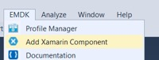
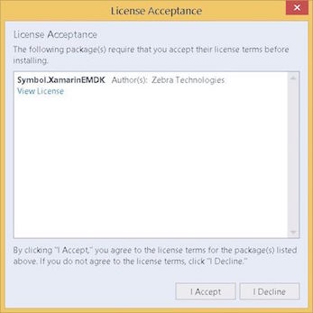

The EMDK for Xamarin NuGet package includes the API libraries required for an building an Android application with Xamarin. The package must be installed and added to any Android project before the APIs will be available for use. 

In previous versions of EMDK for Xamarin, the EMDK APIs were distributed through a Xamarin component. In late 2017, [Microsoft announced](https://blog.xamarin.com/hello-nuget-new-home-xamarin-components/) that it would be sunsetting support for Xamarin components and that all providers would be required to use NuGet packages.

Zebra will officially support NuGet packages in a future EMDK for Xamarin release. In the meantime, the instructions below cover the EMDK for Xamarin NuGet package (beta), which is based on the EMDK for Xamarin 2.7 APIs.

**Visual Studio versions covered these instructions**:

* [Visual Studio 2017 for Windows](#visualstudio2017forwindows)
* [Visual Studio 2017 for Mac](#visualstudio2017formac)

>**WARNING**: Do not use the `Add Xamarin Component` from the `EMDK` menu shown below; it will not function as intended.

 

-----

## Visual Studio 2017 for Windows

### Installing the NuGet Package (beta)
1. From within a project, right-click the project name and select `Manage NuGet Packages...` from the menu:
	  
 
2. Tap on the `Browse` tab. Select the checkbox `Include prerelease`.  In the search field type "`EMDK`":
	
 
3. Select `Symbol.XamarinEMDK`. Click the `Install` button to the right:
	
 
4. Click the "`I Accept`" button to accept the License Agreement:
	
 
5. From the right-hand panel, under Solution Explorer expand the `References` section. The EMDK for Xamarin APIs are now referenced and can be used in the project: 
	
 
-----

### Removing the NuGet Package

**To remove the EMDK for Xamarin NuGet package from a Windows project**:

Right-click on the `Symbol.EMDKForXamarin` package and select "`Remove`" as below:
	
 

-----

## Visual Studio 2017 for Mac
Microsoft has replaced Xamarin Studio for Mac with [Visual Studio 2017 for Mac](https://docs.microsoft.com/en-us/visualstudio/mac/). Install the latest version before proceeding.

### Installing the NuGet Package (beta)
1. In the project right-click the **Packages** folder. Click "`Add Packages...`" from the menu:
	
 
2. At the bottom of the **Add Packages** window, select the checkbox for "`Show pre-release packages`":
	
 
3. In the search box at the top right, enter "`emdk`". Ensure the EMDK package is highlighted. Click the "`Add Package`" button:
	
 
4. Click the "`Accept`" button to accept the license:
	
 

>**EMDK for Xamarin APIs are now ready for use**. 

-----

### Removing the NuGet Package

**To remove the EMDK for Xamarin NuGet package from a Mac project**:

Right-click the `Symbol.EMDKForXamarin` package and select "`Remove`" as below:
	
 
