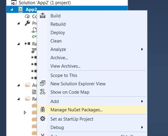
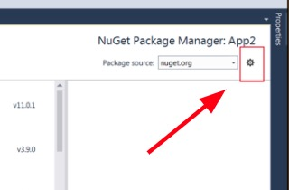
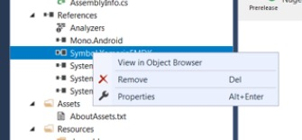

EMDK-X 3.0 now fully supports NuGet packages. The EMDK for Xamarin NuGet package includes the API libraries required for building an Android application with Xamarin. The package must be installed and added to any Android project before the APIs are available for use. 

In previous versions of EMDK for Xamarin, the EMDK APIs were distributed through a Xamarin component. In late 2017, [Microsoft announced](https://blog.xamarin.com/hello-nuget-new-home-xamarin-components/) that it was phasing out support for Xamarin components and that all providers would be required to use NuGet packages.

**These instructions apply to**:

* [Visual Studio 2017 for Windows](#visualstudio2017forwindows)
* [Visual Studio 2017 for Mac](#visualstudio2017formac)

>**WARNING**: Do not use the "Add Xamarin Component" from the "EMDK" menu shown below; it does not function as intended.

 

-----

## Visual Studio 2017 for Windows

### Installing the NuGet Package

1. [Download the EMDK for Xamarin NuGet file](https://github.com/zebra-stage/zebra-stage.github.io/blob/master/emdk-for-xamarin/nuget/Symbol.XamarinEMDK.2.7.0.76-rc.nupkg?raw=true) and save to a local folder.
2. From within a project, right-click the project name and select `Manage NuGet Packages...` from the menu:
	
 
3. Click the `Settings` (gear) icon in the upper-right corner:
	
 
4. Click the "`+`" button in the upper-right corner:
	
 
5. Change the `Name` to "`Local`" and specify the path to the downloaded EMDK for Xamarin NuGet file. Then click the "`Update`" button: 
	
 
6. Click the "`OK`" button.
7. Check the "`Include prerelease`" checkbox and in the upper-right corner, change the package source to "`Local`" as shown: 
	
 
8. Select the `Symbol.XamarinEMDK` package (if not already selected) and click the "`Install`" button: 
	
 
9. When prompted, click "`OK`" to accept the changes and "`I Accept`" for the license: 
	
 
	
 
10. The EMDK for Xamarin APIs are now referenced and can be used in the project:
	

-----

## Visual Studio 2017 for Mac OS
Microsoft has replaced Xamarin Studio for Mac with [Visual Studio 2017 for Mac](https://docs.microsoft.com/en-us/visualstudio/mac/). Install the latest version before proceeding.

### Installing the NuGet Package (beta)
1. [Download the EMDK for Xamarin NuGet file](https://github.com/zebra-stage/zebra-stage.github.io/blob/master/emdk-for-xamarin/nuget/Symbol.XamarinEMDK.2.7.0.76-rc.nupkg?raw=true) and save to a local folder. 
2. In the project right-click "`Packages`" folder.
3. Click "`Add Packages`" as below:
	
 
4. Select "`Configure sources`" from the drop-down, which initially displays `nuget.org` as below: 
	
 
5. Click the "`Add`" button in the lower-right corner:
	
 
6. Select the folder that contains the downloaded EMDK for Xamarin NuGet file and click the "`Open`" button:
	
 
7. Click the "`Add Source`" button:
	
 
8. The `Local` source should now be shown. Click `OK` to save:
	
 
9. **On the "Add Packages" screen**, select the "`Symbol.XamarinEMDK`" package (if not already selected), confirm that the "`Show pre-release packages`" checkbox is checked, and click the "`Add package`" button:
	
 
10. **Accept the license** when prompted:
	
 

#### EMDK for Xamarin APIs are now ready to use. 

-----

### Remove the NuGet Package

##### Windows

**To remove the EMDK for Xamarin NuGet package from a Windows project**:

Right-click on the `Symbol.EMDKForXamarin` package and select "Remove" as below:
	
 

-----

##### Mac OS

**To remove the EMDK for Xamarin NuGet package from a Mac OS project**:

Right-click the `Symbol.EMDKForXamarin` package and select "Remove" as below:
	
 
