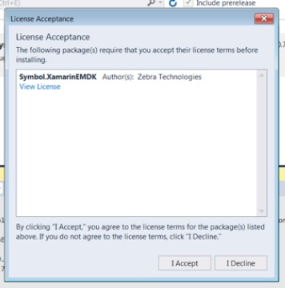

Starting with version 3.0, EMDK for Xamarin development tools are installed from NuGet packages and updated using the NuGet package management system. The EMDK-X NuGet package adds to Microsoft Visual Studio the API libraries required for building Android applications with Xamarin. **The package must be added to any Android project before the APIs are available for use**. 

> **Zebra recommends using EMDK-X with Visual Studio 2017**. 

<!-- 
In previous versions of EMDK for Xamarin, the EMDK APIs were distributed through a Xamarin component. In late 2017, [Microsoft announced](https://blog.xamarin.com/hello-nuget-new-home-xamarin-components/) that it was phasing out support for Xamarin components and that all providers would be required to use NuGet packages.
 -->
**These instructions apply to**:

* Visual Studio 2017 for Mac OS
* Visual Studio 2017 for Windows

>**WARNING**: Do not select "Add Xamarin Component" from the "EMDK" menu shown below; it does not function as intended.

 

-----

### Prerequisites
The following software is required to use EMDK for Xamarin:

**Windows**:
* Windows 7, 8, 8.1, 10 (32- or 64-bit)
* Java Development Kit (JDK) v7u45 or higher
* Visual Studio 2017 or Visual Studio 2015 (up to v15.5) 

**Mac OS**:  
* Mac OS X 10.10 or higher
* Java for OS X 2014-10x or higher
* Java Development Kit (JDK) v7u75 or higher
* **Visual Studio 2017 for Mac OS** `NEW` (Xamarin Studio is no longer supported)

**Attention VS2015 users**: EMDK for Xamarin supports Visual Studio 2015 <u>only up to version 15.5</u>. Upgrading to any higher version results in failure. **Zebra recommends using Visual Studio 2017**. 

-----

## Windows Installation

The following instructions apply to Visual Studio 2017, which should be installed before beginning the steps below. 

If necessary, please [install Visual Studio](https://visualstudio.microsoft.com/downloads/) before proceeding. 

Visual Studio 2017 for Windows

### Installing the NuGet Package

1. [Download the EMDK for Xamarin NuGet file](https://github.com/zebra-stage/zebra-stage.github.io/blob/master/emdk-for-xamarin/nuget/Symbol.XamarinEMDK.2.7.0.76-rc.nupkg?raw=true) and save to a local folder.
2. From within a project, right-click the project name and select `Manage NuGet Packages...` from the menu:
	
	_Click to enlarge_. 
3. Click the `Settings` (gear) icon in the upper-right corner:
	
	_Click to enlarge_. 
4. Click the "`+`" button in the upper-right corner:
	
	_Click to enlarge_. 
5. Change the `Name` to "`Local`" and specify the path to the downloaded EMDK for Xamarin NuGet file. Then click the "`Update`" button: 
	
	_Click to enlarge_. 
6. Click the "`OK`" button.
7. Check the "`Include prerelease`" checkbox and in the upper-right corner, change the package source to "`Local`" as shown: 
	
	_Click to enlarge_. 
8. Select the `Symbol.XamarinEMDK` package (if not already selected) and click the "`Install`" button: 
	
	_Click to enlarge_. 
9. When prompted, click "`OK`" to accept the changes and "`I Accept`" for the license: 
	
	_Click to enlarge_. 
	
	_Click to enlarge_. 
10. The EMDK for Xamarin APIs are now referenced and can be used in the project:
	
	_Click to enlarge_. 

#### EMDK for Xamarin APIs are now ready to use. 

-----

## Visual Studio 2017 for Mac OS

If necessary, please [install Visual Studio](https://visualstudio.microsoft.com/downloads/) before proceeding. 

### Installing the NuGet Package
1. [Download the EMDK for Xamarin NuGet file](https://github.com/zebra-stage/zebra-stage.github.io/blob/master/emdk-for-xamarin/nuget/Symbol.XamarinEMDK.2.7.0.76-rc.nupkg?raw=true) and save to a local folder. 
2. In the project right-click "`Packages`" folder.
3. Click "`Add Packages`" as below:
	
	_Click to enlarge_. 
4. Select "`Configure sources`" from the drop-down, which initially displays `nuget.org` as below: 
	
	_Click to enlarge_. 
5. Click the "`Add`" button in the lower-right corner:
	
	_Click to enlarge_. 	
6. Select the folder that contains the downloaded EMDK for Xamarin NuGet file and click the "`Open`" button:
	
	_Click to enlarge_. 
7. Click the "`Add Source`" button:
	
	_Click to enlarge_. 
8. The `Local` source should now be shown. Click `OK` to save:
	
	_Click to enlarge_. 
9. **On the "Add Packages" screen**, select the "`Symbol.XamarinEMDK`" package (if not already selected), confirm that the "`Show pre-release packages`" checkbox is checked, and click the "`Add package`" button:
	
	_Click to enlarge_. 	
10. **Accept the license** when prompted:
	
	_Click to enlarge_. 

#### EMDK for Xamarin APIs are now ready to use. 

-----

### Remove the NuGet Package

##### Windows

**To remove the EMDK for Xamarin NuGet package from a Windows project**:

Right-click on the `Symbol.EMDKForXamarin` package and select "Remove" as below:
	
 

-----

##### Mac OS

**To remove the EMDK for Xamarin NuGet package from a Mac OS project**:

Right-click the `Symbol.EMDKForXamarin` package and select "Remove" as below:
	
 
