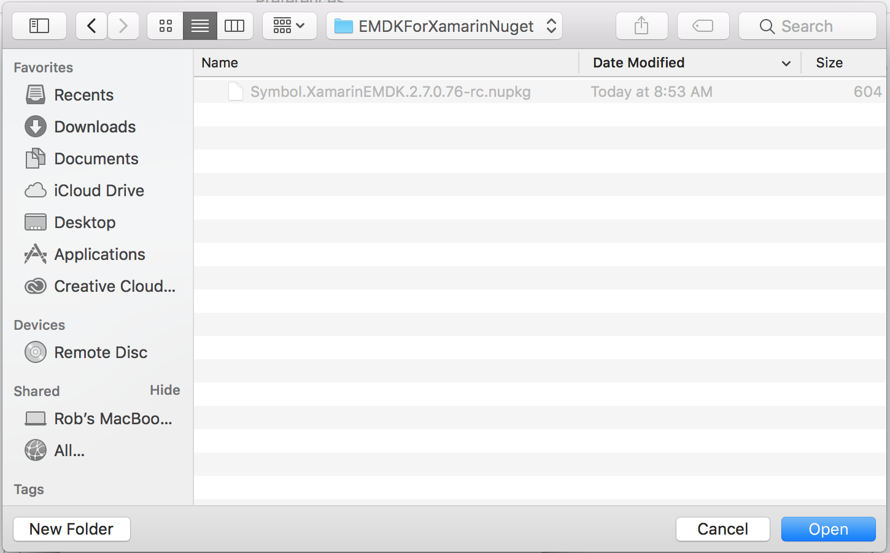

Starting with version 3.0, EMDK for Xamarin development tools are installed from NuGet packages and updated using the NuGet package management system. The EMDK-X NuGet package adds to Microsoft Visual Studio the API libraries required for building Android applications with Xamarin. **The package must be added to any Android project before the APIs are available for use**. 

> **Zebra recommends using EMDK-X with Visual Studio 2017**. 

<!-- 
In previous versions of EMDK for Xamarin, the EMDK APIs were distributed through a Xamarin component. In late 2017, [Microsoft announced](https://blog.xamarin.com/hello-nuget-new-home-xamarin-components/) that it was phasing out support for Xamarin components and that all providers would be required to use NuGet packages.
 -->
**These instructions apply to**:

* Visual Studio 2017 for Mac OS
* Visual Studio 2017 for Windows

>**WARNING**: Do not select "Add Xamarin Component" from the "EMDK" menu shown below; it does not function as intended.

 

-----

### Prerequisites
The following software is required to use EMDK for Xamarin:

**Windows**:
* Windows 7, 8, 8.1, 10 (32- or 64-bit)
* Java Development Kit (JDK) v7u45 or higher
* Visual Studio 2017 or Visual Studio 2015 (up to v15.5) 

**Mac OS**:  
* Mac OS X 10.10 or higher
* Java for OS X 2014-10x or higher
* Java Development Kit (JDK) v7u75 or higher
* **Visual Studio 2017 for Mac OS** `NEW` (Xamarin Studio is no longer supported)

**Attention Visual Studio 2015 users**: EMDK for Xamarin supports Visual Studio 2015 <u>only up to version 15.5</u>. Upgrading to any higher version results in failure. **Zebra recommends using Visual Studio 2017**. 

-----

### Windows Installation

The following instructions apply to Visual Studio 2017. A supported version of Visual Studio must be installed to complete the steps below. If necessary, [install Visual Studio 2017](https://visualstudio.microsoft.com/downloads/) before proceeding. 

**To install the NuGet package in Visual Studio 2017 for Windows**: 
 
1. [Download the EMDK for Xamarin NuGet file](https://github.com/zebra-stage/zebra-stage.github.io/blob/master/emdk-for-xamarin/nuget/Symbol.XamarinEMDK.2.7.0.76-rc.nupkg?raw=true) and save to a local folder.
2. From within a project, right-click the project name and **select "Manage NuGet Packages..."** from the menu:
	
	  
3. **Click the Settings (gear) icon** in the upper-right corner:
	
	  
4. **Click the "+" button** in the upper-right corner:
	
	  
5. Near the bottom of the dialog, **change the Name to "Local" and hit (...) to navigate to the NuGet file** downloaded in Step 1.  Then **click the "Update" button**: 
	
	  
6. **Click the "OK" button**.
7. Check the "**Include prerelease**" checkbox and in the upper-right corner, change the package source to "**Local**" as shown: 
	
	  
8. **Select the** `Symbol.XamarinEMDK` **package** (if not already selected) and **click the "Install" button**: 
	
	  
9. When prompted, **click "OK" to accept the changes**: 
	
	 ...**and "I Accept**" for the license: 
	
	  
10. **Confirm that the EMDK for Xamarin APIs are now referenced** in the project:
	
	 

> EMDK for Xamarin APIs are ready to use. 

-----

### Mac OS Installation

The following instructions apply to Visual Studio 2017, which must be installed to complete the steps below. If necessary, [install Visual Studio 2017](https://visualstudio.microsoft.com/downloads/) before proceeding. 

Visual Studio 2017 for Windows

**To install the NuGet package in Visual Studio 2017 for Mac**:

1. [Download the EMDK for Xamarin NuGet file](https://github.com/zebra-stage/zebra-stage.github.io/blob/master/emdk-for-xamarin/nuget/Symbol.XamarinEMDK.2.7.0.76-rc.nupkg?raw=true) and save to a local folder. 
2. In the project, **right-click the "Packages" folder**.
3. Click "**Add Packages**" as below:
	
	_Click to enlarge_.  
4. **Select "Configure sources**" from the drop-down, which initially displays nuget.org as below: 
	
	_Click to enlarge_.  
5. **Click the "Add" button** in the lower-right corner:
	
	_Click to enlarge_.  
6. **Navigate to the NuGet file** downloaded in Step 1. They **click the "Open" button**:
	
	_Click to enlarge_.  
7. **Click the "Add Source" button**:
	
	_Click to enlarge_.  
8. The "Local" source is shown. **Click OK to save**:
	
	_Click to enlarge_.  
9. **On the "Add Packages" screen**, select the `Symbol.XamarinEMDK` package (if not already selected), confirm that the "**Show pre-release packages**" checkbox is checked, and click the "**Add package**" button:
	
	_Click to enlarge_.  
10. **Accept the license** when prompted:
	
	_Click to enlarge_. 

> EMDK for Xamarin APIs are ready to use. 

-----

### Remove the NuGet Package

#### Remove from Windows

**To remove the EMDK for Xamarin NuGet package from a Windows project**:

From within a project, **right-click the** `Symbol.EMDKForXamarin` **package and select "Remove"** as below:
	
 

-----

#### Remove from Mac OS

**To remove the EMDK for Xamarin NuGet package from a Mac OS project**:

From within a project, **right-click the** `Symbol.EMDKForXamarin` **package and select "Remove"** as below:

	_Click to enlarge_. 
 
