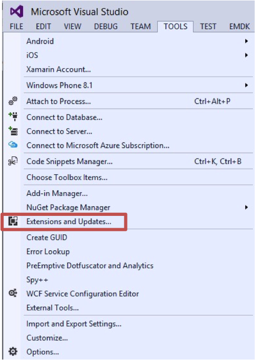
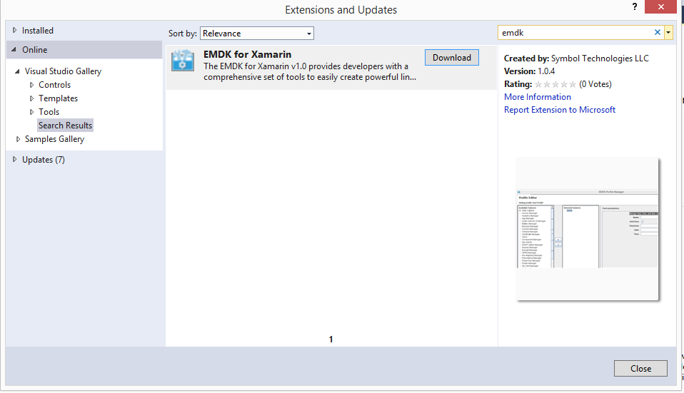
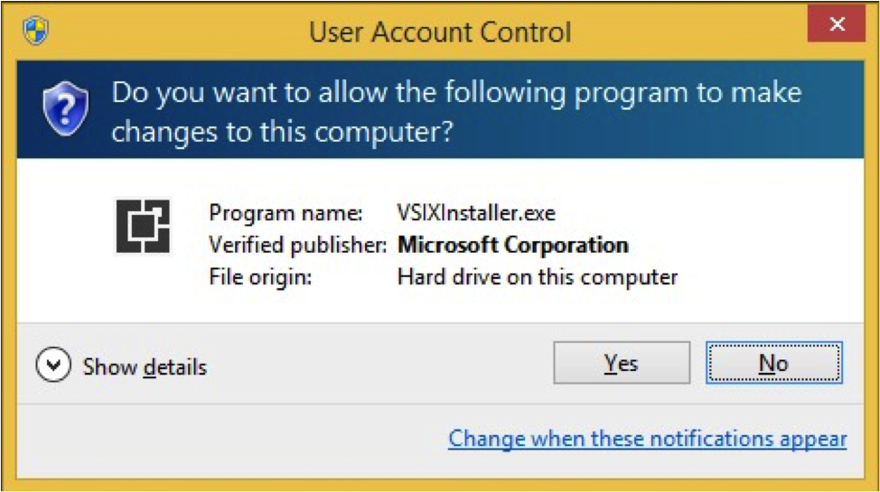
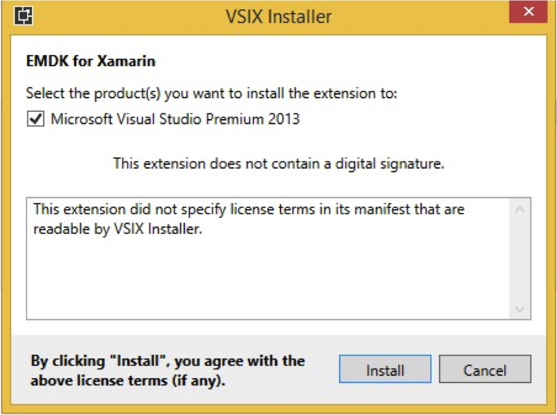
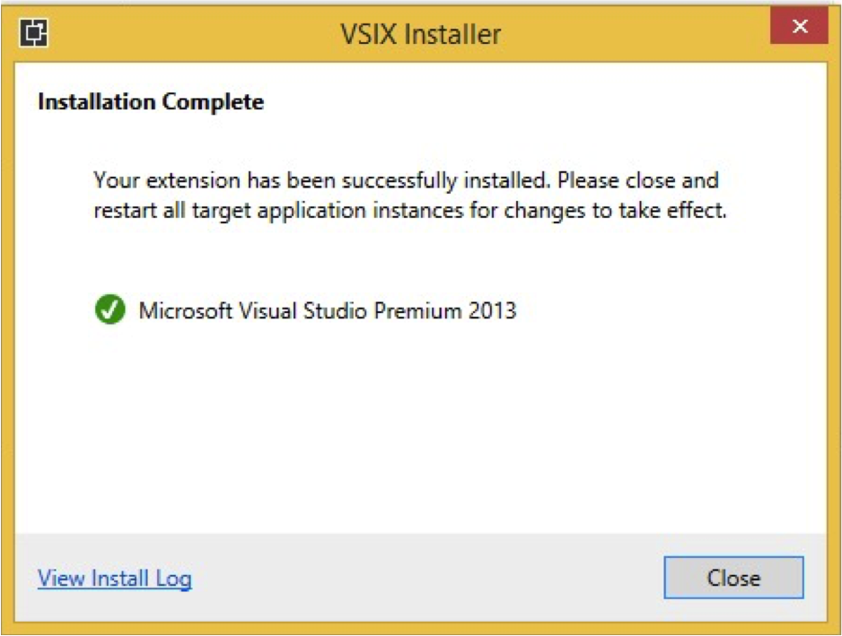
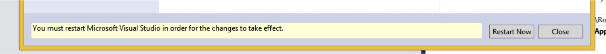
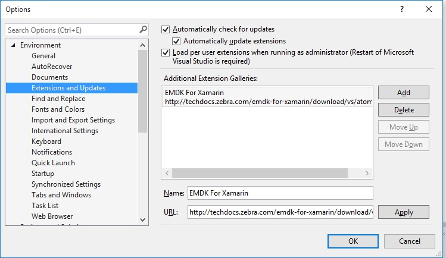
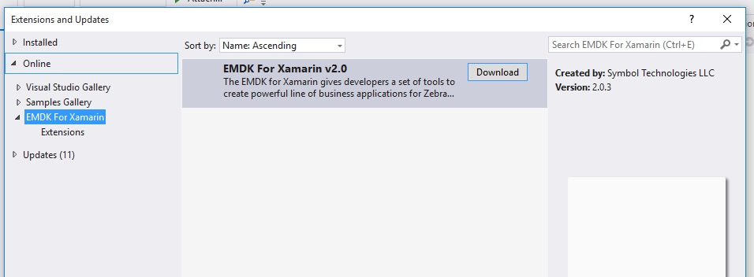

## Watch This Guide

##Installing the Extension
This section describes how to keep your development environment up to date with the most recent version of the EMDK For Xamarin. By choosing this method, you will receive update notifications when a new version is published. If you wish to install a specific version of EMDK for Xamarin, please see the `Installing A Previous Extension Version` section below.

1. Open Visual Studio and select `Tools\Extensions and Updates`.

	
2. Select the `Online` section in the left hand pane of the `Extensions and Updates` dialog.
3. Then Select `Visual Studio Gallery` in the left hand pane under `Online`.
4. Now enter `emdk` in the search box in the top right of the `Extensions and Updates` dialog, and press enter.
5. You should now be presented with a search result, showing the `EMDK For Xamarin`.

	
6. Click the `Download` button.

7. Click `Yes` when prompted to allow the program to make changes to your computer.

	
8. Click `Install` when prompted to agree to the license terms.

	
9. Click `Close` when the extension installer is complete.

	
10. Restart Visual Studio as directed

	

##Installing A Previous Extension Version 
The previous section described a typical way to install the EMDK-For Xamarin Extension. However, it does not let you select previous versions to install. If you have standardized on a certain version and you need to reset your developer environment, you will need to follow these instructions instead of the previous section.

>Note: When choosing this version, you will not receive update notifications when a new version is published.

1. If you already have a version of EMDK For Xamarin installed, please follow the Uninstall and Cleanup sections below, before proceeding

2. Open Visual Studio and select `Tools\Options`.

3. Then select `Environment\Extensions`. 

4. On the right hand side of the `Options` dialog, select the `Add` button.

5. Enter `EMDK for Xamarin` for the `Name` field.

6. Enter the followin for the `URL` field depending on which version you wish to install.

	* 1.0 : `http://techdocs.zebra.com/emdk-for-xamarin/download/vs/v1.0/atom.xml`
	* 2.0 : `http://techdocs.zebra.com/emdk-for-xamarin/download/vs/v2.0/atom.xml`
	* 2.1 : `http://techdocs.zebra.com/emdk-for-xamarin/download/vs/v2.1/atom.xml`

	

7. Click `Ok` to close the Options dialog.

8. Now that the gallery has been added to Visual Studio, you will be able to use this to download specific versions of the EMDK For Xamarin.

9. Select `Tools\Extensions and Updates`.

10. Select the `Online` section in the left hand side of the `Extensions and Updates` dialog.

11. Choose the `EMDK For Xamarin` item you just added.

12. You should now be presented with a listing, showing the `EMDK For Xamarin`.

	

13. Select the version you wish to install and select the `Download` button.

14. Click `Yes` when prompted to allow the program to make changes to your computer.

15. Click `Install` when prompted to agree to the license terms.

16. Click `Close` when the extension installer is complete.

17. Restart Visual Studio as directed

##Uninstalling the Extension

1. Open Visual Studio and select `Tools\Extensions and Updates`.

	

2. Select `Installed` from the left hand pane
3. Type `emdk` in the search box in the top right corner and then press **Enter**
4. In the search results (center pane) find `EMDK for Xamarin`, and click the **Uninstall** button.
5. Then click the **Yes** button when prompted.
6. Restart Visual Studio as directed

	

##Support file cleanup
The IDE extension copies support files to the your file system in order to perform tasks such as Device Runtime Install. To clean up the support files do the following.

* Remove Folder - C:\Users\Public\Symbol EMDK for Xamarin

