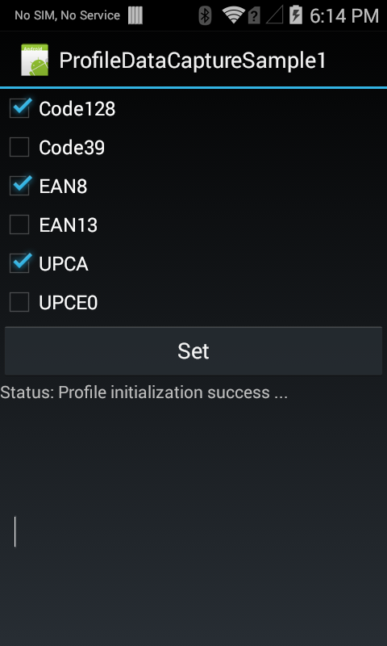
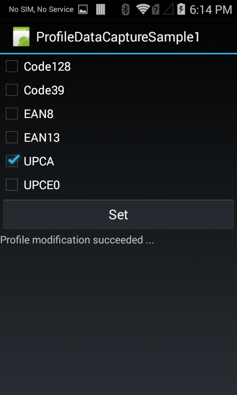
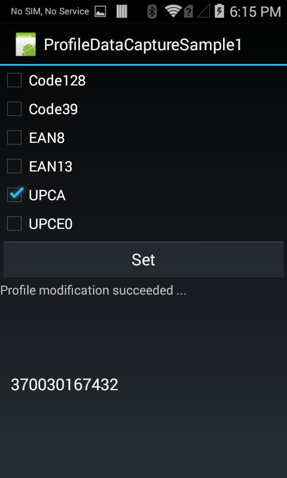

##Overview
One of the features of the EMDK is the ability to create Barcode scanning profiles. This application allows you to modify a Barcode profile to select which types of Barcodes should be interpreted.

##Loading the Sample Application

1. Choose a sample and click the **See Details** button.
2. Now click the **Download** button 
3. `IMPORTANT:` **Extract the downloaded project zip file <u>to C:\</u>** (or to the **root** of an alternate drive).
4. Navigate to the root of the unzipped project folder and double-click the **.sln** file. The project loads in the default IDE for that file type.

Alternatively, launch a preferred IDE and load the project via the File > Open menu.  

## Running the Sample
Now that we have the project loaded, lets run the application and see how it works

###Visual Studio

Visual Studio will detect your device connected via USB, it will display the name of that device next to the "Play" button.

Press the "Play" button next to the devices name.  The IDE will build, deploy and start the sample app on your device.

###Xamarin Studio
In Xamarin Studio, you may need to select your attached device from the devices dropdown under `Physical Devices`.

Now press the "Play" button. The IDE will build, deploy and start the sample app on your device.

## Using the Sample
When the Sample Application loads it will present the following screen. The user interface provides a means to configure the barcode type that the scanner is allowed to decode. In order to make best use of this sample you will need a barcode that represents each of the listed type.

A successful scan of an enabled barcode symbology will append the barcode data to a list in the lower section of the user interface. Disabled type will not scan and will not append data to the barcode data list.

To test this sample, change the barcode types that are allowed by checking, or un-checking the checkboxes next to the barcode types. Then press the `Set` button.

The Status message should change, stating that the profile was successfully modified.

To test that your settings have taken effect, scan a barcode type that was disabled previously, the barcode should not scan. Now scan a barcode that was previously disabled, the user interface should update with the decoded barcode data.

