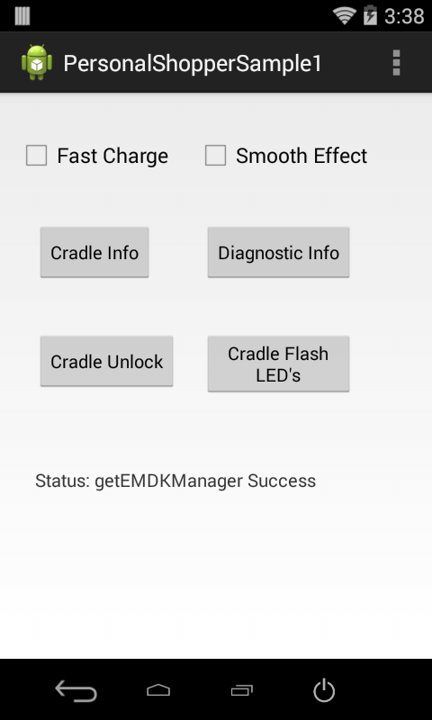
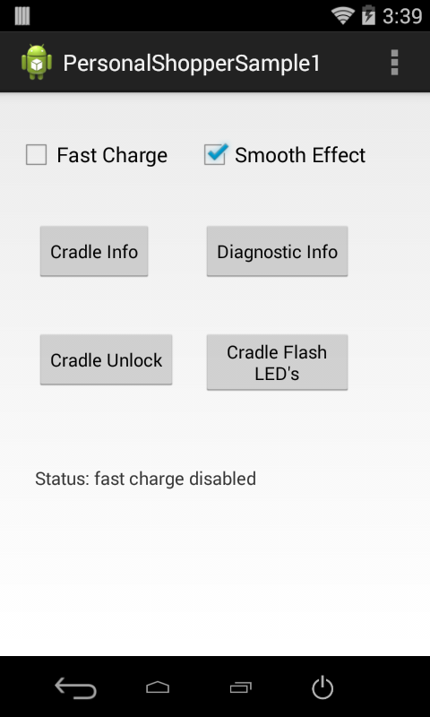

##Overview
This sample application will show how the Personal Shopper APIs can be used to interact with the MC18 Cradle programmatically.

>Note: Although this sample may work with previous versions of the EMDK, it is advised to [update the EMDK runtime](../../guide/setupDevice/) on your device before loading this sample.

##Loading the Sample Application

1. Choose a sample and click the **See Details** button.
2. Now click the **Download** button 
3. `IMPORTANT:` **Extract the downloaded project zip file <u>to C:\</u>** (or to the **root** of an alternate drive).
4. Navigate to the root of the unzipped project folder and double-click the **.sln** file. The project loads in the default IDE for that file type.

Alternatively, launch a preferred IDE and load the project via the File > Open menu.  

##Running The Sample
###Visual Studio

Visual Studio will detect your device connected via USB, it will display the name of that device next to the "Play" button.

Press the "Play" button next to the devices name.  The IDE will build, deploy and start the sample app on your device.

###Xamarin Studio
In Xamarin Studio, you may need to select your attached device from the devices dropdown under `Physical Devices`.

Now press the "Play" button. The IDE will build, deploy and start the sample app on your device.

##Using This Sample

1.  With the MC18 seated in the cradle. Launch the PersonalShopper API sample.
 When the application starts it should look like the following.

  

2. Press the **Fast Charge** checkbox to enable/disable fast charging.

  

3. Press the **Cradle Info** button to retrieve information about the cradle, such as the cradle's firmware version.

  

4. Press the **Diagnostic Info** button to retrieve information such as the the MC18 battery capacity.

  

5. Press the **Cradle Unlock** button to unlock the crade, which will allow the MC18 to be removed.

  

6. Press the **Cradle Flash LED's** button, which will flash the cradle LED's 5 times.

  

7. Press the **Smooth Effect** checkbox to enable/disable smoothing effect and then press the **Cradle Flash LED's** button again. Notice how the
LED's fade in and out, instead of an abrupt on/off state change.

  

