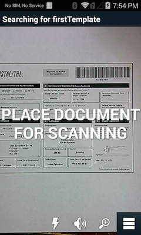

##Overview
This sample application will show how the Simulscan API's can be used to capture multiple types of data from forms, boxes and the like.

##Prerequisites

You will need:

* A SimulScan licensed device
* A Simulscan template
* A printed copy of the form used to create the template

##Requirements
Android API 19 must be installed via the SDK Manager before attempting to load this sample.

##Loading the Sample Application

1. Choose a sample and click the **See Details** button.
2. Now click the **Download** button 
3. `IMPORTANT:` **Extract the downloaded project zip file <u>to C:\</u>** (or to the **root** of an alternate drive).
4. Navigate to the root of the unzipped project folder and double-click the **.sln** file. The project loads in the default IDE for that file type.

Alternatively, launch a preferred IDE and load the project via the File > Open menu.  

##Using This Sample

1. Place a template on the sdcard of you SimulScan licensed device.

		:::
		adb push myTemplate.xml /sdcard/simulscan/templates/
	

2. Launch The SimulScan sample application
	
	The Simulscan sample app will find the templates you place on the devices sdcard, and populate the "Set Template" option list.  Select the template you wish to use from that list.
	 

3. Press the "Read" button, and follow the on screen instructions. The sample app will extract the fields defined in the template. If the "Display Results View" option is checked, a list of results will be displayed for you to review.

	     

4. Press the "Accept" button. The sample app will then display a screen showing how long simulscan took to capture and decode the template fields. Press the devices "Back" hardware button to return to the main screen.

	 

