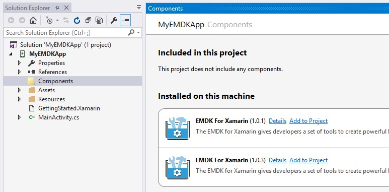
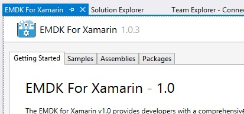

The Xamarin Component part of the EMDK includes the API libraries that you will use in your Android application. You must install the component and add it to your android project before being able to use the APIs.

## Watch This Guide

## Installing the Xamarin Component
After adding the [Visual Studio Extension](/emdk-for-xamarin/4-0/gui/vs/setup) or [Xamarin Studio Add-in](/emdk-for-xamarin/4-0/guide/xs/setup), you must install the EMDK for Xamarin component so it can be accessible from your projects.

> Note: This needs to only be performed once for the IDE. After the component is installed to the IDE, you must follow the steps below, in the `Enabling for Android Projects` section, for each project to enable the component.

1. Select `EMDK\Add Xamarin Component` from the menu.

	

2. After the component is installed, you will see this dialog:

	

## Enabling for Android Projects
Once the Xamarin Component has been installed to the IDE, you need to add it to your Android project.

1. Create or Open an Android based project.
2. Right click on the Project's `Component` folder in the `Solution Explorer`.
3. Choose `Edit Components`

	
4. You must be logged into your Xamarin account in order to add the component.

	
	

5. Choose `Add to Project` in the `EMDK For Xamarin` item of the `Installed on this machine` section. Be sure to pay attention to the version number you are adding, you may have multiple versions of the component installed. See the section below for instructions how to remove components.

    >NOTE: When multiple versions of the EMDK for Xamarin component are installed, all versions of the component will be visible in the **Edit Components** screen for your project.
    
	

6. The EMDK Component is now installed and listed in the projects `Component` folder.

	

7. Clicking on the `Details` link in the projects `Edit Components` page will give you access to more details about the component, like version information, documentation and samples. Check the [Samples Guide](/emdk-for-xamarin/4-0/guide/sample/about) for instructions to access more sample projects.

	

The component and EMDK for Xamarin APIs are now accessible in your application. To understand how to use the APIs, view source of one of our [sample projects](/emdk-for-xamarin/4-0/guide/sample/about) or [follow a tutorial](/emdk-for-xamarin/4-0/tutorial/index).

## Removing from Android Projects
You can disable the EMDK for Xamarin component from a project, however please note that this does not permanently remove the component from the project cache or system. If you wish to permanently remove the component, please follow these instructions and the complete the steps in the `Uninstalling` section

1. Open an Android based project.
2. Right click on the Project's `Component` folder in the `Solution Explorer`.
3. Choose `Edit Components`.

	
5. Choose `Remove` in the `EMDK For Xamarin` item of the `Included in this project` section.

	

> Note: If the `Symbol.XamarinEMDK` library has not been removed from the projects references folder from previous steps, you can manually delete it.  

## Uninstalling Components
When a Xamarin Component is installed to either Visual Studio or Xamarin Studio, it will be available to add to all projects. The component binaries are copied to a shared location and can only be removed manually. Additionally, after a component has been added to an Android project, the project folder will contain a cached version of the component even if you removed it from the project. To permanently clear your system of the component files you must follow the steps below:

### 1) Remove from IDE
For Windows, the installed components can be found in two folders:

1. Delete the `emdk-component-<version>.*` files in: `C:\Users\<username>\AppData\Local\Xamarin\Cache\Components`

	

2. Delete the `emdk-component-<version>.*` files in `C:\Users\<username>\AppData\Local\Xamarin\Cache\ComponentInfo`

	

For Mac, the same files can be found in:

* `/Users/<username>/Library/Caches/Xamarin/Components`
* `/Users/<username>/Library/Caches/Xamarin/ComponentInfo`

### 2) Remove from Android Projects
Each project will cache the version of the component you have added within your project folder. Even after removing the component from your project using the IDE (mentioned above), the component files will remain inside your project folder.

1. Open your project solution folder.

	
2. Open the project `Components` folder and delete the `emdk-component-<version>.*` files and folder.

	

