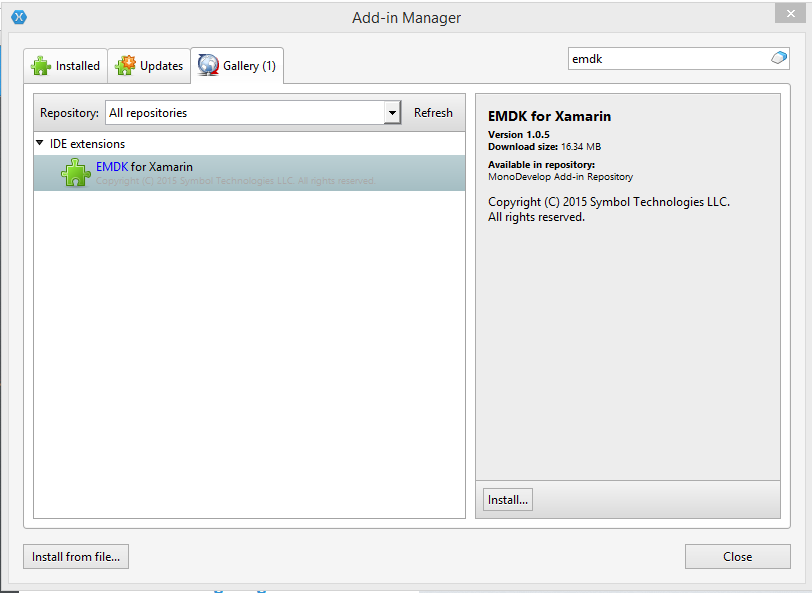
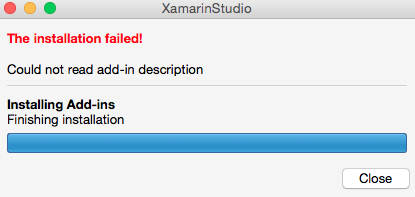
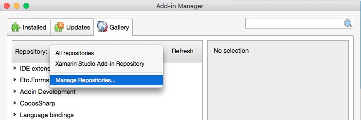

##Installing the Most Recent Add-in
This section describes how to keep your development environment up to date with the most recent version of the EMDK For Xamarin. By choosing this method, you will receive update notifications when a new version is published. If you wish to install a specific version of EMDK for Xamarin, please see the `Installing A Previous Add-in Version` section below.

Before Installing this Add-in make sure your Xamarin Studio version is at least 5.9.5 or above.

>Note: Xamarin Studio is no longer available for Windows. Visual Studio is recommended for EMDK for Xamarin development on Windows.

1. Open Xamarin Studio Add-in Manager by selecting Xamarin Studio Menu > Add-in Manager
2. Then select the Gallery Tab 
3. Enter `emdk` in the search box in the top right corner of the Add-in Manager.
	> As you type in the search box, the Add-in manager will filter out all add-ins except **EMDK for Xamarin**.

	

2.  Now click the `Install` button in the bottom left corner of the right hand pane.

3. Then select Install in the next dialog.

	> You will likely see an error message stating that the install failed. This is a known issue, and will
	be addressed in later revisions of the Xamarin Studio.  The Add-in is now installed, we just need to restart the IDE for the EMDK menu to be displayed.  
	
	

4. Click the close button for that dialog, then click the Close button for the Add-in Manager.

5. Restart Xamarin Studio and you will see the EMDK menu on the Menu bar.

##Installing A Previous Add-in Version 
The previous section described a typical way to install the EMDK-For Xamarin Add-in. However, it does not let you select previous versions to install. If you have standardized on a certain version and you need to reset your developer environment, you will need to follow these instructions instead of the previous section.

>Note: When choosing this version, you will not receive update notifications when a new version is published.

1. If you already have a version of EMDK For Xamarin installed, please follow the Uninstall and Cleanup sections below, before proceeding

2. Open Xamarin Studio Add-in Manager by selecting Xamarin Studio Menu > Add-in Manager

3. Then select the Gallery tab. 

4. Select the Repository drop down and choose 'Manage Repositories'.
	
	

5. Select `Add`

6. In the `Url` field enter the appropriate url for the version you wish to install.
	
	* Version 1.0.5 [for Xamarin Studio 5.x]: http://techdocs.zebra.com/emdk-for-xamarin/download/xs/1.0.5/main.mrep
	* Version 2.0.4.7 [for Xamarin Studio 5.x]: http://techdocs.zebra.com/emdk-for-xamarin/download/xs/2.0.4.7/main.mrep
	* Version 2.1.0.6 [for Xamarin Studio 5.x]: http://techdocs.zebra.com/emdk-for-xamarin/download/xs/2.1.0.6/main.mrep
	* Version 2.1.1.1 [for Xamarin Studio 6.x]: http://techdocs.zebra.com/emdk-for-xamarin/download/xs/2.1.1.1/main.mrep

7. Close the Repository dialog

8. Select `techdocs.zebra.com` from the Repositories drop down in the Gallery Tab.
	
	

9. You should now see the EMDK For Xamarin add-in listed. Select it and choose Install.
	
	

10. You will then see the plug-in download and get installed.

	> You will likely see an error message stating that the install failed. This is a known issue, and will
	be addressed in later revisions of the Xamarin Studio.  The Add-in is now installed, we just need to restart the IDE for the EMDK menu to be displayed.  
	
	

11. Click the close button for that dialog, then click the Close button for the Add-in Manager.

12. Restart Xamarin Studio and you will see the EMDK menu on the Menu bar.

##Uninstalling the Add-in

1. Open Xamarin Studio Add-in Manager by selecting Xamarin Studio Menu > Add-in Manager

2. In the Installed Tab, click the **arrow** left of **IDE extensions** label

3. Find and select `EMDK for Xamarin`

4. Click the Uninstall button in the bottom left corner of the right hand pane.
5. Click the Uninstall button in the next dialog.
	> You will likely see an error message stating that the uninstall failed. This is a known issue, and will
	be addressed in later revisions of the Xamarin Studio.  The Add-in is now uninstalled, we just need to restart the IDE for the EMDK menu to be removed. 
6. Click the close button for that dialog, then click the Close button for the Add-in Manager.
7. Restart Xamarin Studio and you should no longer see the EMDK menu on the Menu bar.

##Support file cleanup
The IDE Add-in copies support files to the your file system in order to perform tasks such as Device Runtime Install. To clean up the support files do the following.

* Remove Folder - /Users/Shared/Symbol EMDK for Xamarin
* Remove File - /Users/Shared/Symbol EMDK for Xamarin\EmdkOSUpdateApp_v3.1.38.apk
* Remove File - /Users/Shared/Symbol EMDK for Xamarin\Deployment.bat

