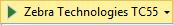
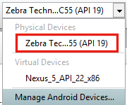
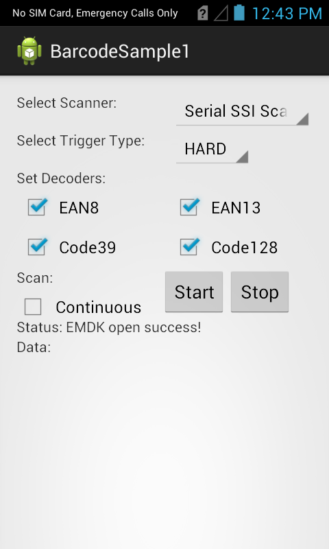
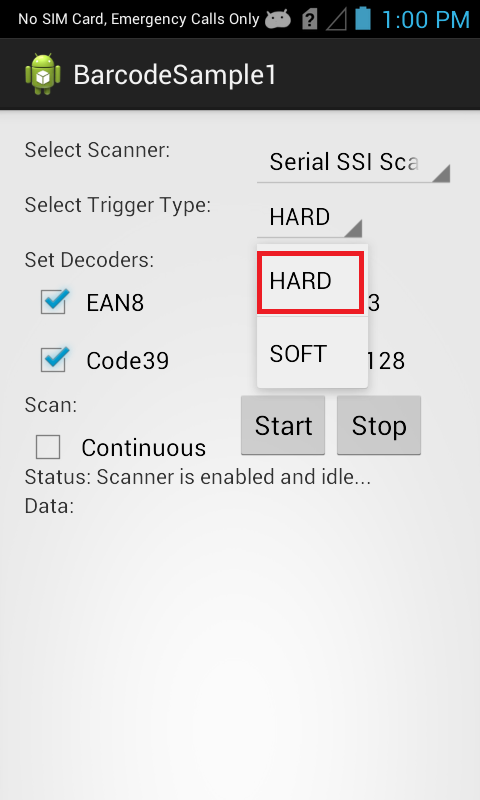

https://github.com/Zebra/samples-emdkforxamarin-4_0/tree/master/BarcodeSample1

##Overview
The Barcode API's are used when you wish to handle all barcode scanning entirely in C# using [Barcode/Scanning APIs](/emdk-for-xamarin/5-0/api/). These API's work independently of any Data Capture profiles.  

The available actions in the [Barcode/Scanning API](/emdk-for-xamarin/5-0/api/barcode/) are:
  
* Set Scanner Device  
* Set [TriggerType](/emdk-for-xamarin/5-0/api/barcode/Scanner_TriggerTypes)
* Set [Decoder Params](/emdk-for-xamarin/5-0/api/barcode/ScannerConfig_DecoderParameters)
* Set [Reader Params](/emdk-for-xamarin/5-0/api/barcode/ScannerConfig_ReaderParameters)
* Set [Scan Params](/emdk-for-xamarin/5-0/api/barcode/ScannerConfig_ScanParameters)
* Scan barcodes based on selected features   

This sample application will allow you to scan barcodes based on selected scanner device, trigger type and few decoder [Decoder Params](/emdk-for-xamarin/5-0/api/barcode/ScannerConfig_DecoderParameters).

## Opening The Component Sample
This sample is also included with the EMDK Component, follow this guide to [open Sample included in Component](../../guide/component-sample).

##Loading the Sample Application

1. Choose a sample and click the **See Details** button.
2. Now click the **Download** button 
3. `IMPORTANT:` **Extract the downloaded project zip file <u>to C:\</u>** (or to the **root** of an alternate drive).
4. Navigate to the root of the unzipped project folder and double-click the **.sln** file. The project loads in the default IDE for that file type.

Alternatively, launch a preferred IDE and load the project via the File > Open menu.  

##Running The Sample
###Visual Studio

Visual Studio will detect your device connected via USB, it will display the name of that device next to the "Play" button.

Press the "Play" button next to the devices name.  The IDE will build, deploy and start the sample app on your device.

###Xamarin Studio
In Xamarin Studio, you may need to select your attached device from the devices dropdown under `Physical Devices`.

Now press the "Play" button. The IDE will build, deploy and start the sample app on your device.

## Using the Sample
1. When the application starts it should look like the following.
  
	
  
2. Set scanner to "Serial SSI Scanner", which is the default one". 

	

3. Set Trigger Type to "HARD".

	

	> Note: Trigger Type "HARD" lets you scan the barcode using device's hard scan key whereas "SOFT" allows you to scan without using device's hard scan key.

4. Keep all checkboxes checked for decoder params and this is how it should look after setting all fields.
    
	  	

5. Click "Start" button and the status will be updated.

	 
 
6. Since we selected Trigger Type as "HARD", press the hard scan key of Symbol device and scan a particular barcode. It will get the scanned barcode data in "Data" field of UI.
   
	 

