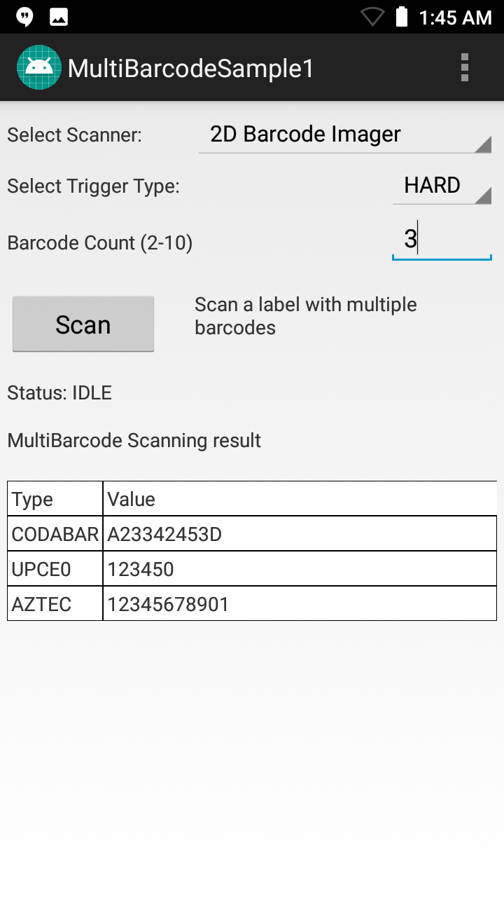

##Overview
This sample demonstrates simultaneous scanning of multiple barcodes using capabilities in the Barcode/Scanning APIs. These APIs work independently of any [Data Capture profiles](../../mx/data-capture/barcode).  

#### Notes

* **This sample illustrates a single use-case** for implementing multi-barcode features; it is not a comprehensive example of the many ways this feature could be used. 
* **DataWedge cannot be configured for data capture through Profile Manager** when using EMDK-X 4.0 or higher. Zebra recommends using the [DataWedge APIs](/datawedge/latest/guide/api/) instead.

##Using Sample App

>**NOTE**: The appearance of sample app screens can vary by sample app version, Android version and screen size.

**Before beginning, download, build and install the sample app**.  See the [Sample App Set-up Guide](../../guide/emdksamples_androidstudio) for help. 

1. **Launch the sample app**. It should appear similar to the image below:
  
  
2. **Select the desired scanner, point the device at a scan target that contains multiple barcodes and tap the Scan button**. The status area should appear similar to the image below:  

  

> **NOTE: Sample apps are for demonstration purposes only and should not be used in production environments**.
