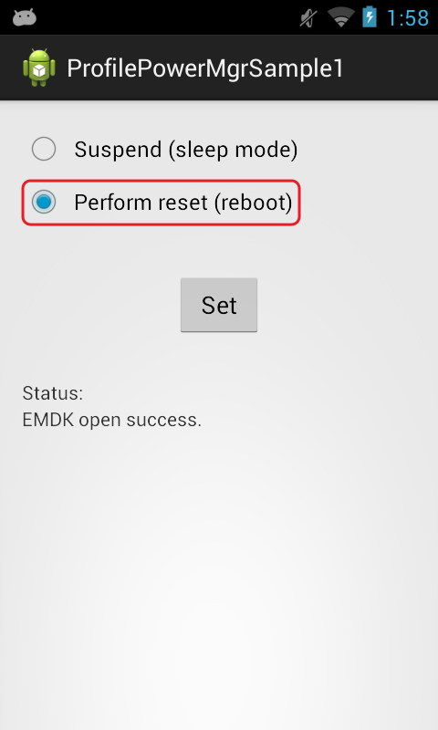

##Overview
The Power Manager Profile allows you to control the power state of a Symbol device. 

The available actions are:  
- Do Nothing  
- Sleep Mode  
- Reboot  
- OS Update  

This sample application will allow you to set the power state of "Suspend" (sleep mode) or "Reset" (reboot).

##Loading the Sample Application

1. Choose a sample and click the **See Details** button.
2. Now click the **Download** button 
3. `IMPORTANT:` **Extract the downloaded project zip file <u>to C:\</u>** (or to the **root** of an alternate drive).
4. Navigate to the root of the unzipped project folder and double-click the **.sln** file. The project loads in the default IDE for that file type.

Alternatively, launch a preferred IDE and load the project via the File > Open menu.  

## Running the Sample
Now that we have the project loaded, lets run the application and see how it works

###Visual Studio

Visual Studio will detect your device connected via USB, it will display the name of that device next to the "Play" button.

Press the "Play" button next to the devices name.  The IDE will build, deploy and start the sample app on your device.

###Xamarin Studio
In Xamarin Studio, you may need to select your attached device from the devices dropdown under `Physical Devices`.

Now press the "Play" button. The IDE will build, deploy and start the sample app on your device.

##Using This Sample
1. When the application starts it should look like the following.  
	  
2. Select the power mode you would like to set.  
	  	
3.  Click "Set" 
4.  Check the status field.   
	  

