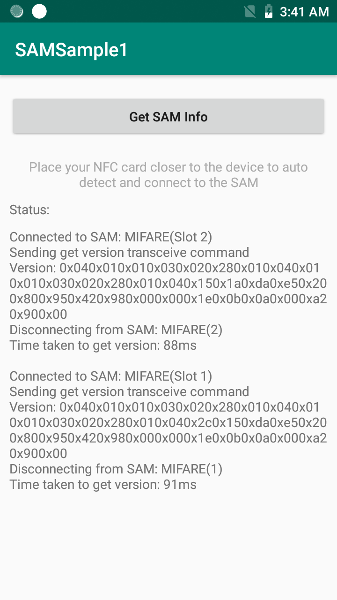

##Overview
EMDK for Xamarin allows secure communication with NFC tags through use of the Secure Access Module (SAM). 

**Available SAM actions**:

* Get the SAM Manager
* Enumerate SAM objects  
* Use the SAM module  
* Tranceive data
* Disconnect the SAM module
* Get the SAM index
* Detect an NFC tag

## Requirements
* Supported Visual Studio version on a Mac or Windows PC with Android API 22 (or higher) installed. See [EMDK Setup Guide](../../guide/setup) for help. 
* A supported Zebra Android device (see list above)
* A Zebra SAM module installed and configured 

##Load Sample App

1. Click the **Download** button from the sample-app details page. 
2. `IMPORTANT:` **Extract the downloaded project zip file <u>to C:\</u>** (or to the **root** of an alternate drive).
3. Navigate to the root of the unzipped project folder and double-click the **.sln** file. The project loads in the default IDE for that file type.

>**NOTE**: The appearance of sample app screens can vary by sample app version, Android version and screen size.

##Using This Sample

1. When the application starts it should look like the following:
  
  

-----

## Also See
[SAM API Programmers Guide](../../guide/samapiusage)

