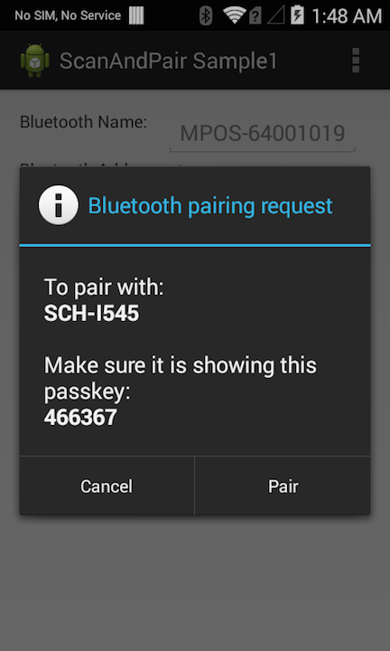

##Overview
This sample application will show how the Scan and Pair API can be used to pair two bluetooth devices programmatically.

##Prerequisites

For this sample, you will need two Android Bluetooth devices, one must be an EMDK for Android supported device. You will also need a barcode that contains the Bluetooth MAC address of the remote bluetooth device that we will be pairing with(The one not running the EMDK app).

##Loading the Sample Application

1. Choose a sample and click the **See Details** button.
2. Now click the **Download** button 
3. `IMPORTANT:` **Extract the downloaded project zip file <u>to C:\</u>** (or to the **root** of an alternate drive).
4. Navigate to the root of the unzipped project folder and double-click the **.sln** file. The project loads in the default IDE for that file type.

Alternatively, launch a preferred IDE and load the project via the File > Open menu.  

##Using This Sample

1.  When the application starts it should look like the following. Leave the **Always Scan** and **Hard Trigger** check boxes selected, and insure the **ScanData Type** spinner is set to **MAC ADDRESS**.  

    

2. Press the **Pair** button. The Status label will update, stating that the Scan and Pair process has started, and then prompt the user to press the hard scan trigger.

     

3. Now place the Pairing Barcode in view of the devices scan window, and then press the devices Hard Scan Trigger. The Scan and Pair sample app will retrieve MAC address from the barcode and place it in the **Bluetooth Address** field, then it will initiate the pairing and connection process. Press **Pair** in the Pairing Request dialog, to complete the pairing process. 
After pairing is complete, the status label will display "Bluetooth device is paired successfully".

   

