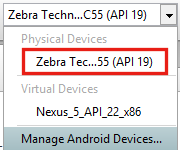
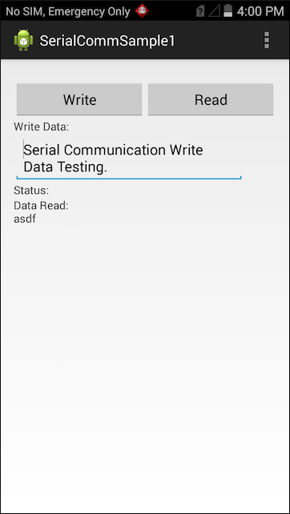

##Overview
This sample demonstrates the EMDK Serial Communication API to enable support for DEX in your application. DEX (data exchange) is a format for collecting audit and event data from vending machines.

##Prerequisites

**Items Needed**
* One of the approved devices listed above
* TC7X SNAP On DEX cable ( CBL-TC7X-DEX1-01 )

>Note: Although this sample may work with previous versions of the EMDK, it is advised to [update the EMDK runtime](../../guide/setupDevice/) on your device before loading this sample.

##Loading the Sample Application

1. Choose a sample and click the **See Details** button.
2. Now click the **Download** button 
3. `IMPORTANT:` **Extract the downloaded project zip file <u>to C:\</u>** (or to the **root** of an alternate drive).
4. Navigate to the root of the unzipped project folder and double-click the **.sln** file. The project loads in the default IDE for that file type.

Alternatively, launch a preferred IDE and load the project via the File > Open menu.  

##Running The Sample
###Visual Studio

Visual Studio will detect your device connected via USB, it will display the name of that device next to the "Play" button.

Press the "Play" button next to the devices name.  The IDE will build, deploy and start the sample app on your device.

###Xamarin Studio
In Xamarin Studio, you may need to select your attached device from the devices dropdown under `Physical Devices`.

Now press the "Play" button. The IDE will build, deploy and start the sample app on your device.

##Using This Sample
1. With the Snap on DEX cable attached, the application should look like the following when it starts.  
    
2. Press the **Write** button. The application should display a message that it has sent the text from the edit field in number of bytes sent in the status area.
      
3.  Press the **Read** button.  The application will continue to read for 10 seconds and then display the read data in the status area.
     
  

