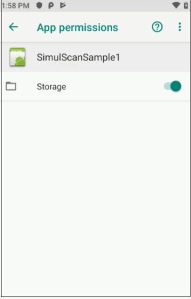
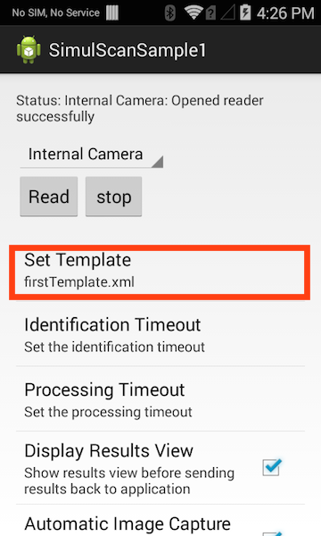

##Overview
This sample application demonstrates how Simulscan APIs can be used to capture multiple types of data from forms, boxes and the like.

##Prerequisites
* A SimulScan-licensed device
* A Simulscan template
* A printed copy of the form used to create the template
* Android API 19 or higher loaded via the SDK Manager

##Loading the Sample Application

1. Choose a sample and click the **See Details** button.
2. Now click the **Download** button 
3. `IMPORTANT:` **Extract the downloaded project zip file <u>to C:\</u>** (or to the **root** of an alternate drive).
4. Navigate to the root of the unzipped project folder and double-click the **.sln** file. The project loads in the default IDE for that file type.

Alternatively, launch a preferred IDE and load the project via the File > Open menu.  

##Using This Sample

1. Place a template on the SD card of the SimulScan-licensed device using an adb command similar to the one below: 

    :::term
    adb push myTemplate.xml /sdcard/simulscan/templates/
  
2. Grant the app permission to access “Storage” by navigating to  **Settings -> Apps -> SimulScanSample1 -> Permissions**. The screen should look similar to the image below:
  

3. Launch The SimulScan sample app, which finds all templates stored in the SD card. **Tap the "Set Template" button** and select the template pushed to the device in Step 1: 
  

4. **Press the "Read" button** and follow the on-screen instructions. The sample app extracts the fields defined in the template: 
   
  If the "Display Results View" option is checked, a list of results is displayed for review: 
  

5. **Press the "Accept" button**. The app displays the elapsed time for capturing and decoding the template fields: 

  

6. Press the device's "BACK" button to return to the main screen.

<!-- 
       
 -->

