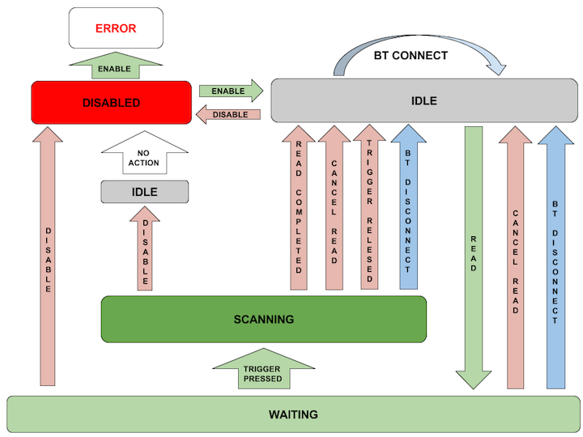
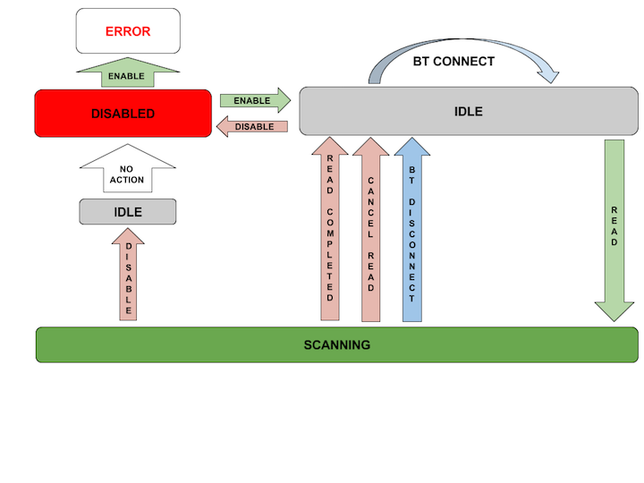

 <button type="button" class="close" data-dismiss="alert" aria-label="Close">×</button> <h4>Regarding EMDK Barcode Scanning APIs</h4> 
<u>Zebra strongly recommends the use of DataWedge for all applications that require barcode scanning</u>. <b>While Zebra will continue to support EMDK Barcode APIs</b>, the efficiency and feature richness of intent-based interfaces make it a simpler alternative to app development using EMDK Barcode APIs.
 
 <b>DataWedge facts</b>:
    
<ul>
        <li><b>DataWedge APIs have the same capabilities currently available in EMDK Barcode APIs.</li>
        <li><b>DataWedge intent-based APIs are easier and faster to implement than EMDK Barcode APIs.</li>
        <li><b>New features are added to DataWedge before being considered for EMDK Barcode APIs.</li>
    </ul>
     
    <a href="/datawedge" class="btn btn-danger">Learn About DataWedge</a>  

 

##Barcode API

The EMDK Barcode API provides applications with an ability to read the
variety barcode labels using different scanner devices such as built-in
imager/laser, built-in camera, Bluetooth ring scanners such as RS507 and
RS600 and Pluggable ring scanner such as RS4000.

###API

BarcodeManager is the primary object to enumerate the supported scanner
devices and access the scanner devices to read barcodes.

The lists of points to be considered during application design are
below:

-   An app should either use the DataCapture feature of the ProfileManager or barcode APIs for scanning barcodes  but it is not allowed access the both at the same time. The EMDKManager > BarcodeManager takes precedence over the DataCapture feature of the ProfileManager.

-   The EMDKManager > BarcodeManager used in an application must be released before another application can use that feature.

-   When the scanner such as RS6000, RS4000 is disconnected and connected back, the calling any method on the barcode object will result in INVALID_OBJECT error. The application can register for the connection notifications to know when the device gets disconnected and connected back so that applications can programmatically  re-initialize the scanner again.

-   Disabling the scanner cancels the pending read in progress and closes the session for the others applications to utilize the device.

-   If the Bluetooth Scanner is not paired, enabling the Bluetooth scanner will automatically launch the pairing utility for the user to scan the barcode displayed on the Mobile device using Bluetooth scanner to pair with the mobile device.

### Getting Barcode Manager

The EMDK must be opened before getting the BarcodeManager object and
release BarcodeManager before exiting the application.

        :::cs
        barcodeManager = (BarcodeManager)emdkManager.GetInstance(EMDKManager.FEATURE_TYPE.Barcode);
        

### Getting Scanner

There are two options here:

1.  **Get Scanner using DeviceIdentifier without device enumeration**

	Use the BarcodeManager.GetDevice(DeviceIdentifier deviceIdentifier) API

	If the specified Device Identifier is not supported on the target platform, call to “getDevice” will return null.

        :::cs
        scanner = barcodeManager.GetDevice(BarcodeManager.DeviceIdentifier.BluetoothImagerRs6000);

2.  **Get Scanner using ScannerInfo from device enumeration**

    Use the BarcodeManager.getSupportedDevicesInfo () first and then pass one of the received ScannerInfo objects to BarcodeManager.getDevice(ScannerInfo scnInfo)

        :::cs
        
        IList<ScannerInfo> scannerList = barcodeManager.SupportedDevicesInfo; ;

        Scanner scanner = null;

        if ((scannerList != null) && (scannerList.Count > 0))
        {
                foreach (ScannerInfo scnInfo in scannerList)
                {
                        if (scnInfo.DeviceIdentifier == BarcodeManager.DeviceIdentifier.BluetoothImagerRs6000)
                        {

                                scanner = barcodeManager.GetDevice(scnInfo);
                        }
                }

        }

### Using Scanner

The scanner must be enabled first to open a session with the hardware. If scanner is already enabled other applications, this will throw an exception with error as scanner in use. The recommendation is to disable when you are done, otherwise it will remain locked for current application and will be unavailable any other application that want to use scanner.

The Scanner.enable() is an async call and exception will thrown if any error occurs during request. After the scanner is successfully enabled , the IDLE status event will be sent the application using the registered status listener. If any error occurs while enabling the scanner, the ERROR status will be sent to application using the registered status listener.

Issuing any read request while the previous read is pending will result in an error. The recommendation is to wait for the IDLE status from the application before issuing the next read to read the barcodes.

### Configuring the Scanner

The EMDK Barcode API provides three categories of scanner configuration to control the behavior of the scanner. The scanner configurations are Decoder Parameters, Reader Parameters and Scan Parameters. 

The user can get current settings by calling the method Scanner.getConfig() after the scanner is successfully enabled. This method returns a ScannerConfig object.

The user can modify the ScannerConfig object returned by scanner.getconfig The modified ScannerConfig object must be set by calling Scanner.setConfig(ScannerConfig) before the settings will take effect. The user must call the Scanner.setConfig(ScannerConfig) only when the scanner is enabled and in idle state.   The modified settings applied will persist until the scanner object is released and this means that when user calls enable() after disable(), all the latest configuration parameter values will be set automatically.  

Setting scanner configurations is not allowed while a read is pending. If a read is pending, the developer must call the Scanner.cancelRead() and must wait for the idle status through the register status listener before setting the configuration.

The below code shows how to disable the Code 128 symbology and set beam timer for imager.

        :::cs
        try {

        ScannerConfig scannerConfig = scanner.GetConfig();
        scannerConfig.DecoderParams.Code128.Enabled = false; 
                
                //Set beam timer for imager
                scannerConfig.ReaderParams.ReaderSpecific.ImagerSpecific.BeamTimer = 4000;

        scanner.SetConfig(scannerConfig); 

        } catch (ScannerException e) {

        //Error occurred and the error can be obtained by e.Message

        }

Calling SetConfig() should be done in the Status callback/Event. This way you can check that the scanner is indeed IDLE and that a scanner read is not pending.

Below is an example of how that should be done:

        :::cs
        void scanner_Status(object sender, Scanner.StatusEventArgs e)
        {
            StatusData statusData = e.P0;
            StatusData.ScannerStates state = e.P0.State;

            if (state == StatusData.ScannerStates.Idle)
            {
                if(!scanner.IsReadPending){
                        // call SetConfig() here
                }
            }
        }

### Decoder Parameters

The ScannerConfig.DecoderParams class provides an interface for the developer to enable or disable the decoder symbologies such as Code39, Code128, Code93, UPCEAN etc.  

The following code snippet shows how to disable the Code128 symbology:

        :::cs
        scannerConfig.DecoderParams.Code128.Enabled = false;

### Reader Parameters

The ScannerConfig.ReaderParams class provides interface for the developer to configure scanner engine specific settings for LaserSpecific, ImagerSpecific and CameraSpecific related parameters such as picklist, aim type, aim timer, beam timer, illumination mode, etc.

The below code snippet shows how to modify the beam timer for different scanner engines.

        :::cs
        //Set beam timer for camera
        scannerConfig.ReaderParams.ReaderSpecific.CameraSpecific.BeamTimer = 4000;
        //Set beam timer for imager
        scannerConfig.ReaderParams.ReaderSpecific.ImagerSpecific.BeamTimer = 4000;
        //Set beam timer for laser
        scannerConfig.ReaderParams.ReaderSpecific.LaserSpecific.BeamTimer = 4000;

### Scan Parameters
The ScannerConfig.ScanParams class provides interface for user to configure scanner parameters such as decode LED time, vibrate on successful decode, beep on successful decode, beep audio file, etc. 

The below code snippet shows how to modify the decode LED time.

        :::cs
        scannerConfig.ScanParams.DecodeLEDTime = 75;

##Scanner States
The following diagrams illustrate the states that a barcode scanner will transition through while using the EMDK Barcode Scanning API's

###Hardware Trigger

###Software Trigger

