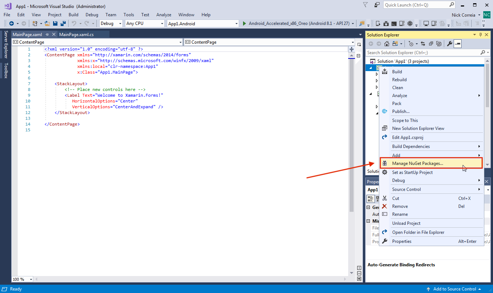
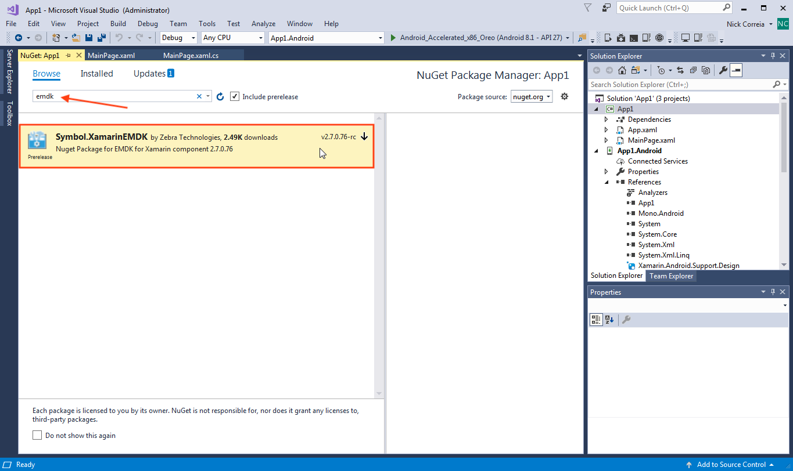
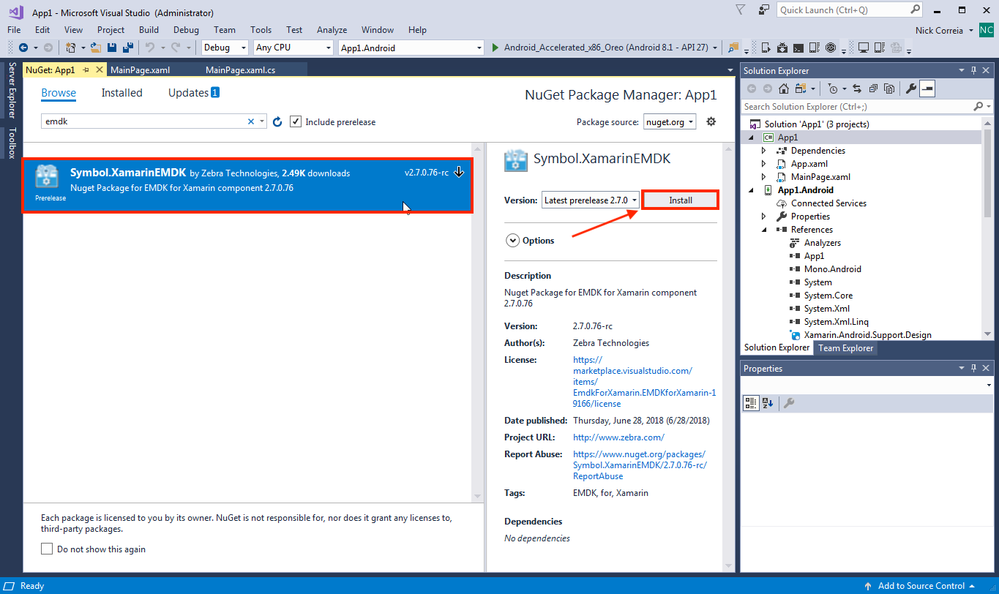
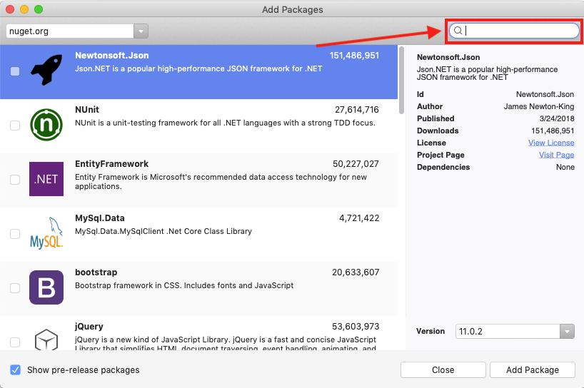
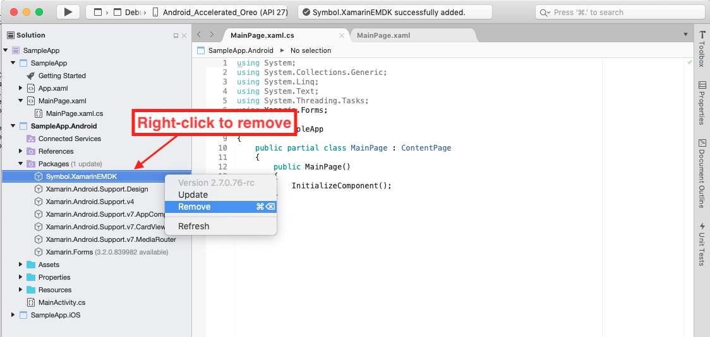

Starting with version 3.0, EMDK for Xamarin development tools are installed from NuGet packages and updated using the NuGet package management system. The EMDK-X NuGet package adds to Microsoft Visual Studio the API libraries required for building Android applications with Xamarin. **The package must be added to any Android project before the APIs are available for use**. 

> **Zebra recommends using EMDK-X with Visual Studio 2017 (or later)**. 

<!-- 
In previous versions of EMDK for Xamarin, the EMDK APIs were distributed through a Xamarin component. In late 2017, [Microsoft announced](https://blog.xamarin.com/hello-nuget-new-home-xamarin-components/) that it was phasing out support for Xamarin components and that all providers would be required to use NuGet packages.
 -->
**These instructions apply to**:

* Visual Studio 2017 for Mac OS
* Visual Studio 2017 for Windows
* Visual Studio 2019 for Windows `NEW`

**Note**: Later versions might vary slightly.
 
-----

### Prerequisites
The following software is required to use EMDK for Xamarin:

**Windows**:
* Windows 7, 8, 8.1, 10 (32- or 64-bit)
* Java Development Kit (JDK) v7u45 or newer
* Visual Studio 2019, 2017 or Visual Studio 2015 (up to v15.5) 

> **NOTE: EMDK-X is NOT supported on Visual Studio Community Edition for Windows**. 

**Mac OS**:  
* Mac OS X 10.11 (El Capitan) or newer
* Java for OS X 2014-10x or newer
* Java Development Kit (JDK) v7u75 or newer
* **Visual Studio 2017 for Mac OS** (Xamarin Studio is no longer supported)

**Attention Visual Studio 2015 users**: EMDK for Xamarin supports Visual Studio 2015 <u>only up to version 15.5</u>. Upgrading to any newer version results in failure. **Zebra recommends using Visual Studio 2017 (or later)**. 

-----

### Install EMDK Plug-in

#### Windows

The following instructions apply to Visual Studio 2017 (later versions might vary slightly). A supported version of Visual Studio must be installed to complete the steps below. If necessary, [install Visual Studio](https://visualstudio.microsoft.com/downloads/) before proceeding. 

**To install the NuGet package in Visual Studio for Windows**: 
 
1. From within a project, right-click the project name and **select "Manage NuGet Packages..."** from the menu:
	
	_Click to enlarge; ESC to exit_.  
2. **Click "Browse"** (if necessary) and **enter "EMDK" in the search box**. The Symbol.XamarinEMDK package appears: 
	
	_Click to enlarge; ESC to exit_.  
3. **Select the package** to show its info and Install button.  Then **click "Install"**:
	
	_Click to enlarge; ESC to exit_.  
4. **Click the "I Accept" button** to accept the license, if necessary.
	
	_Click to enlarge; ESC to exit_.  
5. Repeat Steps 1&ndash;4 for each project that uses EMDK for Xamarin APIs. 

#### The project is ready to use EMDK for Xamarin APIs. 
 

#### Note for Visual Studio 2019 users:
In Visual Studio 2019, an EMDK submenu is displayed in the "Extensions" menu simimar to the image below: 

_Click to enlarge; ESC to exit_.
 

-----

#### Mac OS

The following instructions apply to Visual Studio 2017 (later versions might vary slightly), which must be installed to complete the steps below. If necessary, [install Visual Studio](https://visualstudio.microsoft.com/downloads/) before proceeding. 

**To install the NuGet package in Visual Studio for Mac**:

1. In the project, select **Project -> "Add NuGet Packages..."**
	
	_Click to enlarge; ESC to exit_.  
2. **Enter "EMDK" in the search box**. The Symbol.XamarinEMDK package appears: 
	
	_Click to enlarge; ESC to exit_.  
3. **Select the package** and **click the "Add Package" button**. 
	
	_Click to enlarge; ESC to exit_.  
4. **Click "Accept"** to accept the license when prompted:
	
	_Click to enlarge; ESC to exit_. 

> The project is ready to use EMDK for Xamarin APIs. 

-----

### Remove EMDK Plug-in

#### Windows

**To remove the EMDK for Xamarin NuGet package from a Windows project**:

From within a project, **right-click the** `Symbol.XamarinEMDK` **package and select "Remove"** as below:
	
 

-----

#### Mac OS

**To remove the EMDK for Xamarin NuGet package from a Mac OS project**:

From within a project, **right-click the** `Symbol.XamarinEMDK` **package and select "Remove"** as below:

	_Click to enlarge; ESC to exit_. 
 
