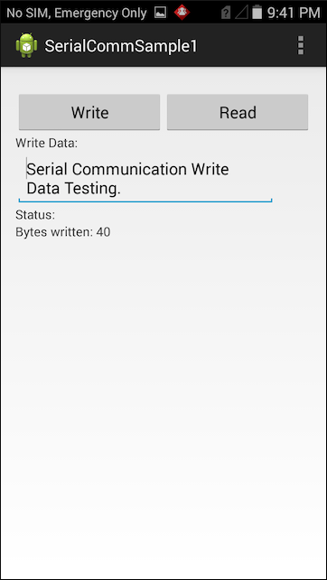

##Overview
This sample demonstrates the EMDK Serial Communication API to enable support for DEX in an application. DEX (Data Exchange) is a format for collecting audit and event data from vending machines.

##Prerequisites

* One of the approved devices listed above
* TC7X SNAP-on DEX cable (CBL-TC7X-DEX1-01)

>**Note**: Although this sample might work with previous versions of EMDK, Zebra recommends [updating the EMDK runtime](../../guide/setupDevice/) on target device(s) before loading this sample.

##Load Sample App

1. Click the **Download** button from the sample-app details page. 
2. `IMPORTANT:` **Extract the downloaded project zip file <u>to C:\</u>** (or to the **root** of an alternate drive).
3. Navigate to the root of the unzipped project folder and double-click the **.sln** file. The project loads in the default IDE for that file type.

Alternatively, launch a preferred IDE and load the project via the **File -> Open** menu.  

##Running The Sample
###Visual Studio

Visual Studio detects the device connected via USB and displays the name of that device next to the "Play" button.

Press the "Play" button next to the device name. The IDE builds, deploys and starts the sample app on the device.

###Xamarin Studio
In Xamarin Studio, it might be necessary to select the attached device from the device's `Physical Devices` drop-down menu.

Now press the "Play" button. The IDE builds, deploys and starts the sample app on the device.

##Using This Sample
1. With the Snap-on DEX cable attached, the application should look like the following when it starts:  
  
2. Press the **Write** button. The application should display a message that it has sent the text from the edit field in number of bytes sent in the status area.
  
3.  Press the **Read** button.  The application will continue to read for 10 seconds and then display the read data in the status area.
  
  

