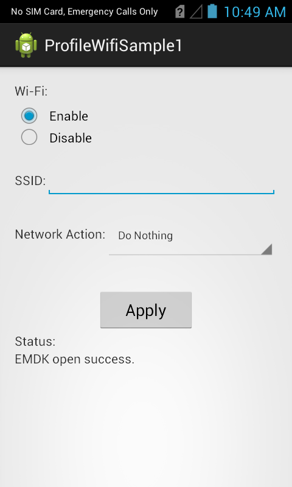
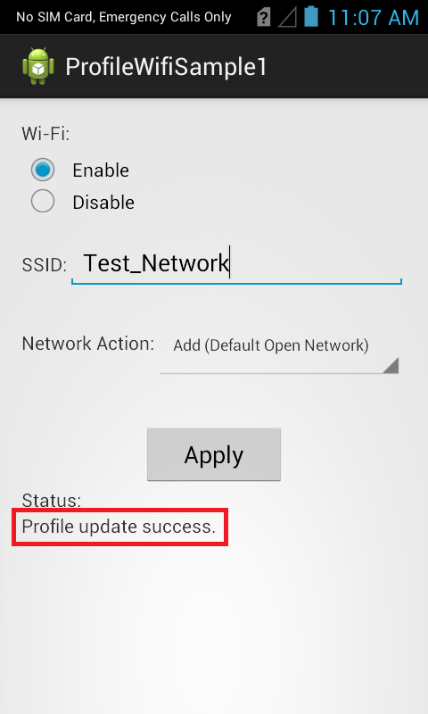

##Overview
The Wifi Profile allows you to configure Wi-Fi settings for the device. 

The available actions are:
  
* Disable Wi-Fi  
* Enable Wi-Fi  
* Add a Network  
* Connect to a Network
* Enable a Network
* Disconnect from a Network
* Disable a Network
* Remove a Network

> Note: In order to perform all Wi-Fi network operations, Wi-Fi should be enabled.  

This sample application will allow you to perform all the above mentioned Wi-Fi actions on Symbol device.

##Loading the Sample Application

1. Choose a sample and click the **See Details** button.
2. Now click the **Download** button 
3. `IMPORTANT:` **Extract the downloaded project zip file <u>to C:\</u>** (or to the **root** of an alternate drive).
4. Navigate to the root of the unzipped project folder and double-click the **.sln** file. The project loads in the default IDE for that file type.

Alternatively, launch a preferred IDE and load the project via the File > Open menu.  

## Running the Sample
Now that we have the project loaded, lets run the application and see how it works

###Visual Studio

Visual Studio will detect your device connected via USB, it will display the name of that device next to the "Play" button.

Press the "Play" button next to the devices name.  The IDE will build, deploy and start the sample app on your device.

###Xamarin Studio
In Xamarin Studio, you may need to select your attached device from the devices dropdown under `Physical Devices`.

Now press the "Play" button. The IDE will build, deploy and start the sample app on your device.

##Using This Sample

1. When the application starts it should look like the following.
  
	
  
2. Select the Wi-Fi operation you want (Enable/Disable).
   
	  	

3. Select the Network action you want to execute from the Network Action drop-down. 
	Let us select "Add(Default Open Network)" option.

	

	> Note: You could also add Personal Network with Passphrase and Enterprise Network with required certificate, which is not in the scope of this sample. 
4. Provide some SSID to the network you want to add in SSID field (Ex. Test_Network).

	

5. Click "Apply" button.

6. Check the status field.
   
	  

