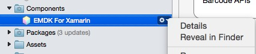
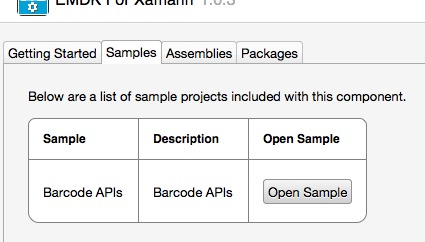
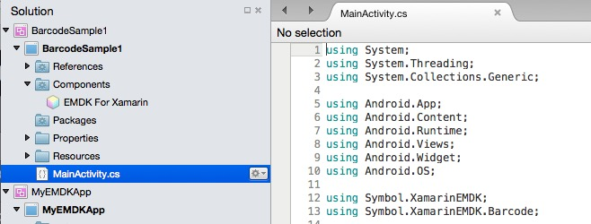

## Opening The Sample
After [adding the EMDK for Xamarin component](../component/install) to your Android project, you can access the Barcode API sample:

1. Open the EMDK for Xamarin components detail page

	
	
2. Select the `Samples` tab
3. Click the `Open Sample` button

	

The sample project will then open. You can choose to run it and review the associated code.

> Note: There is a known [Xamarin issue](https://bugzilla.xamarin.com/show_bug.cgi?id=17662) that may occur when loading and building a sample project from the component details page. When a Xamarin component is added to your project, a copy of that component and its contents are copied to your project and placed in the `PROJECT/Components` folder. All the samples for that project reside three directories further into the project path  `PROJECT/Components/COMPONENTNAME/Samples/SampleName`. As you can see the full path to this sample can grow quite large. i.e. **C:\Users\USERNAME\Documents\Visual Studio 2013\Projects\PROJECTNAME\Components\emdk-component-0.0.1\samples\SAMPLENAME**.  In most cases the project will load correctly when launching the sample, but when you attempt to build the project you get a PathTooLongException. This error happens because the windows operating system sets a maximum limit to how long a path can be (260 characters). This path may not be 260 long yet, but when the build process starts, it will generate files and paths inside that sample folder, which could exceed that limit.  To solve this issue, you simply need to copy the sample project that you wish to use, out of that embedded samples folder, up to the IDE's project folder, and then load the sample by clicking on its .sln (solution)file.

