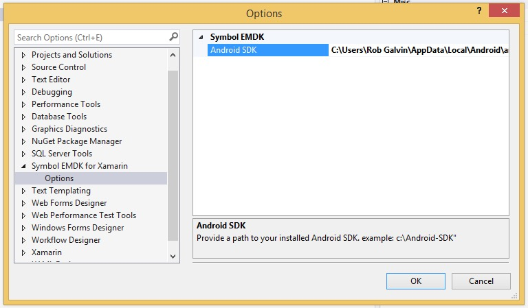
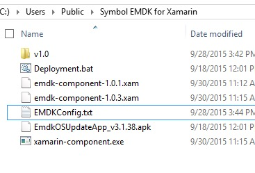
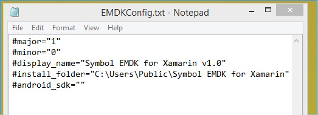

>`NOTICE:`  
	The instructions below for updating the EMDK runtime via the EMDK OS update package pertain to devices running KitKat only. Devices running Lollipop+ will have the EMDK built in to the devices OS and can only be updated with a device BSP update package. `The OS Update package that comes with the EMDK will not be supported on Lollipop+`

##	Device Update from IDE

For your convenience, a menu item has been added to the Visual Studio and Xamarin Studio extension to perform the device update. Before running make sure:

1. The device has USB Debugging enabled
2. The device has been connected to the development machine

Once the device is connected:

1. Select the `EMDK` menu from the menu bar
2. Select `Install Device Runtime` menu item

The device will display information about the update progress and any actions that need to be taken. The device may be rebooted after the update has been applied.

### Trouble Shooting
The device update process uses `ADB.exe` to download and initiate the installation package. If ADB cannot be located, you may receive an error message indicating that ADB cannot be found. To correct this you can:

1. Change the path where ADB is located and run the `Install Device Runtime` menu item again.
2. Use the Device Update APK file manually.

### ADB Configuration path
#### Visual Studio
In Visual Studio, you can configure the path where ADB can be found by:

1. Open Visual Studio
2. Select `Tools` \ `Options`
3. Scroll down and open `Symbol EMDK For Xamarin` \ `Options`
4. On the right hand side of the dialog, enter the path to the Android SDK

	
5. Click `Ok`
6. Select the `EMDK` menu from the menu bar
7. Select `Install Device Runtime` menu item

####Xamarin Studio
For Xamarin Studio, you can configure the path where ADB can be found by:

1. Open the file `EMDKConfig.txt` found in `C:\Users\Public\Symbol EMDK for Xamarin` (Win) or `/Users/Shared/Symbol EMDK for Xamarin` (Mac)

	
2. Change the line `#android_sdk=""` line to include your path to ADB between the quotes like: `#android_sdk="C:\Path\To\AndroidSDK"`

	

> Note: Do not edit any other lines in this file, otherwise you may not be able to perform other EMDK functions like Profile Manager.

If the `EMDKConfig.txt` file is not there, please be sure to do the following once and then try again:

1. Select the `EMDK` menu from the menu bar
2. Select `Install Device Runtime` menu item 

## Device Update APK
After selecting the `EMDK\Apply Device Update` menu option at least once, the device update APK file can be found in `C:\Users\Public\Symbol EMDK For Xamarin` (Win) or `/Users/Shared/Symbol EMDK for Xamarin` (Mac)folder.

This can be used by Mobile Device Management or Staging solutions for mass deployment and update of a large set of devices. Be sure to review the `Usage Notes` section below for more information.

## Usage Notes
### AppLock Manager
When installing the EMDK device runtime update while the AppLock Manager is on, you have two options:

* Option 1: Turn Off the AppLock Manager before EMDK device runtime deployment and the AppLock Manager can be turned On after device reboot.
* Option 2: The customer can add the EMDK OS update app name to the AppLock Manager Applications white list before the EMDK device runtime deployment.

### Google Mobile Service (GMS) devices
Before installing EMDK device runtime on GMS devices, you must enable the enterprise-grade features like Mobility Extensions (MX). To download enterprise enabler for your device, go to [https://portal.motorolasolutions.com/Support/US-EN](https://portal.motorolasolutions.com/Support/US-EN) and search for "Enterprise Enabler" along with the device name.

### Modify Device Runtime Installation Behavior
The EMDK device runtime update application will skip the EMDK runtime install if a device has an EMDK runtime version higher than the install version. The EMDK device runtime installation behavior can be modified by pushing an EMDK install mode configuration (`emdkosupdateconfig.xml`) to the `/enterprise/usr/` folder on a devices internal storage. This overrides the default settings of the application.

>NOTE: **This process is not required to use the default installation behavior.**

**Example emdkosupdateconfig.xml**

		:::xml
		<?xml version="1.0" encoding="utf-8"?>
		<wap-provisioningdoc>
			<characteristic type="EmdkOSUpdateMode">
				<parm name="InstallMode" value="skip"/>
				<parm name="RemoveInstaller" value="true"/>
			</characteristic>
		</wap-provisioningdoc>

**InstallMode Parm Value Options:**
This determines the install behavior when the existing version on the device is higher than the version being installed. The default install mode is `skip`.

* **auto** - Displays alert box during installation and waits for the user input
* **overwrite** - Overwrite and continue installation
* **skip** - Skip and continue installation. This is the default
* **cancel** - Exit the installation

**RemoveInstaller Parm Value Options:**
Removes the EMDK OS Update application on successful update.

* **true** - Removes the EMDK OS Update application on successful update (Default).
* **false** - Don't remove the EMDK OS Update application on successful update.

>Note: Supported in EMDKOS Update App v3.1.37 or higher.

**EMDK Device Runtime Installation Steps**

1. Create `emdkosupdateconfig.xml` and push into `/enterprise/usr/` to modify the default behavior.
2. Push the `EmdkOSUpdateApp_[version].apk` to a supported Symbol device.
3. Install EmdkOSUpdateApp application.
4. Launch installed EmdkOSUpdateApp application.

>NOTE: If the update succeeds, the EmdkOSUpdateApp will be un-installed (if the default settings have not overridden) and device will be rebooted. If the update fails, the EmdkOSUpdateApp application will not be un-installed. The update results will be available at  `/enterprise/usr/emdkosupdateresults.xml`

