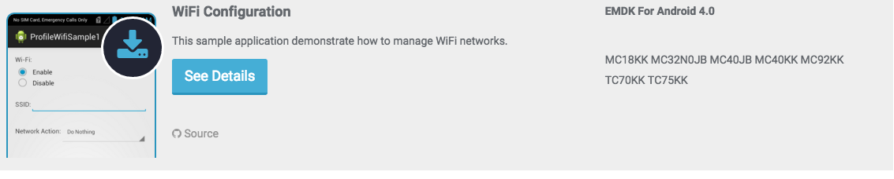
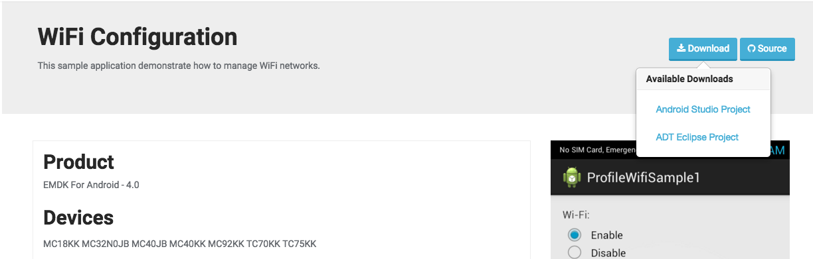
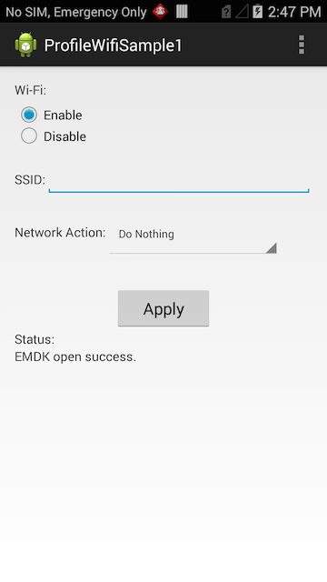

##Loading the Sample Application

1. Choose a sample and click the **See Details** button.
    
2. Now click the **Download** button and select **Android Studio Project**
    
3. Extract the downloaded project zip file and make note of the extracted sample's path. You will need to know where it exists on your file system in following steps.

4. Now open Android Studio.  If you have a previous project open, close the project by clicking **Close Project** from the **File** menu.

5. In the Android Studio Welcome window, select **Open an existing Android Studio project** from the **Quick Start** pane.

6. Browse to the path of the extracted project(from step #3) , add click the **OK** button.

When the import process is complete, the project load in the IDE, ready to deploy.
  

##Deploying a Sample Application

1. Select the project you want to deploy from the run configuration drop down, then press the green play button.

 
 Android studio will push the application to your device via USB and start the main activity.

 

