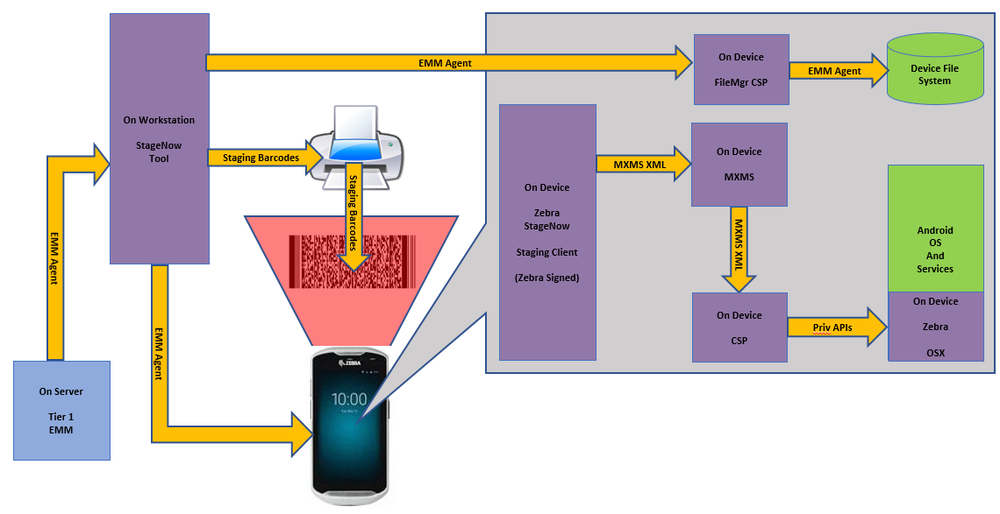
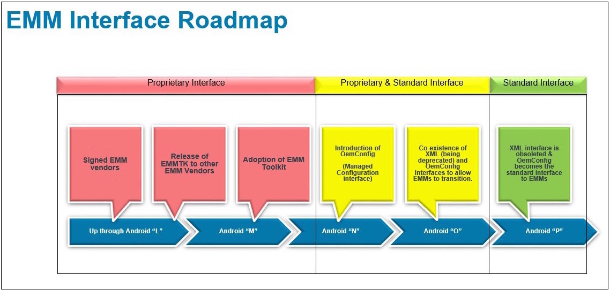

## `DRAFT`

**_Information subject to change without notice_**. 

-----

## Overview

The Zebra Enterprise Mobility Management Toolkit (EMMTK) is designed to allow developers of EMM (sometimes known as "mobile device management" or MDM) solutions to adapt their products to manage Zebra devices. This has historically involved interfacing with the [MX Management System (MXMS)](/mx/overview), Zebra's XML-based communication framework for managing the capabilities and behaviors of its Android devices. With the emergence of Android Enterprise, **_some_** capabilities once accessible only through Zebra's proprietary management layer can (or will in the near future) be controlled by an agent designated as a "Android Enterprise Device Owner" (AEDO) using standardized Android APIs. 

**Zebra staging mechanisms follow these basic steps**:​

* **Create staging profiles** through the StageNow desktop client
* **Generate barcodes** or other media that contains staging instructions​
* **Read the generated medium on the device** using a staging client
* **Execute the staging instructions to**:​
 * Configure the device for connection to a staging network​
 * Download, install, configure and launch an EMM agent on the device​
 * Perform persistence and/or other desired staging tasks

The primary vehicle for integrating an EMM solution with Zebra's staging tools is the [Staging Service APIs](../api). This guide contains all information necessary for adding Zebra-device staging capabilities to an EMM management console. 

<!-- 

WATCH (George's?) GTX (and possibly embed it)

DO WE WANT TO GO HERE: 
Prior solutions required two separate sets of tools: One to generate the XML-based profiles for consumption by a client on the device, and another to read them on the device and configure Zebra devices, and another could export those profiles for deployment through an EMM. Zebra is phasing out the two-tool solution in favor of informing EMM solution providers how to modify their tools to generate the XML. 

 -->

-----

### Background

Tier-1 EMM solution providers have historically administered Zebra devices through a signed agent, an Android app running on the device that accepts XML passed directly from the Zebra StageNow administrative tool. Other EMM vendors adapt their solutions using the legacy [MDM Toolkit](../mdmtk). Through these mechanisms, EMM vendors are able to access Zebra's proprietary MX Management System, which configures Zebra devices through standard Android APIs when possible, or through OSX, Zebra's proprietary Android extension layer.

_Legacy staging process for Zebra device management. Click to enlarge_.
 

Over time, many of the capabilities once available only through these mechanisms have been added by the Android development community. Starting as "Android for Work," these capabilities are now available as "Android Enterprise" APIs or Android Managed Configurations, both of which are based on publicly available specifications. Zebra is adopting both as part of the natural evolution of its device management system. 

To prepare for the new approach, **EMM solution providers must migrate their Android "Device Administrator" (DA) agent apps to the "Device Owner" (DO) model**. The current method augments standard Android functions with Zebra's proprietary MX Management System. The forthcoming model works through Android Enterprise Device Owner (AEDO) APIs when possible, and fills gaps in functionality with OemConfig, a solution developed by Zebra that uses Managed Configurations when no AEDO solution is available. 

**<u>The major advantage of this method is universality</u>; it allows a single agent to work with <u>any</u> Android device in the future**, regardless of brand. In the past, EMM vendors have had to develop and maintain multiple agents to support the proprietary management mechanisms required for each brand of device they chose to target. 

> **IMPORTANT NOTES**:  
* **Zebra devices running Android 7.x Nougat and 8.x Oreo support DA <u>and</u> DO agents**.
* **Migration options described below include features implemented in [MX 8.1](/mx)**.
> * **<u>Agents for Oreo (and later) must be unsigned</u>**; Zebra devices running Android 8.x do not support signed agents.
> * **Support for MX ends with Android 9.x Pie**; devices running Android Pie must use [unsigned DO/DA+ZMC](#unsigneddodazmc) agents.

-----

## See Also

* **[EMMTK Glossary](../glossary)** | Defines terms used in the EMM Toolkit
* **[AEDO Migration Guide](../migrateaedo)** | EMM agent migration options 
* **[Persistence Best Practices](../persistence)** | Zebra-recommended processes for EMMs
* **[Staging Service APIs](../api)** | Interfacing with StageNow from an EMM console

