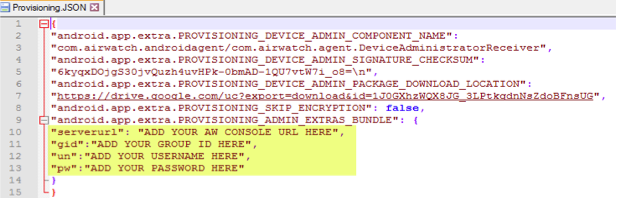
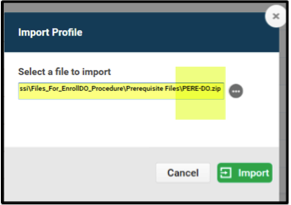
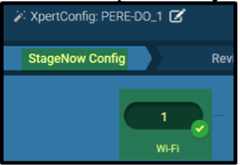
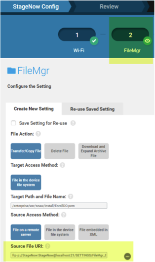
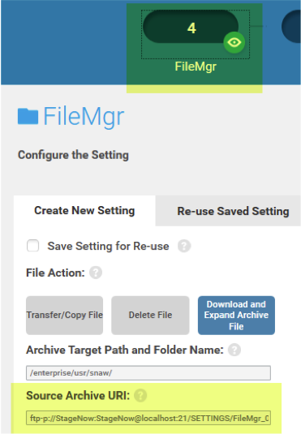
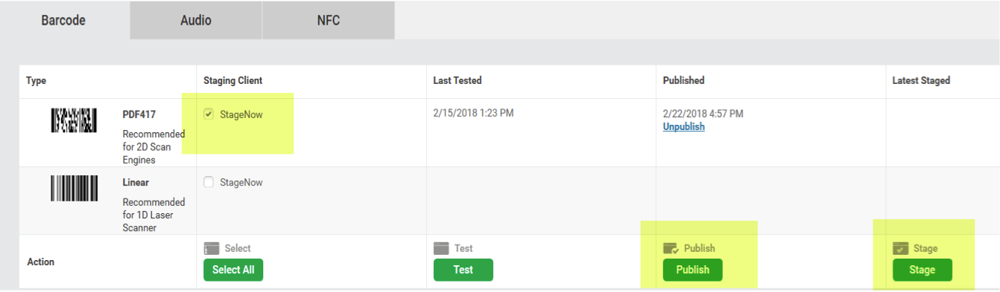

## Overview

overview text that explains device owner stuff. 

Android Enterprise Device Owner

_caption_
 

-----

## raw from slides

Assumptions
The device(s) to be staged is starting from a Factory Default state with no 3rd Party files/apps (not included with the OS) resident on the device. Device(s) supported: TC51, Android Nougat or greater, MX7.1 or greater. 

Prerequisites
Download and install StageNow.  
Note: The 2 StageNow Profiles that are required for this procedure were built with StageNow tool version 2.10.1.  Make sure your version is at least as current.  Older versions may result in an import error.
 
Set up the Organization Group on your AirWatch server console for AFW.  Contact VMWare for this procedure.
Make sure you have the device enrollment credentials listed below. They are created on the console and will be required later.
GID (Group ID)
Username
Password 
Also required: Your AirWatch Console URL

Obtain 2 AirWatch APK files (AirWatchAgent.apk and AirWatchMotorolaMXService.apk) as follows:

Log in your AW Console. Create and download a “Sideload-Stage” (.ZIP file) package from the AW Console to your Workstation. (Contact VMWare for this procedure.)  

Your staging package must include a version of AW Agent that supports DO (e.g. v8.0.1 or greater).  Download the package and decompress the file.  It has 3 folders as shown below.  

The two files you need are in the /agent folder.  Copy and paste them to a folder on your Workstation.
 

Contact David Degrassi at Zebra for access to the necessary files and customer Certificate requests

## Steps (still raw)

1. Prepare a folder on the Workstation that will be required for device enrollment.  
Create folder path: /snaw/install/

2. Copy these 2 files that were obtained in Prerequisite section step4:
AirWatchAgent.apk
AirWatchMotorolaMXService.apk
Paste files to the /snaw/install/ folder.
IMPORTANT: Filenames are case-sensitive. Make sure the files are renamed exactly as shown above and remove any version information from the filename.

3. Copy Provision.apk that was downloaded earlier in Prerequisite section step5.
Paste file to the /snaw/install/ folder

4. Edit the credentials in the Provisioning.JSON file that was downloaded earlier in Prerequisite section step5.
Open the JSON file with any editing application e.g. Notepad++.
See the 4 highlighted parameters below.  Edit these with the credentials required for enrollment into your AW Console and Organization Group.
Save.
Copy/Paste Provisioning.JSON to the /snaw/install/ folder.
IMPORTANT: Filenames are case-sensitive. Make sure the file is named exactly as shown above.

_caption_
 

5. Import the First of two StageNow Profiles as follows:
Launch StageNow and log in as an Administrator.  
On StageNow UI, select:

Then select: (screenshot of "Import Profiles")

6. StageNow
Navigate to the PERE-DO.zip file on the Workstation that was downloaded earlier from Zebra.  
Then select Import.

_caption_
 

7. StageNow
Edit the StageNow Profile as follows: 
Rename Profile to: PERE-DO
Select Stagenow Config.
Select Wi-Fi.  Select Edit. 
Edit the Wi-Fi profile for your network. Save.

_caption_
 

8. StageNow
Complete the StageNow Profile as follows:
Select: (review)

Then select: (publish)

9. StageNow
Export an XML file from the StageNow Profile as follows:
Select:

Export the file to the /snaw/install/ folder on the Workstation.
Make sure the file is named exactly like this: PERE-DO.xml.

10. Folder Check: On the Workstation, make sure the /snaw/install/ folder has ALL the required files listed below.
IMPORTANT: Filenames are case-sensitive. Make sure each file is named exactly as shown.

11. StageNow
Import the Second of two StageNow Profile as follows:
On StageNow UI, select: (home)

Then select: (profiles)

Then select: (import profiles)

12. StageNow
Navigate to the AirWatch_Device_Owner_Enrollment.zip file on the Workstation that was downloaded earlier from Zebra.  
Then select Import.

13. StageNow
Edit the StageNow Profile as follows: 
Rename Profile to: AirWatch_Device_Owner_Enrollment
Select Stagenow Config
Select Wi-Fi.  Select Edit. 
Edit the Wi-Fi profile for your network. Save.

14. StageNow
Edit the StageNow Profile further:
Select the first FileMgr.  Select Edit.
Revise the Source File URI: Navigate to the EnrollDO.pem certificate file on your Workstation.  Save.

_caption_
 

15. StageNow
Edit the StageNow Profile further:
Select the second FileMgr.  Select Edit.
Revise the Source File URI: Navigate to the /snaw/ folder that you created on your Workstation.  Save.

_caption_
 

16. StageNow
Complete the StageNow Profile as follows:
Select: (review)

Then select: (publish)

17. Generate Staging barcodes as follows:
Select StageNow for PD417 barcode.
Select Publish
Select Stage.  This will produce the staging barcode
<Optional> 
Save the barcode PDF file.  
Print the barcodes.

_caption_
 

18. Before scanning the Staging barcode(s):
Ensure the StageNow Workstation is connected to the local staging WIFI network (same as set up in the Profiles).
Ensure StageNow is running on the Workstation.

19. For each device to be staged:
Install a charged battery and press the Power key to turn on.  
After initial power up, device will display the Setup Wizard (SUW).
Scan the barcode below to skip the SUW and launch the StageNow application.  

(barcode image)

Note:
The barcode above is supported by MX7.1 and greater. If the SUW is not bypassed after scanning, then manually navigate the SUW screens and launch StageNow from its icon.

20. Scan the Staging barcodes.  Barcodes can be displayed on the Workstation display or printed out.
 
Note:
The elapsed time from Scan to Enrollment is approximately 6 minutes.
Device displays may go dark due to timeout while the enrollment finishes.  This is expected.

21. (optional)
Log in to your AirWatch Console to monitor the progress of enrolled devices.
Devices will be added the Device List as they complete enrollment.  

-----

## See Also

* [About EMM Toolkit](../about)
* [EMMTK Guides](../guide)
