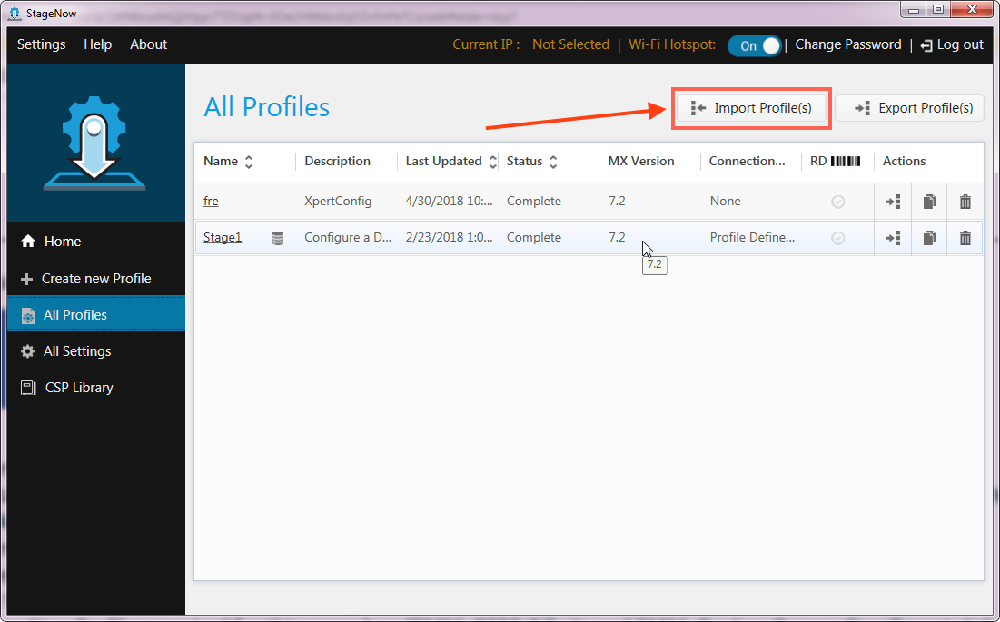

## `DRAFT`

**_Information subject to change without notice_**. 

-----

## Overview

This guide documents enrollment of an EMM agent app as a "Device Owner," granting the agent the permissions necessary to confiure all parameters of a Zebra device. Device Owner (DO) capabilies apply to Zebra devices running Android 5.x Lollipop and higher. However, **the procedures in this guide require Android 7.x Nougat (or later) and Zebra MX 7.1 (or higher)**. 

-----
<!-- 
section explains device owner stuff, and why a Nougat device _should_ be enrolled as a DO and why an Oreo _must_. 

* DO is recommended with Nougat. With Oreo, it's required. 
* Agent Uses AEDO + Zebra OemConfig Managed Configs​
* Android N or higher​
* EMM must leverage Zebra EMM TK V4​
* Supported from Android Nougat onwards​
* Provides parity of functionality to EMM TK V2 when combined with AEDO APIs​
* Standard-based​
* Not available prior to Android Nougat​
* Requires special Device Owner Enrollment​
* It is OPTIONAL for all EMMs to use OemConfig, but NOT doing so will leave the EMM unable to provide parity of functionality once they can no longer use MX via EMM TK V1 and V2 to augment the capabilities of AEDO APIs​
* SHOULD support use of OemConfig as early as possible, preferably by the by the end of Android Nougat​
* MUST support use of OemConfig by the start of Android P​

> Info in the QR code is identical to contents of the `Provisioning.JSON` file.  

### Terms used in this guide

* **AE -** Android Enterprise (formerly "Android for Work")
* **AEDO -** Android Enterprise Device Owner
* **AFW -** Android for Work
* **DA -** Device administrator
* **DO -** Device owner
* **EMM -** Enterprise Mobility Management
* **MDM -** Mobile Device Management

-->
-----

### Supported Devices

* All Zebra devices running Android Nougat or later with MX 7.1 or higher

### Prerequisites
* **For the Staging Workstation**:
 * **A computer running Windows 7** (or Windows 10 with StageNow 3.0 or higher)
 * **StageNow 2.10.1 or higher** installed (for compatibility with sample profiles provided)
* **Access to the "main console"** of the EMM solution 
* **Adequate EMM priviledges** to create: 
 * **A "Device Owner" enrollment** 
 * **User name**
 * **Password** 
* **The EMM management server URL**
* **All agent and/or service apps (`.apk` files)** required by the EMM solution to be present on the device being managed.  **Required files**:
 * `Agent.apk(s)` - **Device-resident agent file(s) with DO support** (provided by the EMM vendor)
 * `EMM_Device_Owner_Enrollment_Profile.zip` - **StageNow profile for enrolling device** (provided by Zebra)
 * `EnrollDO.pem` - **Owner enrollment certificate for EMM agent app** (provided by EMM vendor; file names vary)
 * `EMM_PERE-DO.zip` - **StageNow persistence profile** template (provided by Zebra)
 * `Provision.apk` - **Android provisioning app**. There's one for TC20/TC25 devices and another for all other Zebra devices (provided by Zebra)  
 * `Provisioning.JSON` - **Credentials file, including server address and login credentials** (created during the enrollment process below)

<!-- remove AirWatch-specific items:
 * **At least one group** in which to categorize devices to be staged
 * **Group ID(s) (GIDs)** for the group(s)

 -->
-----

## How to Enroll a Device Owner

This staging process is intended for devices that are in a factory-default state, and contain no third-party files or apps other than those included with the operating system. For information about returning a device to a factory-default state, [see Zebra Power Manager](/mx/powermgr). 

**Enrollment three-part process**: 

1. [Prepare the staging workstation](#1preparetheworkstation) (5 steps, one-time only)
2. [Create provisioning barcodes](#2createprovisioningbarcodes) (13 steps)
3. [Enroll the device](#3enrolladevice) (4 steps)

-----

### 1. Prepare the Workstation

This section is required only for first-time set-up of the staging workstation. **If the workstation is already prepared, [skip to Part 2](#2createprovisioningbarcodes)**. 

**Prepare the device-staging workstation**:

1. **Create a folder of any name** on the workstation to contain device-enrollment files listed in the [Prerequisites section](#prerequisites) above. 
  The folder name used for this guide is "`/EMM/install/`". 
2. **Copy the agent files** required for device management to the `/EMM/install/` folder. 
3. **Copy the** `Provision.apk` **file** to the `/EMM/install/` folder.
4. **Open the** `Provisioning.JSON` **file with a text editor**, and enter the server name, user credentials and any other necessary fields (as required by the EMM solution) in the appropriate section (see image, below). **TIP**: Information required for the `Provisioning.JSON` file is identical to that of the relevant QR code, if used.
5. **Save the changes and copy the updated file** to the  `/EMM/install/` folder.
 
 _The `Provision.JSON` sample showing server URL, user name and password fields. Syntax might vary by EMM solution_.
 

> **Note: File and folder names are case-sensitive**.

-----

### 2. Create Provisioning Barcodes

This section involves importing the StageNow settings profile `EMM_PERE-DO`, which is provided in generic form and must be modified for network settings of the target environment, vendor-specific agent files and other situation-specific parameters. The profile is then exported and deployed to the device for use during enrollment. 

#### Barcode Provisioning and the `EMM_PERE-DO` Profile 

1. Launch StageNow and log in as Administrator. 
2. **Click "All Profiles"** from the StageNow "Home" area:   
 _Click image to enlarge_. 
 
3. **Click "Import Profiles"** in the upper-right corner:
 _Click image to enlarge_. 
  
4. **Navigate to the** `EMM_PERE-DO.zip` **file** on the staging workstation (prepared in Section 1).  
**Select "Import"** and follow prompts to complete the process:
 _Click image to enlarge_. 
 
5. **Open the imported profile** to begin editing. If necessary, click the StageNow "HOME" icon to display this screen: 
 _Click image to enlarge_. 
 
6. The imported profile appears in "Review" mode. **Click "StageNow Config"** to enter Config mode... 
 
 **...then click the left arrow three times** to see the view shown below:
 _Click image to enlarge_. 
 
7. **Edit the necessary configuration sections of the imported profile** as required for the target environment (using Steps a&ndash;i below). **To edit a config**, tap its numbered button and click the blue "Edit" button on the right side of the screen (see arrow, above). <u>**Be sure to hit "Save" when done editing each config**</u> or settings are lost.  
	a. **Wi-Fi -** **Enter network settings** for the network on which the target device(s) will operate: 
	 
	b. **AppMgr -** **Enter the EMM agent app name <u>only</u>**. <u>Do not change the path</u> from that shown below: 
	`/enterprise/usr/EMM/install/<AgentAppName>.apk` 
	 
	c. **Intent -** **Enter the EMM vendor-specific package and class names of the agent app** to enroll as Device Owner: 
	 
	d. **AppMgr  -** **Optional**; use (as in Step b) only if EMM solution requires an additional app(s).  **Skip this step if no additional app(s) are required**. 
	**If one or more additional app(s) are required**, add and modify an AppMgr config for each, copy the corresponding .apk files to the `/enterprise/usr/EMM/install/` folder and speficy the file(s) as in Step b, above.  
	 
	e. **AppMgr -** **DO NOT CHANGE**. This config installs the required `Provision.apk` app. 
	 
	f. **Intent -** **DO NOT CHANGE**. This config enrolls the EMM with credentials provided in `Provisioning.JSON` file during the preparation in Section 1. 
	 
	g. **Intent -** **Enter the Android Action, Package and Class Names for the EMM solution**. The intent in this config launches the EMM agent on the device. 
	 
	h. **PersistMgr -** **DO NOT CHANGE**. This config ensures that settings configured in Steps a&ndash;g remain on the device if an Enterprise Reset is performed in the future.  
	
	i. If additional app(s) were not added in Step d above, **delete the optional AppMgr profile**.
	 
8. **Click "Review"** and verify all settings are configured as desired. **Then click "Publish" to proceed**. 
  
9. On the Publish screen, **click the "Export for MDM" button** and save the file in the `/EMM/install` folder as "`EMM_PERE-DO.xml`". 
 **<u>File name must be entered EXACTLY AS INDICATED ABOVE</u>**. 
  
10. The `/EMM/install` folder on the workstation should now contain these files: 
	1. `EMM_PERE-DO.xml` - StageNow config created above
	2. `Provision.apk` - Zebra-provided provisioning app
	3. `Provisioning.JSON` - EMM vendor-provided device user credentials
	4. `EnrollDO.pem` - enrollment certificate (names vary)
	5. `<EMM_agent_app.apk>` file(s) 

-----

### 3. Enroll the Device 

This section involves importing the StageNow settings profile `EMM_Device_Owner_Enrollment`, which is provided in generic form and must be modified for network settings of the target environment, a vendor-specific certificate file and other situation-specific parameters. The profile is used to publish the final staging barcodes. 

#### Barcode Generation and the `EMM_Device_Owner_Enrollment` Profile 

1. **Click the "HOME" icon and select "All Profiles"**: 
 _**Click on image to enlarge**_. 
2. **Click "Import Profiles"** in the upper-right corner:
 _**Click on image to enlarge**_.  
3. **Navigate to the** `EMM_Device_Owner_Enrollment.zip` **file** on the staging workstation (prepared in Section 1)._**Click on image to enlarge**_. 
**Select "Import"** and follow prompts to complete the process:
 _**Click on image to enlarge**_. 
4. **Open the imported profile** to begin editing. If necessary, click the StageNow "HOME" icon to display this screen: 
 _**Click on image to enlarge**_. 
5. The imported profile appears in "Review" mode. **Click "StageNow Config"** to enter Config mode... 
 
 **...then click the left arrow three times** to see the view shown below:
 _**Click on image to enlarge**_. 
6. **Edit the necessary configuration sections of the imported profile** as required for the target environment (using Steps a&ndash;d below). **To edit a config**, tap its numbered button and click the blue "Edit" button on the right side of the screen (see arrow, above). <u>**Be sure to hit "Save" when done editing each config**</u> or settings are lost.  
	a. **Wi-Fi -** **Enter network settings** for the network on which the target device(s) will operate: 
	 
	b. **FileMgr -** **Enter the Archive Target Path and Folder Name** as: 
	`/enterprise/usr/EMM/`.  
	In Source Archive URI, **navigate to** `/EMM/install/` **folder on the <u>workstation</u>**. 
	This config downloads to the device files placed on the workstation earlier.    
	 
	c. **CertMgr -** **Enter the certificate file name** and path on the device as:  
	`/enterpise/usr/EMM/install/<EnrollDO.pem>` 
	File name specified here <u>must match exactly</u> (including letter case) with file in the `EMM/install` folder on the workstation. 
	 
	d. **Batch  -** **DO NOT CHANGE**. This config executes all actions in the `EMM_PERE-DO.xml` profile. 
	 
7. **Click "Review"** and verify all settings are configured as desired. **Then click "Publish" to proceed**. 
  
8. On the Publish screen: 
	a. In the PDF417 row, **select the StageNow checkbox**. 
	b. **Click the "Publish" button** and if desired, enter comments for the staging operator in the pop-up box.  
  
	c. **Click the "Stage" button**. Barcodes appear (similar to those in the image below) containing encoded commands of the `EMM_Device_Owner_Enrollment` config profile, which calls the `EMM_PERE-DO` config profile (copied to the device in Step 6b). 
	d. Optionally, print and/or save the barcode file.  
  
9. **IMPORTANT**: Zebra recommends that barcodes be validated before deployment.  
**To validate**:  
	a. Connect the StageNow workstation to the same Wi-Fi network as that configured for the devices. 
	b. Power up a fully-charged device that is <u>NOT ENROLLED</u> in the EMM. If the Android set-up wizard appears (GMS devices only), bypass it by scanning the barcode below (requires MX 7.1 or higher on the device): 
	
	If the wizard isn't bypassed and/or the StageNow client doesn't launch on the device, finish the Android set-up and launch the StageNow client manually. 
	c. **Scan the staging barcodes** generated in Step 8, above. 
	d. Optionally, bring up the EMM console and monitor the enrollment progress (about 6 minutes). 
	**Note**: Device display goes dark during final enrollment steps. This is normal.  

#### Device Staging for Enrollment is Complete. 

-----

## See Also

* [About EMM Toolkit](../about)
* [Other EMMTK Guides](../../guide)

-----

## `DRAFT`

**_Information subject to change without notice_**. 

