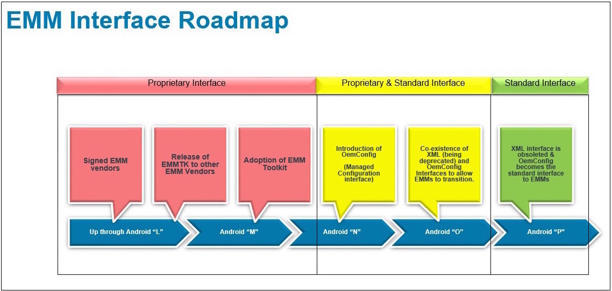

## Overview

The Zebra Enterprise Mobility Management Toolkit (EMMTK) is designed to allow developers of EMM solutions to adapt their products to manage Zebra devices. This has historically involved interfacing with the [MX Management System (MXMS)](/mx/overview), Zebra's XML-based communication framework for managing the capabilities and behaviors of its Android devices. 

With the emergence of Android Enterprise, some capabilities once accessible only through Zebra's proprietary management layer can now be controlled by an agent designated as a "Android Enterprise Device Owner" (AEDO) using standardized Android APIs. Functions lacking an Android API can be configured using OEMConfig, a Google-sanctioned approach developed by Zebra that controls device settings through the Android Managed Configurations mechanism. [More about OEMConfig](../glossary/#oemconfig).

**The general Zebra staging process**:​

* **Create staging profiles** through the StageNow desktop client
* **Generate barcodes** or other media that contains staging instructions​
* **Read the staging instructions on the device** using a staging client
* **Execute the staging instructions to**:​
 * Configure the device for connection to a staging network​
 * Download, install, configure and launch an EMM agent on the device​
 * Perform persistence and/or other desired staging tasks

The primary method of integrating an EMM solution with Zebra's staging tools is through the [Staging Service APIs](../api). This guide contains all information necessary for adding Zebra-device staging capabilities to an EMM management console. 

-----

### Background

Tier-1 EMM solution providers have historically administered Zebra devices through a signed agent, an Android app running on the device that accepts XML passed directly from the Zebra StageNow administrative tool. Other EMM vendors adapt their solutions using the legacy [MDM Toolkit](../mdmtk). Through these mechanisms, EMM vendors are able to access Zebra's proprietary MX Management System, which configures Zebra devices through standard Android APIs when possible, or through OSX, Zebra's proprietary Android extension layer.

_Legacy staging process for Zebra device management. Click to enlarge_.
 

Over time, many of the capabilities once available only through these mechanisms have been added by the Android development community. Starting as "Android for Work," these capabilities are now available as "Android Enterprise" APIs or Android Managed Configurations, both of which are based on publicly available specifications. Zebra is adopting both as part of the natural evolution of its device management system. 

### Prep for the Future

To prepare for the new approach, **EMM solution providers must port their Android "Device Administrator" (DA) agent apps to the "Device Owner" (DO) model**. The forthcoming model works through Android Enterprise Device Owner (AEDO) APIs when possible, and fills gaps in functionality with OEMConfig, a **Google-recommended solution developed by Zebra** that uses Managed Configurations when no Android Enterprise API is available. 

**Managed Configurations can**:

* Be defined and published by any application. 
* Be used by an app to configure its own settings. 
* Be used by an EMM agent **<u>to configure device settings</u>**. 
* Be discovered by an EMM agent or server and acted upon.
* Be used by an EMM Server through its EMM agent and a data-driven UI.

**<u>The major advantage of the [AEDO+ZMC](../port/#unsigneddodaagentzmc) method is universality</u>; it allows a single agent to work with <u>any</u> Android device in the future**, regardless of brand. In the past, EMM vendors were required to develop and maintain multiple agents to support the proprietary management mechanisms required for each brand of device they chose to target. 

_Click image to enlarge_. 
 

> **IMPORTANT NOTES**:  
* **Zebra devices running Android 7.x Nougat and 8.x Oreo support DA <u>and</u> DO agents**.
* **Agents for Oreo (and later) must be <u>unsigned</u>**; Zebra devices running Android 8.x and later do not support signed agents.
> * Porting options described in the EMMTK include features implemented in [MX 8.1 and MX 8.2](/mx) ([See function map](../functionmap)).
> * **Support for MX ends with Android 9.x Pie**; devices running Android Pie must use [unsigned DO/DA+ZMC](../port/#unsigneddodaagentzmc) agents.

-----

## See Also

* **[FAQ](../faq)** | Frequently asked questions about EMM Toolkit 
* **[EMMTK Glossary](../glossary)** | Defines terms used in the EMM Toolkit
* **[AEDO Porting Guide](../port)** | EMM agent porting options 
* **[Persistence Best Practices](../persistence)** | Zebra-recommended processes for EMMs
* **[Other EMMTK Guides](../../guide)** | A complete list of all guides in the EMM Toolkit
* **[Staging Service APIs](../api)** | Interfacing with StageNow from an EMM console
* **[Build a DDUI from the Zebra OEMConfig Schema (.pdf)](../../downloads/Zebra_EMMTK_Building_DDUI_from_OEMConfig_Schema_091418.pdf)** | Breakdown of DDUI creation with Zebra OEMConfig
* **[DA-to-DO Agent Porting Guide (.pdf)](../../downloads/Zebra_EMMTK_DA-to-DO_Porting_Guide_091418.pdf)** | Detailed porting information and guidance

