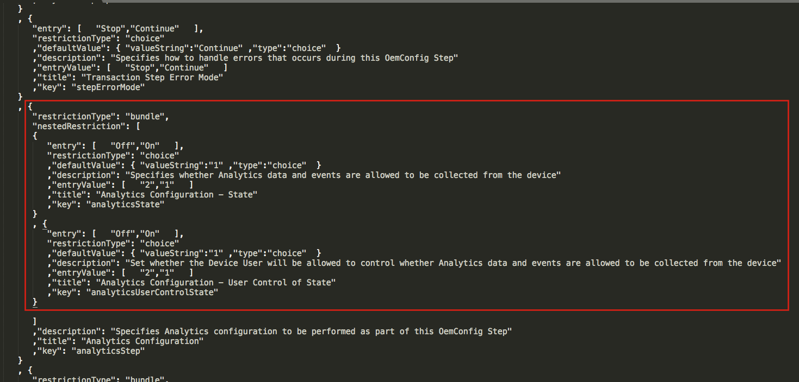
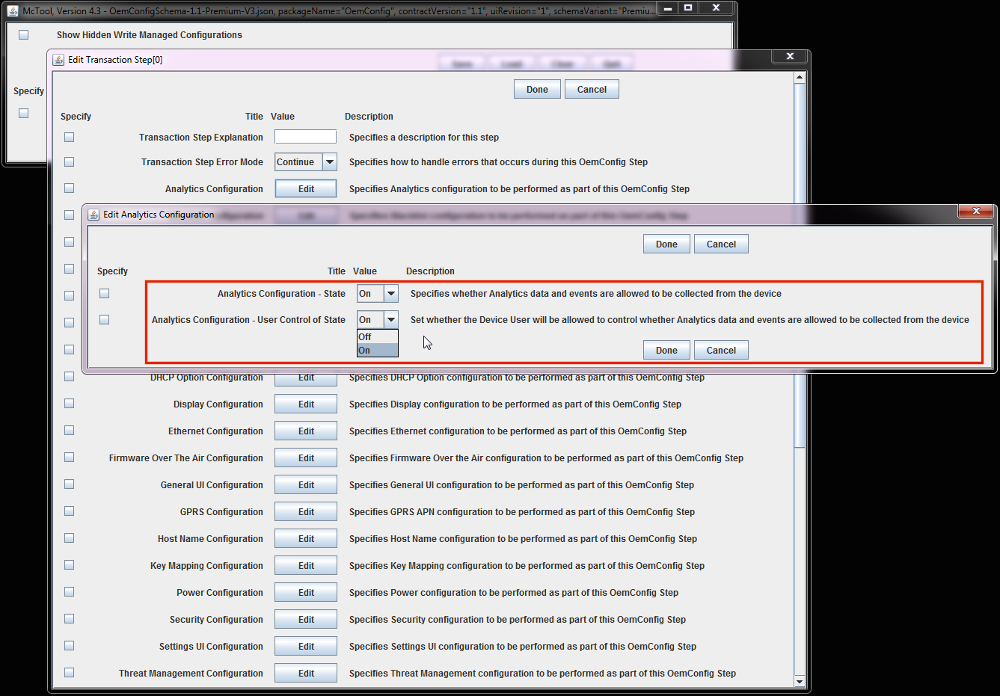

## `DRAFT`
**_Information subject to change without notice_**. 

-----

## Overview

This guide is intended to allow EMM solution providers to enable their products to support OemConfig, a Google-recommended approach developed by Zebra Technologies that configures Zebra devices using Android Managed Configurations. When performing administrative tasks on devices, Managed Configurations are used when no Android Enterprise API is available. Both are based on publicly available specifications developed by Google and the Android community. 

Zebra partners wishing to follow the processes defined in this guide must [register with Google](https://developers.google.com/android/work/play/emm-api/) as an EMM solution provider. This unlocks API-level access to the Google Play store, where the schemas for all Android apps are stored. An app's schema defines functions available for interrogation and/or configuration using Managed Configurations, and is central to OemConfig usage. 

### OemConfig Process:

1. EMM Server acquires OemConfig schema from Google Play store or [other locations]() 
2. Using schema data, EMM Server presents UI with device functions available for configuration 
3. Administrator interacts with UI, selecting desired configuration actions
4. Actions are saved as a Managed Configuration object (Google recommends JSON format)
5. EMM Server packages and transports MC objects to device agent
6. Agent converts MC objects to Android in-memory bundle(s)
7. Agent calls `DevicePolicyManager.SetApplicationRestrictions` and passes bundle(s) to `com.zebra.oemconfig` for action

### Sample Files

To aid EMM developers, Zebra provides two fully working tools as examples of effective implementations of this process to copy or compare with their own solutions. With the exception of the schema, which describes functions specific to Zebra devices, the sample solutions are based entirely on Google's public specifications, and contain no Zebra-proprietary logic. In theory, tools built from these samples are effective on any device that conforms to the Google specifications. 

`McTool.jar` - A Java app that presents a data-driven user interface from the contents of a schema.

`Schema.json` - The Zebra OemConfig schema. Contains Zebra-specific function definitions and a source for building a data-driven configuration UI. 

`BundleTools.java` - Java source code that converts JSON Managed Configuration objects into bundles. 

> NOTE: Zebra provides no warranty or support for sample files. 

-----

## About Zebra Schema

The Zebra schema is fully compliant with the Android schema design, yet is far richer than other publicly available schemas. It contains multiple layers of nested bundles, which provide it the richness and complexity necessary for configuring Zebra devices.

_JSON-compliant OemConfig schema showing code for Analytics UI settings. Click to enlarge_.
 

_Rendering the Analytics section of the schema in Zebra McTool sample app. Click to enlarge_.
 

> The Zebra OemConfig app and schema come preinstalled in Zebra devices.

-----

## See Also 

* **[Build a DDUI from the Zebra Schema (.pdf)](../schema/Zebra_EMMTK_Building_DDUI_from_OemConfig_Schema_091418_FINAL.pdf)** | Breakdown of DDUI creation with Zebra OemConfig
* **[DA-to-DO Agent Porting Guide (.pdf)](pdf)** | Detailed porting information and guidance

