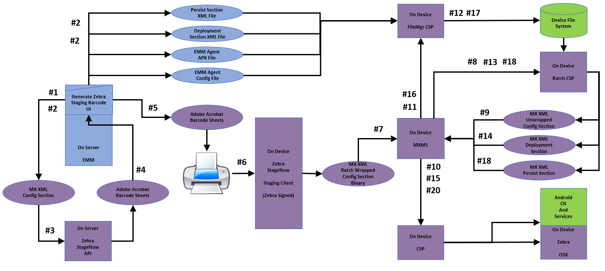

## Overview

Zebra provides a persistence framework that allows designated apps, settings and data to remain on a device following an [Enterprise Reset](/mx/powermgr), which otherwise erases all non-factory apps and data. For providers of enterprise mobility management (EMM) solutions, this permits an EMM agent and its related data and services to be preserved after all other software is erased, restoring the device to a manageable state. 

**Persistence can include**: 

* **Device owner** (DO) settings
* **Device administrator** (DA) settings 
* **EMM agent and/or service** apps and settings
* **A company's own apps, data and settings**

### About Device Persistence 
**An Enterprise Reset returns a device to its enterprise-defined state** as generally determined by the contents of the `/enterprise` folder in the device file system. The Zebra solution makes this possible only on devices configured in advance with its persistence framework, which is typically installed during initial device enrollment. See the [AEDO Enrollment Guide](../enrollaedo/#2createprovisioningbarcodes) for an example. 

**Some EMM systems have the ability to apply persistence or "fault tolerance" settings retroactively**, giving administrators the ability to preserve certain device settings and/or apps immediately prior to a reset. This can return a reset device to its EMM-enrolled state without further intervention. 

> **Zebra recommends using EMM vendor-specific persistence methods for device restoration whenever such capabilities are available**. 

For further information about EMM vendor-specific persistence, please <!-- see the guidance below or  -->refer to the documentation for the EMM system in use. 

-----

## Persistence Practices 

For optimal device staging and persistence of settings, agent software and enrollment status following an Enterprise Reset, observe these best practices whenever possible. 

Zebra's recommended staging phases perform the following : 

 1. **Configure Phase** - Bootstrap network connection, download deployment instructions
 2. **Deploy Phase** - Download EMM agent and additional configuration settings
 3. **Persist Phase** - Install, enroll and launch EMM agent 

-----

### 1. Configure Phase

**The Configure Phase includes creation of XML sent to the StageNow API to produce barcodes to be executed during the initial staging​ of a device**. This phase should contain the minimum steps required to enable a device to execute the steps in the Deploy Phase, the second phase of the staging process. For example, the Configure Phase might contain only Wi-Fi settings for connecting to a network plus a minimum of additional settings to download instructions and files for use during the Deploy Phase. For an example, see the [AEDO Enrollment Guide](../enrollaedo/#2createprovisioningbarcodes). 

**Notes**: 

* **Configure settings are <u>absolutely required</u> for successful staging to occur**.
* **Everything in the Configure Phase is encoded in the barcodes**.
* **The number of configured features determines barcode size** and count.
* **To reduce barcode size and count**, reduce the number of parameters being configured.

-----

### 2. Deploy Phase

**The Deploy Phase generally includes additional XML generated by StageNow and stored on a server for download and execution during the initial staging​**. Deployment-phase configs typically contain staging steps not required for initial bootstrapping, such as those for downloading EMM agent and other files. 

**Notes**: 

* **Deploy Phase steps are typically <u>not</u> included in barcodes​**. 
* **These steps are typically downloaded** and executed during the Configure Phase. 

-----

### 3. Persist Phase

The Persist Phase contains XML downloaded from a server and executed during initial staging **_and_** following an Enterprise Reset​. **This is true only of the steps in this phase**. 

**The Persist Phase <u>should</u>**:
​
* **Install the EMM agent** .apk and all other files on which it depends.
* **Install files in a persistent location** on the device.
* **Enroll the EMM agent as a Device Owner** (if running in DO Mode​).
* **Pre-configure the EMM agent** as required to contact the appropriate EMM Server.
* **Launch the EMM agent​**.

**The Persist Phase <u>should not</u>**:
​
* **Download files from an EMM Server** since it is unlikely that a network connection will be available immediately following an Enterprise Reset​, when the Persist steps are executed.
* **If Persist steps must access files downloaded by Deploy steps**, such files must be stored in a location that persists following an Enterprise Reset​.

**Notes**: 

* Steps in the Persist Phase are typically downloaded and executed during initial staging by steps contained within the Deploy Phase. 
* Deploy and Persist Phases are separated to avoid the need to repeat steps following an Enterprise Reset​. 
* Following an Enterprise Reset, only steps in the Persist Phase are executed (because they are the only steps that are not erased by the Enterprise Reset). 

-----

#### EMM Agent Notes

**EMM agents <u>should</u>**:​

* **Store network and other critical config settings in a persistent location** on the device.
* **Automatically re-apply critical settings** when launched by the Persist Phase following an Enterprise Reset​.
* **Re-establish production-network configuration**.

* **EMM agent settings must be persistent** following an Enterprise Reset. 
* **Agent settings must allow the device to connect to the appropriate EMM server**. 
* **Agent settings must allow management of the device**.
* **The EMM agent (not the Staging process) usually controls access to production-network configuration** since such configurations often change over time. 
* **Agent settings should ensure that production-network configuration is re-established** following an Enterprise Reset​. 

-----

## Persistence Planning

Zebra recommends that EMM solution providers use a process similar to the following when adapting their solution for Zebra devices and software. A specific set of minimum steps is shown below.

* Work out the required set of staging steps​:
 * Minimum staging steps required to bring a device under management​
 * Most appropriate ordering of steps​
 * Most appropriate division into Config, Deployment and Persist section​s
* Create and test using StageNow workstation tool to verify expected experience and behavior​
 * Decide where Deployment- and Persist-section XML files should reside​
 * Will there be multiple locations (e.g. EMM server, deployment server(s), etc.) from which these files might be pulled?​
 * Which transfer protocol(s) will be used? What security will control access to files in these locations?​
 * How will the EMM Server know which URI to use in the Config section to download the Deployment section?​
* Develop EMM server code to create and deploy all required files​:
 * EMM agent .apk, Configuration file, etc.​
 * Deployment- and Persist-section XML files​
* Develop EMM server console UI code to generate XML and staging barcodes​:
 * Select Wi-Fi configuration to use​
 * Select EMM mode, deployment server, etc.​
 * Disposition of staging barcodes (i.e. view, print, email)​
 * Storage of generated XML and/or staging barcodes for later use

_Zebra's latest staging processes implements configuration, deployment and persistence phases with a single tool. **Click to enlarge**_. 
 

<!-- 

_Zebra "legacy" staging process_
 

 -->

-----
## Minimum Staging Steps

As a general rule, steps involved in staging a device should be kept to a minimum. 

### Config​ Steps

* **Wi-Fi**:
 * Configure Staging WLAN​
* **File Manager**:
 * Download Deployment Section XML File from Server to Device​
* **Batch Manager**:
 * Execute Deployment Section XML File​

### Deploy Steps

* **File Manager**:
 * Download agent APK File from Server to Device​ to Persistent Location on Device​
 * Download agent Configuration File from Server​ to Persistent Location on Device​
 <!-- removed per eng. Not required b/c persist does this automatically.
 * Download Persist Section XML File from Server to Persistent Location on Device​ 
 -->
* **Batch**:
 * Execute Persist Section XML File​

### Persist​ Steps

* **Application Manager**:
 * Install agent APK file​
* **Intent**: 
 * Launch agent APK and/or enroll agent APK as Device Owner​

-----

## Kiosk Mode

Kiosk mode is generally defined as a single app running full-screen on a device with no obvious means of exiting. The kiosk feature is often used to dedicate a device to a particular usage scenario while securing it from damage or misuse. Common examples include retail price checkers, auto parts look-ups and patient check-in systems. Kiosk mode also can be useful for dedicating devices to a single task, such as the hand-held barcode scanner at a retail checkout counter. 

### Peripheral Connections

When a kiosk lockdown is enabled, the device user generally loses the ability to connect devices not previously known, such as Bluetooth peripherals. Zebra recommends that such peripherals be paired with devices running the kiosk app before kiosk mode is enabled. If a new Bluetooth device must be paired after kiosk mode is enabled, an administrator must exit kiosk mode, pair the Bluetooth device and re-enable kiosk mode.

-----

## Vendor-specific practices

**[AirWatch persistence info](http://techdocs.zebra.com/bestpractices/kiosk_persistence_airwatch.pdf)** | returning a kiosk-locked device to a manageable state

-----

## See Also

* [About EMM Toolkit](../about) | General information
* [FAQ](../faq) | Frequently asked questions about EMM Toolkit 
* [Staging Service APIs](../api) | Interface specs for cloud-based staging
* [Other EMMTK Guides](../../guide) | A complete list of all guides in the EMM Toolkit
* **[Build a DDUI from the Zebra OemConfig Schema (.pdf)](../../downloads/Zebra_EMMTK_Building_DDUI_from_OemConfig_Schema_091418.pdf)** | Breakdown of DDUI creation with Zebra OemConfig
* **[DA-to-DO Agent Porting Guide (.pdf)](../../downloads/Zebra_EMMTK_DA-to-DO_Porting_Guide_091418.pdf)** | Detailed porting information and guidance

