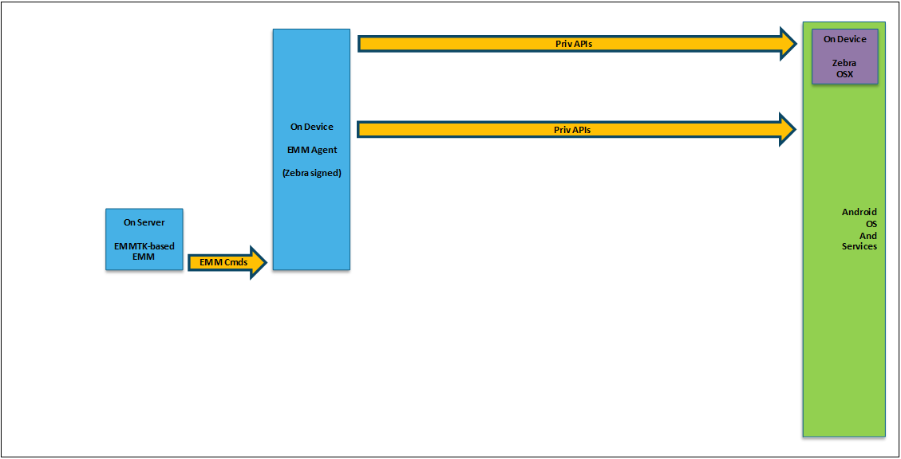

## `DRAFT`

**_Information subject to change without notice_**. 

-----

## Overview

This guide is intended for EMM vendors and other Zebra partners that offer solutions designed to administer and manage Zebra Android devices in an enterprise. It describes the time line for changes to the mechanisms by which Zebra devices are managed, and provides basic descriptions of the steps required to port an agent from DA to DO. 

#### See Also 

* **[Anatomy of the Zebra Schema (.pdf)](../schema/Zebra_EMMTK_Building_DDUI_from_OemConfig_Schema_091418.pdf) | Breakdown of DDUI creation with Zebra OemConfig
* **[DA-to-DO Agent Porting Guide (.pdf)](pdf)** | Detailed porting information and guidance

-----

**Milestones**:

* **Android KitKat, Lollipop and Marshmallow**:
 * Support continues for existing EMM solutions targeting these versions.
 * EMM vendors are encouraged to begin adapting to Device Owner model.
* **Android 7.x Nougat**: 
 * **Phase-out of signed agents begins**; signing of new agents ends.
 * **All tier-1 EMMs must begin adapting the modern approach**.
 * **Use of existing signed EMM agents can continue** for management. of Zebra devices running Android versions that support such agents.
 * Support for existing signed agents on Nougat devices not guaranteed.
* **Android 8.x Oreo**: 
 * End of support for signed agents.
 * All agents must be unsigned.
 * Tier-1 EMMs must adapt signed agents to an alternate [Privilege Escalation Method](../glossary/#privilegeescalation) based on the Android version(s) the vendor intends to support.

-----

## Managing Legacy Devices 
Successful EMM solutions for managing Zebra devices running Android Marshmallow (6.x) and older generally used one of the following three approaches (click images to enlarge). 

### Signed EMM Agent

_Support for signed agents on Zebra devices ends with Android O; all EMM vendors must adapt to unsigned agents. Click image to enlarge_. 

For porting a signed EMM agent to an unsigned one, the method described in "[Unsigned DA EMM Agent Plus MX](#unsigneddaagentmx)" would likely be preferable in most cases. Such an agent could be used to manage Zebra Android devices from Kit Kat through Oreo. Once such an agent is developed, the EMM vendor is well positioned to support most Zebra Android devices and to begin porting to the new standards-based approach required in the future. 

-----

### Unsigned DA Agent + MX

_Tier-2 EMM vendors taking this approach are well positioned for porting to the new approach. Click image to enlarge_.

The diagram above illustrates the method employed by most Tier-2 EMM vendors that support complete solutions for managing Zebra Android devices. Most have already developed a DA EMM agent and augmented it using MX to provide the additional privileged functionality. Such EMM vendors are well positioned to support current and past Zebra Android devices and to begin porting to the new standards-based approach required to manage Zebra Android devices in the future. 

-----

### Unsigned Non-DPC Agent + MX

_This approach is supported through Oreo, but could complicate porting to a DO agent. Click image to enlarge_.

If a Tier-2 EMM vendor already supports a complete solution for managing Zebra Android devices based on a non-DPC EMM agent that is augmented using MX to provide the additional privileged functionality, they can continue to use that approach to support management of all Zebra Android devices through Oreo. 

* **Support for this approach will end with Android 9.x** (Android P). Conversion to the new standards-based approach is required. 
* **Starting from a non-DPC EMM agent will likely complicate the porting process** to a DO EMM agent. But once available, that DO EMM agent could be used to manage Zebra Android devices as far back as Android Nougat, if appropriate. 

-----

## Managing Current and Future Devices 

To successfully manage current and future Zebra Android devices running Android Nougat (7.x) and later, Zebra recommends that EMM solution providers follow one of the approaches described below. 

### Unsigned DO/DA Agent + ZMC

_This approach is the most universal, "future-proof" and standards-compliant. Click image to enlarge_. 

**This is Zebra's most preferred approach because it**: 

* **Is based on standard interfaces** rather than Zebra-proprietary interfaces. 
* **Allows an EMM agent to be completely generic**, with no Zebra-specific code. 
* **Allows the same EMM agent to manage devices from any OEM**. 
* **Supports Zebra Android devices running Nougat or later**. 
* **Provides immediate support for new Zebra features** without EMM agent or server changes. 
* **Offers immunity from significant agent changes in the future**. 

**Disadvantages**: 

* **Cannot be effectively used for devices running Marshmallow and earlier**. 
* **Porting requires the most changes to the agent** than other approaches. 

-----

### Unsigned DO/DA Agent + MX

_This approach offers advantages that make it attractive as an interim solution. Click image to enlarge_.

**Advantages**: 
* **Supported by all Zebra Android devices running Oreo** and earlier.
* **Might require fewer changes for agent porting** than other approaches. 

**Disadvantage**: 
* **Not supported on Zebra Android devices running Android 9.x (P)** or later. 

-----
<!-- 
Allan's stuff: 
The EMMTK is a Zebra product that is designed to provide EMM Vendors with everything they need to develop an EMM agent that can access all functionality needed to implement a “complete” EMM Solution for managing Zebra Android devices. 

Early versions of the EMMTK primarily focused on providing documentation, sample code, tools, and technologies required to leverage MX as a Privilege Escalation method to augment the functionality of an EMM agent that was either totally unprivileged or that was using another Privilege Escalation, such as DA. 

Multiple EMM Vendors successfully used the EMMTK to enable development of a Zebra-proprietary EMM agent that provided the in-device support for a “complete” EMM Solution for managing Zebra Android devices. 

Note that some EMM Vendors chose to augment a DA EMM agent and others chose to augment a non-DPC unprivileged application. 

Upcoming versions of the EMMTK are de-emphasizing the use of MX and instead focusing on migrating towards using the Android Device Administration API available to a DO, augmented using the Zebra implementation of OemConfig, via Managed Configurations. 

Allan's DA-to-DO intro

“ZMC” = Managed Configurations exposed by the Zebra OEM Configuration Application (OemConfig) 

To facilitate the migration to DA mode and the removal of all Zebra-proprietary logic from an EMM agent, an alternative to MX was required. While MX accomplished the goal of providing EMM agents with access to privileged and proprietary functionality, the proprietary nature of the MX interface is inherently incompatible with the goal of enabling an EMM Vendor to develop and maintain a single generic EMM agent that could work on all Android devices from all OEMs, or at least all devices running a suitably recent version of Android. 

Luckily, the Android Device Administration APIs provide a generic extension mechanism called Managed Configurations (also previously known as Application Restrictions). 

As the original name “Application Restrictions” would suggest, this mechanism was originally conceived as a way for Android device applications to expose restrictions that could be imposed on them from outside, such as by an EMM. For example, the Chrome Web Browser for Android exposed the ability for an EMM to change key behavioral aspects, such as whether to show the address bar and whether to store passwords. 

Over time, Android recognized that applications might expose more than just restrictions, hence the name was changed to Managed Configurations, although the functionality was not altered. 

Zebra recognized that that Managed Configurations represented an extension mechanism that could be used for more than just configuration of applications, specifically that configuration of a device could be accomplished indirectly via a configurable application. 

Zebra defined a special application, called OemConfig that publishes Managed Configurations that control the behavior of the device rather than just the behavior of the application itself. 

Zebra reviewed this approach with Google and with several key EMM Vendors and this approach has now been approved and is being promoted by Google as the recommended approach for use by OEMs to publish extended functionality and for use by EMMs to utilize extended functionality published by OEMs. 

### Tier-1 agents

All Tier-1 EMMs will need to begin migrating to a more modern approach since Zebra will began phasing out support for Signed agents in Nougat and will have discontinued all such support as of Oreo. 

Already signed EMM agents can continue to be used to manage Zebra devices running Android versions that support Signed agents. 

Already signed EMM agents cannot effectively used to manage Zebra devices running Android versions that do not support Signed agents since they will be unable to gain access to the privileged functionality they require. 

Zebra may at some point decline to sign new versions of EMM agents that were previously signed for use on older devices. 

Tier-1 EMMs should migrate from a Signed agent to an alternate Privilege Escalation Method based on the versions of Android they wish to support. 

To migrate a Signed EMM agent to a single EMM agent that could be used to manage all Zebra Android devices running Kit Kat through Oreo, the method Unsigned DA EMM agent Augmented by MX, described below, would likely be preferable in most cases. 

Once such an agent was available, the EMM Vendor would be well positioned to support current and past Zebra Android devices and to begin migration to the new standards-based approach that will be required to manage future Zebra Android devices. 

### Tier-2 agents

Tier-2 EMM Vendors that already support complete solutions for managing Zebra Android devices have already developed a DA EMM agent and augmented it using MX to provide the additional privileged functionality. Such EMM Vendors will be well positioned to support current and past Zebra Android devices and to begin migration to the new standards-based approach that will be required to manage future Zebra Android devices. 

if a Tier-2 EMM Vendor already supports a complete solution for managing Zebra Android devices based on a non-DPC EMM agent that is augmented using MX to provide the additional privileged functionality, they can continue to use that approach to support management of all Zebra Android devices through Oreo. 

Since such an approach will no longer work from Android P onwards, migration to the new standards-based approach will be required to continue to manage future Zebra Android devices. 

Starting from a non-DPC EMM agent will likely complicate the migration process to a DO EMM agent and hence should not be left to the last minute.  Once available, the new DO EMM agent could be used to manage Zebra Android devices as far back as Android Nougat, if appropriate. 

### Future Solutions

#### EMM Solutions for Managing Current and Future Zebra Android Devices 

Successful EMM Solutions for managing Current and Future Zebra Android devices running Android Nougat (7.x) and above are recommended to follow one of the following approaches: 

Unsigned DO EMM agent Augmented by ZMC 

This is the most preferred approach for the following reasons: 

It is based on standard interfaces rather than Zebra-proprietary interfaces (e.g. MX). 

It allows an EMM agent to be completely generic and standard, with ZERO Zebra-specific code. 

It allows the same EMM agent to be used to managed devices from all OEMs. 

It will support all Zebra Android devices running Nougat or higher, albeit with more functionality in later versions. 

It provides a means for an EMM to provide immediate support to customers for new ZMC features as they are added to devices by Zebra, without the need for any changes to the EMM agent or EMM Server. 

Once an EMM has successfully invested the one-time cost to migrate to this approach, they should be immune to the need for significant additional changes moving forward. 

This approach does have a few downsides: 

It cannot be effectively used to support Zebra Android devices running Marshmallow and below. 

It requires the most changes to migrate to this approach from any agent using another approach. 

#### Unsigned DO or DA EMM agent Augmented by MX 

This approach has a few advantages that may make it attractive as an interim solution: 

It allows the same agent to be used to manage Zebra Android devices running Oreo and below, although use on Oreo is discouraged. 

It may require fewer changes to migrate to this approach from an agent using another approach. 

This approach has the following significant downside: 

It will not be usable to manage Zebra Android devices running P and above and therefore should only be considered as a temporary stopgap measure. 

-----

Administrative mechanisms and processes generally include:​

* An EMM administrator using an EMM Console to request an administrative task be performed to a managed device or set of devices​.
* The EMM server transmits a command in an EMM-defined format to the EMM agent on each affected device using an EMM-defined protocol​.
* The EMM device agent receives and decodes the command and uses a suitable admin mechanism on the Zebra device to produce the required effect. 

 -->

-----

<!-- 
### Migration Timetable

<table style="width:100%" border="1" padding="5px">
  <tr bgcolor="#dce8ef">
    <th style="text-align:center">Phase</th>
    <th style="text-align:center">Description</th> 
    <th style="text-align:center">Prerequisite(s)</th>
    <th style="text-align:center">Pros</th>
    <th style="text-align:center">Cons</th>
    <th style="text-align:center">Requirement(s)</th>
    <th style="text-align:center">Migration Milestones</th>
  </tr>
  <tr>
    <td></td>
    <td></td>
    <td></td>
    <td></td>
    <td></td>
    <td style="text-align:center"></td>
    <td style="text-align:center"></td>
  </tr>
  <tr>
    <td>Present</td>
    <td></td>
    <td></td>
    <td></td>
    <td style="text-align:center">&#x25cf;</td>
    <td style="text-align:center">&#x25cf;</td>
    <td style="text-align:center">&#x25cf;</td>
  </tr>
  <tr>
    <td>Near Future</td>
    <td></td>
    <td></td>
    <td></td>
    <td></td>
    <td></td>
    <td style="text-align:center">&#x25cf;</td>
  </tr>
  <tr>
    <td>Android P and beyond</td>
    <td></td>
    <td></td>
    <td></td>
    <td style="text-align:center">&#x25cf;</td>
    <td style="text-align:center">&#x25cf;</td>
    <td style="text-align:center">&#x25cf;</td>
  </tr>
  <tr>
    <td>TC72/TC77</td>
    <td></td>
    <td></td>
    <td></td>
    <td></td>
    <td></td>
    <td style="text-align:center">&#x25cf;</td>
  </tr>

</table>
 -->

## See Also

* [About EMM Toolkit](../about)
* [Agent Porting Guide](https://zebra.sharepoint.com/:w:/r/sites/converge/emc-android-platform-architect-review-board/_layouts/15/doc2.aspx?sourcedoc=%7B08423a04-d00d-4015-a4b1-4420ce38749f%7D&action=edit&wdPid=1cdba535) (<< `SHAREPOINT LINK FOR ZEBRAS ONLY`). 
