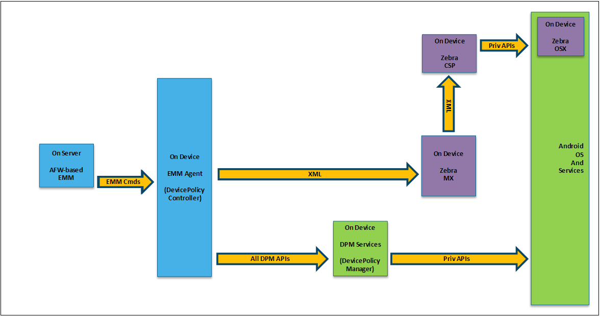

## Overview

This guide is intended for EMM vendors and other Zebra partners that offer solutions designed to administer and manage Zebra Android devices in an enterprise. It describes the time line for changes to the mechanisms by which Zebra devices are managed, and provides basic descriptions of the steps required to port an agent from DA to DO. 

#### See Also 

* **[Build a DDUI from the Zebra OemConfig Schema (.pdf)](../../downloads/Zebra_EMMTK_Building_DDUI_from_OemConfig_Schema_091418.pdf)** | Breakdown of DDUI creation with Zebra OemConfig
* **[DA-to-DO Agent Porting Guide (.pdf)](../../downloads/Zebra_EMMTK_DA-to-DO_Porting_Guide_091418.pdf)** | Detailed porting information and guidance

-----

**Milestones for devices running**:

* **Android KitKat, Lollipop and Marshmallow**:
 * Support continues for existing EMM solutions targeting these OS versions.
 * EMM vendors are encouraged to begin porting agents to the Device Owner model.
* **Android 7.x Nougat**: 
 * **Phase-out of signed agents begins**; Zebra ceases to sign new agents.
 * **All tier-1 EMMs must begin adapting the modern approach**.
 * **Use of existing signed EMM agents can continue** for management. of Zebra devices running Android versions that support such agents.
 * Support for existing signed agents on Nougat devices not guaranteed.
* **Android 8.x Oreo**: 
 * End of support for signed agents.
 * All agents must be unsigned.
 * Tier-1 EMMs must adapt signed agents to an alternate [Privilege Escalation Method](../glossary/#privilegeescalation) based on the Android version(s) the vendor intends to support.

-----

## Managing Legacy Devices 
Successful EMM solutions for managing Zebra devices running Android Marshmallow (6.x) and older generally used one of the following three approaches (click images to enlarge). 

### Signed EMM Agent

_Support for signed agents on Zebra devices ends with Android O; all EMM vendors must adapt to unsigned agents. Click image to enlarge_. 

For porting a signed EMM agent to an unsigned one, the method described in "[Unsigned DA EMM Agent Plus MX](#unsigneddaagentmx)" would likely be preferable in most cases. Such an agent could be used to manage Zebra Android devices from Kit Kat through Oreo. Once such an agent is developed, the EMM vendor is well positioned to support most Zebra Android devices and to begin porting to the new standards-based approach required in the future. 

-----

### Unsigned DA Agent + MX

_Tier-2 EMM vendors taking this approach are well positioned for porting to the new approach. Click image to enlarge_.

The diagram above illustrates the method employed by most Tier-2 EMM vendors that support complete solutions for managing Zebra Android devices. Most have already developed a DA EMM agent and augmented it using MX to provide the additional privileged functionality. Such EMM vendors are well positioned to support current and past Zebra Android devices and to begin porting to the new standards-based approach required to manage Zebra Android devices in the future. 

-----

### Unsigned Non-DPC Agent + MX

_This approach is supported through Oreo, but could complicate porting to a DO agent. Click image to enlarge_.

If a Tier-2 EMM vendor already supports a complete solution for managing Zebra Android devices based on a non-DPC EMM agent that is augmented using MX to provide the additional privileged functionality, they can continue to use that approach to support management of all Zebra Android devices through Oreo. 

* **Support for this approach will end with Android 9.x** (Android P). Conversion to the new standards-based approach is required. 
* **Starting from a non-DPC EMM agent will likely complicate the porting process** to a DO EMM agent. But once available, that DO EMM agent could be used to manage Zebra Android devices as far back as Android Nougat, if appropriate. 

-----

## Managing Current and Future Devices 

To successfully manage current and future Zebra Android devices running Android Nougat (7.x) and later, Zebra recommends that EMM solution providers follow one of the approaches described below. 

### Unsigned DO/DA Agent + ZMC

_This approach is the most universal, "future-proof" and standards-compliant. Click image to enlarge_. 

**This is Zebra's most preferred approach because it**: 

* **Is based on standard interfaces** rather than Zebra-proprietary interfaces. 
* **Allows an EMM agent to be completely generic**, with no Zebra-specific code. 
* **Allows the same EMM agent to manage devices from any OEM**. 
* **Supports Zebra Android devices running Nougat or later**. 
* **Provides immediate support for new Zebra features** without EMM agent or server changes. 
* **Offers immunity from significant agent changes in the future**. 

**Disadvantages**: 

* **Cannot be effectively used for devices running Marshmallow and earlier**. 
* **Porting requires the most changes to the agent** than other approaches. 

-----

### Unsigned DO/DA Agent + MX

_This approach offers advantages that make it attractive as an interim solution. Click image to enlarge_.

**Advantages**: 
* **Supported by all Zebra Android devices running Oreo** and earlier.
* **Might require fewer changes for agent porting** than other approaches. 

**Disadvantage**: 
* **Not supported on Zebra Android devices running Android 9.x (P)** or later. 

-----

## See Also

* [About EMM Toolkit](../about) | General information
* [FAQ](../faq) | Frequently asked questions and answers
* [Staging Service APIs](../api) | Interface specs for cloud-based staging
* [Other EMMTK Guides](../../guide) | A complete list of all guides in the EMM Toolkit
* **[Build a DDUI from the Zebra OemConfig Schema (.pdf)](../../downloads/Zebra_EMMTK_Building_DDUI_from_OemConfig_Schema_091418.pdf)** | Breakdown of DDUI creation with Zebra OemConfig
* **[DA-to-DO Agent Porting Guide (.pdf)](../../downloads/Zebra_EMMTK_DA-to-DO_Porting_Guide_091418.pdf)** | Detailed porting information and guidance

