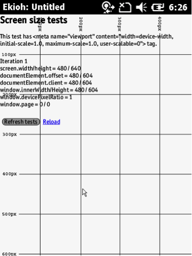
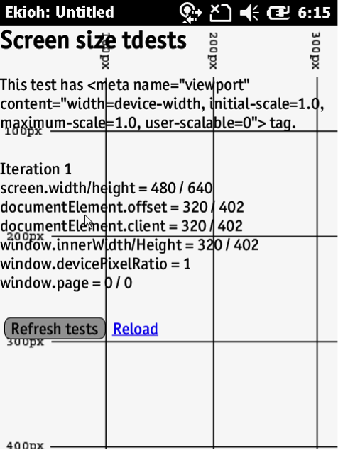

The appearance of an app's pages on the device screen is controlled by the app's HTML and the viewport settings in the app's `config.xml` file. Page width can with based either on the physical width of the display or on a specified fixed width. This guide explains the workings of both settings. 

## Enable Viewport Settings
This setting enables the use of standard viewport settings within the Zebra Technologies Webkit. For details about the viewport meta tag, refer to the [Mozilla Viewport Docs](https://developer.mozilla.org/en-US/docs/Mozilla/Mobile/Viewport_meta_tag).

To enable the viewport in the WebKit, specify the following option in the `config.xml` file:
	 
    :::xml
    <ViewportEnabled VALUE="1"/>

## Specify Device Widths
Specifying `width=device-width` in a meta tag will either:

* Use the value specified at &lt;ViewportWidth VALUE="320"/&gt; (if one is specified)
* Use the physical width of the display (if no value is specified)

For comparison, the width of the MC75a display is 480 pixels.

#### With Specified initial-scale
Pages that specify an initial or maximum scale will cause the width property to translate into a minimum viewport width. For example, if the layout needs at least 500 pixels of width, the meta tag markup shown below can be used. When the same page is rendered on a screen that is more than 500 pixels wide, the browser will expand the viewport (rather than zoom in) to fit the screen. Use the following code in the app's html:

    :::html
    <meta name="viewport" content="width=500, initial-scale=1"/>

The same page rendered on an MC75a will appear as follows:

_MC75a with Windows Mobile 6.5_

* An Android device's viewport appears similar but is not identical. The screen width is rendered at 360 pixels because the device resolution is different for Android.
* The MC75a is behaving within the documented parameters when specifying both device width and initial scale (as detailed above), and is expanding the viewport to fit the content.

#### Without Specified initial-scale

Now consider the same page without specifying an initial-scale:

In the app's html:

    :::html
    <meta name="viewport" content="width=320"/>

_MC75a with Windows Mobile 6.5_

Without specifying an initial scale, the MC75a displays the page with a viewport width of 320 pixels, the width specified for the device in the `config.xml` file. If this value had been left blank, the page would rendered with a width of 480 pixels.

Zebra recommends that the initial scale be left blank in the viewport parameter so that the page is not locked to a set resolution. If necessary, a meta tag can be added to the HTML file to allow for an adaptive viewport width.

