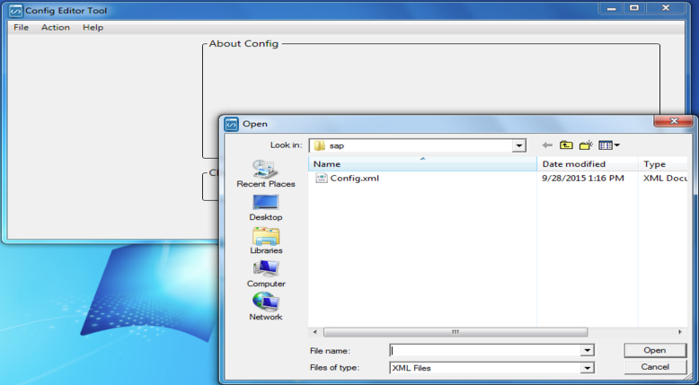
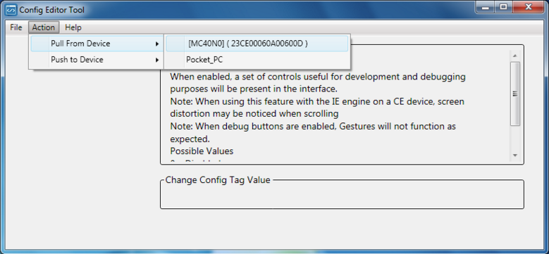
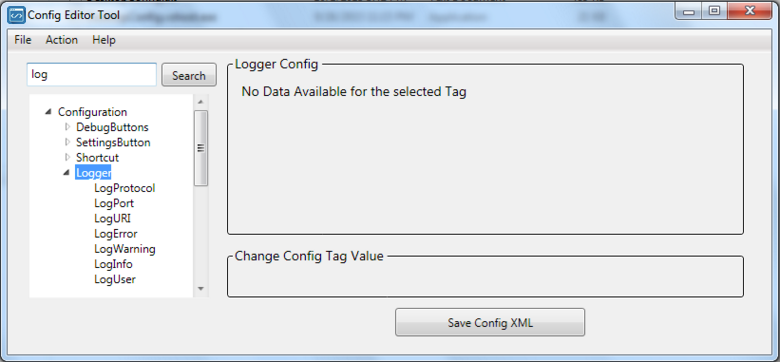
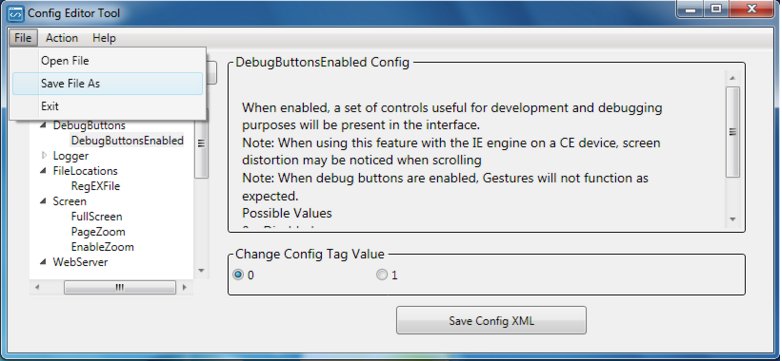
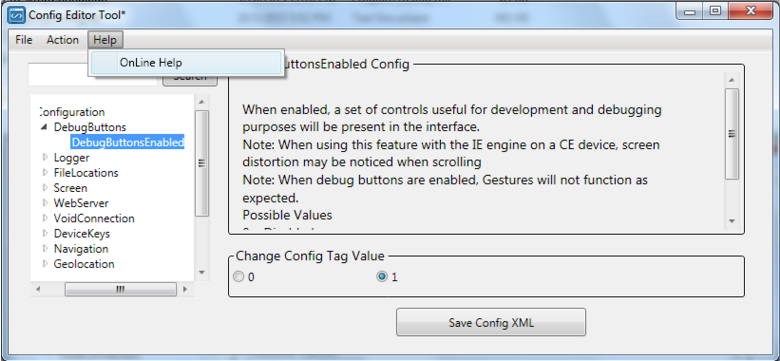

## Config Editor Utility 

The Config Editor is a Windows utility that provides a quick and easy way to edit and deploy the `Config.xml` file, which controls the runtime behavior of Enterprise Browser apps. The tool can pull the `Config.xml` file from a connected device, describe the behavior of any selected XML tag, display valid settings, parse and validate previously stored values, save changes locally and deploy the file back to a connected device running Android or Windows Mobile/CE. 

The Desktop Config Editor is included with Zebra Enterprise Browser 1.3 and higher. 

### QUICK STEPS
The basic steps to edit a `Config.xml` file from a PC attached to the target device: 
1. Select **File>Open** or **Action>Pull From Device>[Device name]**.
2. **Open the Config.xml file** to be edited. 
3. In Config Editor window, navigate tree view to **locate and edit tag value(s)** as required.
4. Press **Save Config XML** button to save changes.
5. Use **Action>Push to Device>[Device name]** to deploy saved file to device. 

## Prerequisites
* Windows development host
* Zebra Enterprise Browser 1.3
* USB driver for targeting Zebra devices
* Android Debug Bridge (if targeting Android devices)
* Microsoft ActiveSync (if targeting WIndows Mobile/CE devices)

## Using Config Editor

**WARNING: Free-form text fields (i.e. username and password) can accept alpha-numeric characters only. Entering non-text characters (< > \ / " ') in these fields will corrupt the Config.xml file**. 

### Open a file stored on a development host

* **Select File>Open File** from the menu bar.
* Browse to and **open the Config.xml file** to be edited.

### Open a file stored on a connected device 

* **Select Action>Pull From Device>[Device name]** from the menu bar.

The app's Config.xml file will be pulled from the selected device, stored locally on the development host, and opened in the utility for editing. 

**Note**: This method requires that the device be visible to the host through Android Debug Bridge or ActiveSync, and that it have an EB app installed. See the [Connections section](../ConfigEditor?Connections) for details. 

### Edit a Config.xml file

When a Config.xml file is opened, a Config Editor window will appear similar to the one below, with the file's tag names in a tree pane at left and an explanation of the selected tag's values and runtime behavior at right, along with an editor for its values. 

* **Locate the tags to be edited** by scrolling the tree or using the search field and button (below). 

* **Make changes to tag values as required**. 

* **Press "Save Config XML"** to save changes in the Config.xml file.

Config Editor indicates that unsaved changes are present by placing an asterisk (*) in the title bar (as below). 

* To push changes to the device, **select Action>Push to Device>[Device name]** from the menu bar.

If multiple Config.xml files are desired, for example to test the behavior of various settings, select **File>Save File As** to save and/or rename additional copies of the Config.xml file as needed. 

## Tree View Features
The tree view offers these useful right-click features: 

* Expand all - Expands all XML tags to display all configurable settings.
* Collapse all - Collapses all tags to hide all nodes. 
* Refresh - Reloads the Config.xml file into the Editor, overwriting unsaved changes with the last-saved version. The refresh feature also can be used for editing multiple Config.xml files by overwriting one file with another, or when recovering from an accidental deletion or other mishap. 

## Config Editor Notes

* Validation is performed only on tags accepting boolean or binary value sets. Validation is not performed on tags that accept free-form text or that initially contain a blank value. The values in such fields will be saved back to the Config.xml file unchanged. 

* Enterprise Browser Config.xml files contain different sets of default values depending on the target platform. However, Config Editor does not differentiate between device platforms when pushing to devices. It's up to the user to manage the deployment to the appopriate platform(s). 

* Config Editor will automatically recognize and display tags in any Config.xml file, but cannot be used to add tags (use a text editor for that). 

* Tags added to a Config.xml file beyond its default tag set will be displayed with a text box for storing and editing the values of those tags. 

* Config Editor has not been tested for use with mobile device management or deployment solutions. 

* Use of Config Editor with Android devices requires ADB and a USB connection. 

* Use of Config Editor with Windows Mobile/CE devices requires ActiveSync and a USB or Bluetooth connection.  

* Config Editor supports only the English-language versions of Windows, Android and Windows Mobile/CE. 

## Connections
Communication from the development host to target device(s) is handled by the [Android Debug Bridge](http://developer.android.com/tools/help/adb.html) (ADB) for Android devices and by [Microsoft ActiveSync](http://www.microsoft.com/en-us/download/details.aspx?id=15) for Windows Mobile/CE. If a device is not shown in Config Editor's list of connected/detected devices, please verify that the appropriate software and drivers are installed, and check the physical connection(s). 

* **ADB supports USB only**
* **ActiveSync supports USB or Bluetooth** 
* **Device(s) must contain an EB app and its Config.xml file**  

It might be necessary to install an OEM USB driver to make a USB-attached Android device visible to Windows. Visit [Google’s OEM USB Driver page](http://developer.android.com/tools/extras/oem-usb.html) for instructions and links to OEM drivers for your brand of hardware.

## Online Help 
Config Editor's Online Help links to the [Enterprise Browser Config.xml Reference](../configreference) in a browser. For off-line viewing, [download the Enterprise Browser User Guide (.zip)](https://github.com/EBZebra/docs/archive/gh-pages.zip). 

