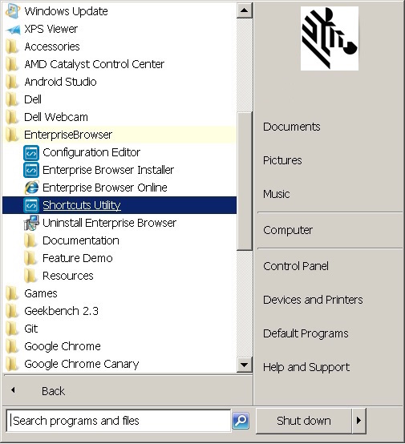
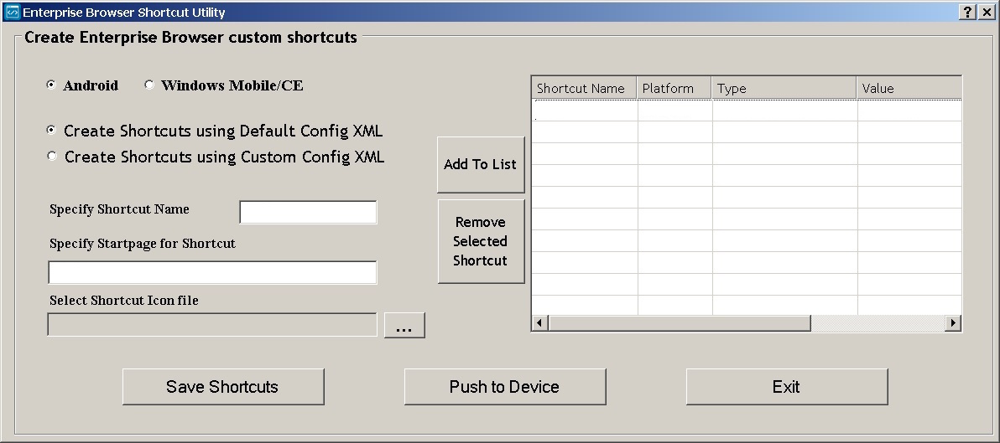
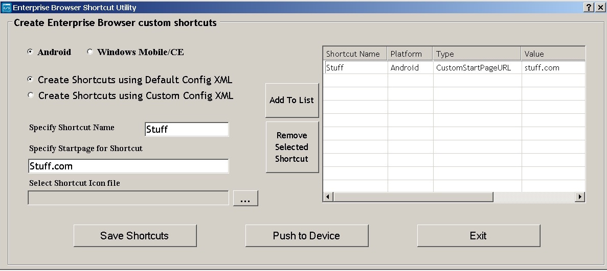
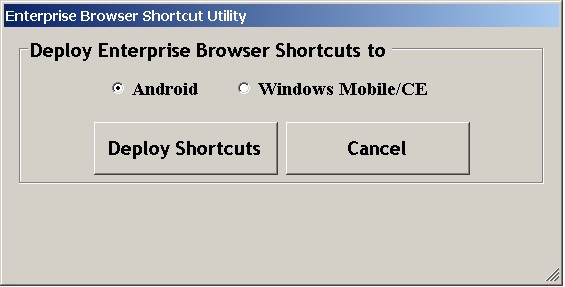
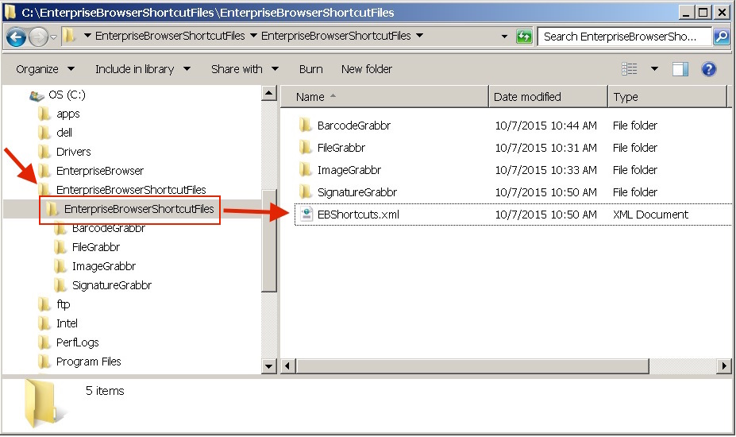
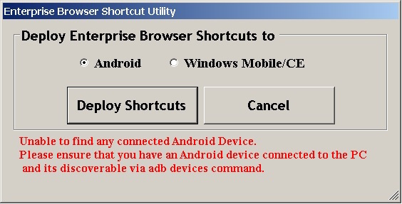

##Overview
Shortcuts on a mobile device are small files that launch an application with a set of specific settings contained in the shortcut file. Depending on the app, some shortcuts can even invoke some of the app's functions, such as the phone dialer or sound recorder. On Enterprise Browser, each shortcut can contain a separate start page for the app and also can link to a custom config.xml file with as many runtime settings as required. On devices running Android, EB shortcuts also can have separate icons. 

## Shortcut Utility
Shortcut Utility is a Windows tool that quickly creates shortcuts for Enterprise Browser apps for Android and Windows Mobile/CE and can deploy them directly to devices. From a single screen, the tool can create and deploy multiple shortcuts, each with a unique name, startpage URL and Config.xml file, if desired. Shortcuts for different platforms can be created at one time and easily deployed en masse to their respective platforms using a Mobile Device Management (MDM) system. 

Shortcut Utility is included with Zebra Enterprise Browser 1.3. 

>**IMPORTANT: This tool relies on settings in the Config.xml**, a device-resident file that controls all runtime settings for Enterprise Browser. For help editing Config.xml files, please refer to the [Config Editor utility guide](../ConfigEditor) and the [Config.xml Reference](../configreference). 

### QUICK STEPS
1. Use these instructions only after [installing Enterprise Browser](../setup) (version 1.3 is required). 
2. Open Shortcut Utility and **select a platform** (Android or Windows Mobile/CE).
3. **Select Default or Custom** Config.xml (if Custom, navigate to the file).
4. **Enter a name** for the shortcut.
5. **Specify a start page** (fully qualified path or URL).
6. **Select an icon** for your shortcut (Android only).
7. Click **Add to List** to store settings and create another, if desired. 
8. Click **Save Shortcut** to save all shortcut settings for later retrieval.
9. Click **Push to Device** to deploy (via ADB or ActiveSync).
10. **Launch Enterprise Browser** to create shortcut(s) on device.&#42;

&#42; *Shortcut creation behavior is determined by the **&lt;shortcut&gt; tag** in the Config.xml file on the target device. This tag must be configured prior to shortcut deployment*.

## Prerequisites
* **Windows development host**
* **Zebra Enterprise Browser 1.3**
* **USB driver for targeting Zebra devices**
* **Android Debug Bridge (if targeting Android devices)**
* **Microsoft ActiveSync (if targeting Windows Mobile/CE devices)**

EB Shortcut Utility is included with Zebra Enterprise Browser 1.3. If you don't already have EB 1.3, please [install Enterprise Browser](../setup), then resume from here. 

## Using Shortcut Utility

* **Launch the "Shortcuts Utility"** from the Enterprise Browser folder of the Windows Start Menu, as below. 

A Shortcut Utility window will appear, similar to the one below.  

### Create shortcut(s)

1. **Select the platform** (Android or Windows Mobile/CE) to be targeted by the shortcut.
2. **Select Default or Custom** for the Config.xml to be used with the shortcut (selecting Custom will cause the Startpage field to change to a navigation box).
3. **Enter a name** for the shortcut.
4. **Specify a start page**. Must be a fully qualified local path using `file://` or URL using `http://`. (**If 'Custom' was chosen in step 3, navigate to the Config.XML file to be used**). 
5. **Select an icon** for your shortcut (Android only). If left blank, the default Enterprise Browser shortcut icon will be used.
6. Click **Add to List** to store settings in the list at right.

After creating your first shortcut and adding it to the list, your screen should look something like this:   

&#55;. **Repeat Steps 1-6** until all the desired shortcuts are created and added to the list.

&#56;. **Click Save Shortcut** button to save all shortcut settings to the development host for later retrieval and/or mass deployment. 

Shortcut data is stored in a file called `EBShortcuts.xml` in the path: 

`C:\EnterpriseBrowserShortcutFiles\EnterpriseBrowserShortcutFiles\EBShortcuts.xml` 

In the same location are custom folders named for each shortcut created, with that shortcut's Config.xml inside. For more information, see the Mass Deployment section, below. 

### Deployment (to single device)

1. After desired shortcuts have been created (using steps 1-8 above), **click Push to Device**. A screen similar the one below will appear. 
2. **Select the desired platform and click Deploy Shortcuts** to deploy through ADB (Android via USB) or ActiveSync (WM/CE via USB or Bluetooth). Shortcut(s) will be pushed to the device. 
3. **Launch Enterprise Browser** to create shortcut(s) on the device.  

**Notes**

* **Shortcut(s) appear on the device _after_ Enterprise Browser is launched following deployment**.
* **Shortcuts are created _only_ if the &lt;ShortcutCreationEnabled&gt; tag value = 1 or 2**. See [Troubleshooting section](../ShortcutCreator?Troubleshooting). 
* **Shortcuts are placed in the Home Screen on Android and in the Main Screen of WM/CE**. 

### Mass Deployment (via MDM)

Shortcuts can be packaged with an Enterprise Browser app (.apk or .cab) and the corresponding Config.xml file and easily deployed across an enterprise using a mobile device management (MDM) system. 

**IMPORTANT**:

* **Shortcut creation requires Enterprise Browser 1.3 (the latest) on the deployment PC and the device(s)**. The vast majority of installations will therefore require an upgrade. 
* **Upgrading overwrites the Config.xml on target device(s)**. Previous runtime settings should be replicated in the new Config.xml before deployment.
* **Shortcut creation behavior is controlled by settings in the Config.xml**. Be sure to read, understand and configure shortcut settings before deployment. 
* **Shortcut(s) must be deployed to an individual device before they can be deployed via MDM**. The instructions below cover this scenario. 

**To prepare an Enterprise Browser app for MDM deployment**: 

&#49;. **Deploy an app for Android (.apk) or Windows Mobile/CE (.cab)** using the [standard device deployment procedures](../setup).

&#50;. **Copy the `Config.xml` file from the device to the host PC** and open it in a text editor. **Its location varies by platform**:

**Android**: `<internal storage>/Android/data/com.symbol.enterprisebrowser/`

**WM/CE**: `<internal storage>\Program Files\EnterpriseBrowser\Config\` 

&#51;. **Set the &lt;ShortcutCreationEnabled&gt; value to either 1 or 2**. For behavior of these options, refer to the [Troubleshooting section](../ShortcutCreator?Troubleshooting) (below) or the [Config.xml reference](../configreference). 

&#52;. **Push the `Config.xml` file to its original location on the device**, replacing the original.  

&#53;. If not done earlier, **create the desired shortcut(s) (using steps 1-8 above)**. Shortcut data is stored on the PC in a file called `EBShortcuts.xml` in the following path: 

`C:\EnterpriseBrowserShortcutFiles\EnterpriseBrowserShortcutFiles\EBShortcuts.xml` 

In the same location are custom folders named for each shortcut created, with that shortcut's Config.xml inside: 

&#54;. To deploy shortcuts _**and**_ the Enterprise Browser app using an MDM system, **components <u>MUST</u> be deployed by the MDM in the following order**:

####MDM Deployment Order
 
a. **Deploy the desired .apk or .cab file to the device**.

b. **Unpackage the .apk or .cab file on the device**. This will generate the Enteprise Browser directory structure on the device and create a default Config.xml file.  

c. **Deploy Config.xml modified in step 3 <u>to its original location (as below) on the target device</u>** (replacing the default Config.xml file generated in step b). 

**Location of Config.xml file**:

*  **Android**: `<internal storage>/Android/data/com.symbol.enterprisebrowser/`
*  **WM/CE** `<internal storage>\Program Files\EnterpriseBrowser\Config\`

**<u>DO NOT deploy to removeable storage</u>**. 
 
d. **Copy directory structure (in the red box) to the target device**: 
 
* **Android**: `<internal storage>/EnterpriseBrowserShortcutFiles/` 

* **WM/CE**: `<internal storage>\Application\EnterpriseBrowserShortcutFiles\` 

**<u>DO NOT deploy to removeable storage</u>**. 
 
e. **Launch Enterprise Browser on the device to create shortcut(s)**.

Shortcut icons will be visible to the user in the device's main application area or menu. From a system perspective, shortcut files are stored this way: 

**Android**: shortcut files are not exposed to the end-user.

**Windows Mobile**: `.lnk` files are deployed in the `\​Windows\StartMenu\Programs` directory and named after the shortcut. 

**Windows CE**: `.lnk` files are deployed in `\​Windows\Programs` and `\​Windows\Desktop` directories  and named after the shortcut.

**Notes** 

* **File structure must be replicated exactly** for proper shortcut operation.
* **Shortcut files for all platforms (Android, WM, CE) are copied to the device**. 
* **When created on the device, shortcuts for other platforms are ignored**.
* Automatically generated shortcut **files and folders must not be modified by hand**. 
* **Customizing shortcut data files manually could result in unknown failures**.
* **To change shortcut settings, use the Shortcut Utility** and redeploy. 
* Existing **shortcuts on target device(s) will be overwritten** when redeployed. 

## Troubleshooting

Shortcut Utility communicates with Android devices via ADB (USB only) and with Windows Mobile/CE devices through Mobile Device Center (or ActiveSync on WinXP) over USB or Bluetooth. If you're seeing a message like the one below or having other communication-related issues, please **refer to the Connections section of the [Enterprise Browser installation guide](../setup#connections)**. 

### Config.xml
If shortcuts are being deployed to the device but not showing up, **check the Config.xml to ensure that the &lt;ShortcutCreationEnabled&gt; tag has a value or 1 or 2**.  

 	:::xml

	<shortcut>
		<ShortcutCreationEnabled value = "1"/>
	</shortcut>

On-device shortcut creation is determined by this setting, and behavior thereafter depends which value is selected. Available options:  

* **0= create no shortcuts (default)**
* 1= check for and create new shortcuts at every launch
* 2= check for and create new shortcuts only at initial launch

<!-- &#55;. Shortcuts will be created on the device the next time Enteprise Browser is launched following deployment. **Optionally, launch Enterprise Browser from the MDM using one of the following commands**: 

Android: 

		:::term
		adb shell am start com.symbol.enterprisebrowser

Windows Mobile/CE: 

		:::term
		( ---> info to come <--- ) 
-->

## Platform Notes

### Windows Mobile/CE
Windows Mobile/CE shortcut (.lnk) files launch the Enterprise Browser runtime with startup options that override EB's default settings. A text editor such as Notepad on Windows CE can be used to create shortcuts. It's also possible to use the File menu in Platform Builder (New Project or File, Text File type). Edit the file for command line parameters and save it to \Windows\Start Menu on Windows Mobile, or \Windows\Programs for Windows CE. This will put the shortcut at the top level in the Start Menu.

The Enterprise Browser installation path on Windows Mobile/CE devices: 
`\Program Files\Enterprise Browser` 

The path to the executable:  
`\Program Files\Enterprise Browser\EnterpriseBrowser.exe` 

The shortcut file supports the following command line parameters:

`/C:` specifies the location of the configuration file for the Enterprise Browser application. This will override all default configuration settings. If the full file name contains spaces, surround URL with single or double quotes:

        /C:file://\application\config.xml
        /C:'file://\Program Files\application\Config.xml'
        /C:"file://\Program Files\My Application\config.xml"
        
`/S:` specifies the start page of the Enterprise Browser application. Other configuration parameters will be used from the default config.xml file. If the full file name contains spaces, surround URL with single or double quotes:

        /S:"file://\HTML\index.html"
        /S:"file://\RE App\index.html"
        /S:"file://\Program Files\MyApp\index.html"
        /S:"http://www.google.com"

If neither the `/S` nor `/C` parameters are specified in the shortcut file, the default values for the location of the configuration file and the start page of the Enterprise Browser application will be used. 

**Note**: URLs that contain query string parameters (?name=value) cannot be used within a shortcut on Windows Mobile/CE. 

The format in the .lnk file is:

	:::xml
	<line-length>#<runtime-exe> <command-line-parameter> <app-folder>

For example, to change the startup page in the .lnk file to a local HTML file:

	:::bash
	70#"\Program Files\Enterprise Browser\EnterpriseBrowser.exe" /S:file://\helloscan.html

###Android
In devices running Android, shortcut files are created and stored in an OS-manageable location that is not exposed to the end-user.

<!-- ### Running Multiple Web Apps
Create shortcuts that link to two separate Enterprise Browser web apps like this:

	:::bash
	68#\Program Files\Enterprise Browser\EnterpriseBrowser.exe /S:file://\helloscan.html

And another could be:

	:::bash
	66#\Program Files\Enterprise Browser\EnterpriseBrowser.exe /S:file://\helloscan.html

> Note: The last application will launch using the same runtime container. Only one application will be running at a time. When launching the second application, the runtime simply changes the starting URL. -->

