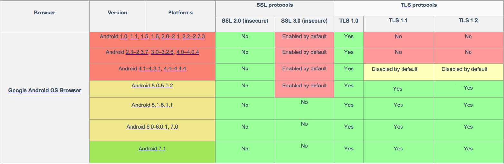

## Overview
Compliance of Enterprise Browser with Secure Sockets Layer (SSL) and the newer Transport Layer Security (TLS) protocols is determined by the operating system running on the device and the WebView that's in use. The highest security compliance currently supported by Enterprise Browser on devices running Android or Windows Mobile/CE is TLS 1.2.

SSL and TLS (which replaced SSL 3.0 in 1999) are transport protocols that encrypt network communications, and are most often used to protect web browsing, email, instant messaging and other web-based apps. See the [Certificates guide](../certificates) for information about using TLS to secure communications between one or more servers and Enterprise Browser clients attempting to connect. 

-----

### Android
The WebView engines vary from one Zebra Android device to another, and the level of TLS/SSL support depends on WebView version present in the device. The chart below shows which versions of Android support (or will support) the various levels of TLS and/or SSL. 

_Enterprise Browser currently supports Android versions up to Android 5.x Lollipop and TLS up to v1.2_.
 

-----

### Windows Mobile/CE 
On all Zebra devices running Windows Mobile/CE that use the Webkit Engine, Enterprise Browser supports TLS v1.2. On devices that use the IE Engine, TLS/SSL support depends on the IE version present in the device. To determine security compliance, see below.

### Verify Compliance

To determine the security compliance on a device, use Enterprise Browser to navigate to one of the URLs below:

* [How's My SSL?](https://www.howsmyssl.com)
* [SSL Labs](https://www.ssllabs.com/ssltest/viewMyClient.html)

